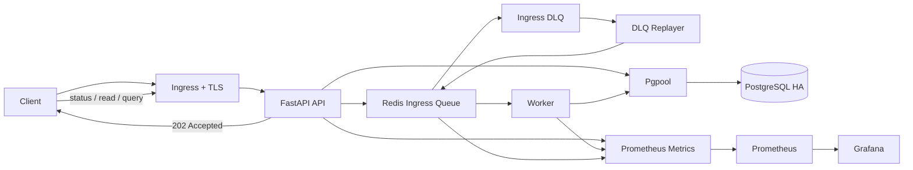

# Event Stream Systems Portfolio

이 저장소는 채팅형 이벤트 흐름을 단순 CRUD 로 끝내지 않고, 장애 상황에서도 요청을 최대한 빠르게 받아들이고 이후에 복구 처리할 수 있는 `event stream processing system` 형태로 구성한 포트폴리오입니다.

핵심 목표는 아래와 같습니다.
- `queue-backed async processing`
- `HA`
- `autoscaling`
- `observability`
- `backup / restore`
- `Ingress + TLS`
- `GitOps / Argo CD`

현재 저장소는 로컬 `kind` 환경에서 위 시나리오를 재현할 수 있도록 구성되어 있으며, 이후 AWS `EKS` 같은 외부 클러스터로 확장할 수 있는 방향도 함께 담고 있습니다.

## Summary
- API 는 요청을 바로 DB 에 쓰지 않고 Redis ingress queue 에 적재합니다.
- Worker 는 queue 를 소비하면서 PostgreSQL 에 비동기 영속화합니다.
- 장애 상황에서는 retry, DLQ, replayer 로 복구 경로를 제공합니다.
- Kubernetes 환경에서는 PostgreSQL HA, Redis HA, HPA, Prometheus, Grafana 를 함께 검증합니다.
- GitOps 경로에서는 Argo CD 가 Git 의 원하는 상태(`desired state`)를 기준으로 애플리케이션 매니페스트를 동기화합니다.

## Architecture


처리 흐름:
- API 는 요청을 `accepted` 상태로 받고 Redis queue 에 적재합니다.
- Worker 는 queue 의 이벤트를 PostgreSQL 에 기록합니다.
- 실패한 요청은 DLQ 로 이동하고, replayer 가 다시 queue 로 재주입합니다.
- 사용자는 이후 요청 상태, 이벤트 목록, unread count 를 API 로 조회합니다.
- Prometheus / Grafana 로 API latency, worker 처리 시간, queue depth, DB / Redis 상태를 관측합니다.

## What This Project Covers
### Normal Path
- event request intake
- async persistence
- read receipt / unread count

### Failure Recovery
- DB down during intake, then persistence after recovery
- Redis complete outage detection
- Redis single-node failover recovery
- retry exhaustion to DLQ

### Operations
- health / readiness / metrics
- HPA autoscaling
- backup / restore
- ingress + local TLS
- GitOps / Argo CD sync

## Prerequisites
필수:
- Docker Desktop
- Windows PowerShell

도구 설치 방법:

**Windows (chocolatey)**
```powershell
choco install kind kubernetes-helm
```

**macOS (homebrew)**
```bash
brew install kind helm
```

**Linux**
```bash
# kind
curl -Lo kind https://kind.sigs.k8s.io/dl/latest/kind-linux-amd64
chmod +x kind && sudo mv kind /usr/local/bin/

# helm
curl https://raw.githubusercontent.com/helm/helm/main/scripts/get-helm-3 | bash
```

로컬에서 사용하는 포트:
- `80` for ingress HTTP
- `443` for ingress HTTPS
- `9090` for Prometheus alert validation fallback

## Quick Start
전체 로컬 검증은 아래 명령으로 실행할 수 있습니다.

```powershell
powershell -ExecutionPolicy Bypass -File scripts/quick_start_all.ps1
```

이 스크립트는 아래 작업을 수행합니다.
- kind cluster 생성
- `ingress-nginx` 설치
- `metrics-server` 설치
- application image build and load
- PostgreSQL HA / Redis HA 배포
- application stack 배포
- ingress readiness 확인
- smoke / DB recovery / Redis recovery / HPA scaling test 실행

기본 접근 경로:
- API: `http://localhost`
- TLS API: `https://localhost`
- Grafana: `http://localhost/grafana`
- TLS Grafana: `https://localhost/grafana`
- Prometheus: `http://localhost/prometheus/`
- TLS Prometheus: `https://localhost/prometheus/`

## Verified Scenarios
- smoke
- DB recovery
- Redis complete outage
- Redis single-node failover
- DLQ flow
- failover alerts
- HPA scaling
- PostgreSQL backup / restore
- GitOps / Argo CD sync

상세 결과는 [TEST_RESULTS.md](docs/TEST_RESULTS.md) 에 정리했습니다.

## Observability
Grafana / Prometheus 에서 아래 항목을 확인할 수 있습니다.
- API request count / latency
- worker processed count / processing latency
- queue depth
- DB pool usage / reconnect / failure
- Redis reconnect state
- component health status
- alert firing / resolution

## Performance
`k6` 부하 테스트 자체는 동작하지만, 현재 latency threshold 는 아직 통과하지 못하고 있습니다.

최근 측정 예시:
- 초기 기준: `5434 req`, avg `3660ms`, p95 `8175ms`
- 1차 개선 후: `7966 req`, avg `2285ms`, p95 `4936ms`
- 2차 개선 후: `9102 req`, avg `1934ms`, p95 `3851ms`
- pgpool / DB pool 조정 후: `11314 req`, avg `1519ms`, p95 `3333ms`

## Backup and Restore
현재 운영 보강 범위:
- manual backup: `scripts/backup_postgres_k8s.ps1`
- manual restore: `scripts/restore_postgres_k8s.ps1`
- weekly PostgreSQL backup `CronJob`

관련 운영 지침은 [OPERATIONS.md](docs/OPERATIONS.md) 에 정리했습니다.

## GitOps / Argo CD
현재 저장소에는 Argo CD 기반 GitOps 경로가 추가되어 있습니다.

- GitOps sync path: `k8s/gitops/overlays/local-ha`
- Argo CD bootstrap 스크립트:
  - `k8s/scripts/install-argocd.ps1`
  - `k8s/scripts/bootstrap-argocd-app.ps1`
- 로컬 GitOps quick start:
  - `powershell -ExecutionPolicy Bypass -File scripts/quick_start_gitops.ps1 -RepoUrl https://github.com/<your-account>/<your-repo>.git -Revision ops`

현재 검증 기준은 아래와 같습니다.
- 로컬 `kind` 클러스터에서 Argo CD 설치
- `ops` 브랜치를 바라보는 `Application` 생성
- commit / push 후 Argo CD 가 새 revision 을 읽고 배포 리소스를 갱신하는 것까지 확인

즉 이 프로젝트는 문서상으로만 GitOps 를 설명하는 것이 아니라, 로컬 Kubernetes 환경에서 실제 sync 동작까지 검증한 상태입니다.

## Branch Strategy
- `master`
  - 실제 배포 기준 브랜치입니다.
  - 이후 EKS 와 연결할 때 운영 배포 기준점으로 사용할 수 있습니다.
- `dev`
  - 개발 통합용 브랜치입니다.
  - 기능 개발을 모으고 정리하는 용도로 사용합니다.
- `ops`
  - 로컬 `kind` + Argo CD 검증용 브랜치입니다.
  - GitOps 흐름과 운영 절차를 실험하고 확인하는 용도로 사용합니다.

현재 로컬 GitOps 검증은 `ops` 브랜치 기준으로 수행했습니다.

## CI
현재 저장소에는 기본 `GitHub Actions` CI 구성을 추가했습니다.

- Python 문법 검증
- Docker image build 확인
- Kustomize manifest render 확인

이 단계는 아직 EKS 직접 배포와 연결되어 있지는 않지만, 코드 변경이 최소한 배포 가능한 형태인지 빠르게 확인하는 역할을 합니다.

## Current Limits
- HTTPS is local self-signed TLS, not production-issued certificates
- `k6` latency threshold is still failing
- stream 단위 event ordering guarantee 는 추가 검증 과제가 남아 있습니다
- 운영 UI 는 데모와 검증 목적에 맞춰 노출 범위를 열어둔 상태이며, production access control 까지는 구현하지 않았습니다
- EKS / ECR / external secret manager 연동은 아직 로컬 중심 검증 단계입니다

## Documents
- 실행 가이드: [QUICK_START.md](docs/QUICK_START.md)
- 구조와 처리 흐름: [ARCHITECTURE.md](docs/ARCHITECTURE.md)
- 운영 지침: [OPERATIONS.md](docs/OPERATIONS.md)
- GitOps / Argo CD: [GITOPS.md](docs/GITOPS.md)
- 검증 결과: [TEST_RESULTS.md](docs/TEST_RESULTS.md)
- 변경 이력: [PATCH_NOTES.md](docs/PATCH_NOTES.md)
- 저장소 구조: [REPOSITORY_STRUCTURE.md](docs/REPOSITORY_STRUCTURE.md)

## Suggested Reading Order
1. README 에서 전체 구조와 현재 상태 파악
2. [QUICK_START.md](docs/QUICK_START.md) 로 실행 방법 확인
3. [ARCHITECTURE.md](docs/ARCHITECTURE.md) 로 구성과 처리 흐름 확인
4. [GITOPS.md](docs/GITOPS.md) 로 GitOps / Argo CD 구성 확인
5. [TEST_RESULTS.md](docs/TEST_RESULTS.md) 로 실제 검증 상태 확인
