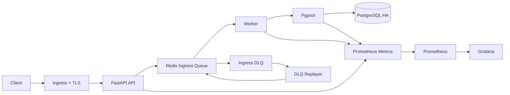

# Event Stream Systems Portfolio

메시지 예제로 구현했지만, 목표는 채팅 앱 자체보다 장애 상황에서도 요청을 최대한 유실 없이 수락하고 복구 후 다시 처리할 수 있는 `event stream processing system`을 만드는 것입니다. 이 저장소는 `queue-backed async processing`, `HA`, `autoscaling`, `observability`, `backup / restore`, `Ingress + TLS`까지 한 번에 검증할 수 있는 로컬 Kubernetes 포트폴리오입니다.

## Summary
- API는 요청을 바로 DB에 쓰지 않고 Redis ingress queue에 적재합니다.
- Worker는 queue를 소비해 PostgreSQL에 비동기로 영속화합니다.
- 장애 시 retry와 DLQ, replayer로 복구 경로를 유지합니다.
- Kubernetes 위에서 PostgreSQL HA, Redis HA, HPA, Prometheus, Grafana를 함께 검증합니다.

## Prerequisites
필수:
- Docker Desktop running
- Windows PowerShell

저장소에 포함된 도구:
- `tools/kind.exe`
- `tools/helm/windows-amd64/helm.exe`

로컬에서 사용하는 포트:
- `80` for ingress HTTP
- `443` for ingress HTTPS
- `9090` for Prometheus alert validation fallback

`scripts/quick_start_all.ps1`는 실행 전에 포트 충돌을 확인하고, 충돌이 있으면 배포 전에 중단합니다.

## Architecture


핵심 흐름:
- API는 request를 `accepted` 상태로 받고 Redis queue에 적재
- Worker는 queue를 소비해 PostgreSQL에 영속화
- 실패한 request는 DLQ로 이동
- Replayer가 복구 후 다시 queue로 재투입
- Prometheus / Grafana로 상태와 지표를 관측

## What This Project Covers
### Normal path
- event request intake
- async persistence
- read receipt / unread count

### Failure recovery
- DB down during intake, then persistence after recovery
- Redis complete outage detection
- Redis single-node failover recovery
- retry exhaustion to DLQ

### Operations
- health / readiness / metrics
- HPA autoscaling
- backup / restore
- ingress + local TLS

## Quick Start
전체 로컬 검증은 아래 명령 하나로 실행할 수 있습니다.

```powershell
powershell -ExecutionPolicy Bypass -File scripts/quick_start_all.ps1
```

포함 범위:
- kind cluster 생성
- `ingress-nginx` 설치
- `metrics-server` 설치
- application image build and load
- PostgreSQL HA / Redis HA 배포
- application stack 배포
- ingress readiness 확인
- smoke / DB recovery / Redis recovery / HPA scaling test 실행

기본 접근 경로:
- API: `http://localhost`
- TLS API: `https://localhost`
- Grafana: `http://localhost/grafana`
- TLS Grafana: `https://localhost/grafana`
- Prometheus: `http://localhost/prometheus/`
- TLS Prometheus: `https://localhost/prometheus/`

HTTPS는 local self-signed certificate 기반이라 브라우저에서 처음에는 경고가 날 수 있습니다.

빠른 실행 가이드는 [QUICK_START.md](docs/QUICK_START.md)에서 확인할 수 있습니다.

## Current Verification Status
최근 기준으로 다시 확인된 항목:
- `scripts/smoke_test.ps1`: pass
- `scripts/test_db_down.ps1`: pass
- `scripts/test_redis_down.ps1`: pass
- `scripts/test_redis_failover.ps1`: pass
- `scripts/test_dlq_flow.ps1`: pass
- `scripts/test_failover_alerts.ps1`: pass
- `scripts/test_hpa_scaling.ps1`: pass
- `scripts/backup_postgres_k8s.ps1`: pass
- `scripts/restore_postgres_k8s.ps1`: pass

상세 결과는 [TEST_RESULTS.md](docs/TEST_RESULTS.md)에서 정리합니다.

## Performance
`k6` load test는 정상 실행되지만 현재 latency threshold는 아직 미통과입니다.

최근 개선 흐름:
- 초기 기준: `5434 req`, avg `3660ms`, p95 `8175ms`
- 1차 개선 후: `7966 req`, avg `2285ms`, p95 `4936ms`
- 2차 개선 후: `9102 req`, avg `1934ms`, p95 `3851ms`
- pgpool / DB pool 조정 후: `11314 req`, avg `1519ms`, p95 `3333ms`

현재 해석:
- 실행 경로 문제는 아니라 성능 문제입니다.
- API hot path 최적화는 효과가 있었고, 현재 주요 병목은 `pgpool`과 connection policy에 더 가깝습니다.
- 즉 `k6`는 아직 남은 핵심 기술 과제입니다.

## Backup and Restore
현재 운영 보강 범위:
- manual backup: `scripts/backup_postgres_k8s.ps1`
- manual restore: `scripts/restore_postgres_k8s.ps1`
- weekly PostgreSQL backup `CronJob`

관련 운영 절차는 [OPERATIONS.md](docs/OPERATIONS.md)에서 확인할 수 있습니다.

## Current Limits
- HTTPS is local self-signed TLS, not production-issued certificates
- `k6` latency threshold is still failing
- stream 단위 event ordering guarantee는 추가 검증 여지가 남아 있습니다
- 운영 UI는 데모 확인을 위해 비교적 쉽게 열려 있으며, production access control까지는 구현하지 않았습니다

## Documents
- 실행 가이드: [QUICK_START.md](docs/QUICK_START.md)
- 구조와 장애 흐름: [ARCHITECTURE.md](docs/ARCHITECTURE.md)
- 운영 절차: [OPERATIONS.md](docs/OPERATIONS.md)
- 검증 결과: [TEST_RESULTS.md](docs/TEST_RESULTS.md)
- 변경 이력: [PATCH_NOTES.md](docs/PATCH_NOTES.md)
- 저장소 구조: [REPOSITORY_STRUCTURE.md](docs/REPOSITORY_STRUCTURE.md)

## Suggested Reading Order
1. README에서 전체 구조와 현재 상태 파악
2. [QUICK_START.md](docs/QUICK_START.md)로 실행 방법 확인
3. [ARCHITECTURE.md](docs/ARCHITECTURE.md)로 구성과 장애 흐름 확인
4. [TEST_RESULTS.md](docs/TEST_RESULTS.md)로 실제 검증 상태 확인
5. [PATCH_NOTES.md](docs/PATCH_NOTES.md)로 어떤 문제를 어떻게 줄여왔는지 확인
