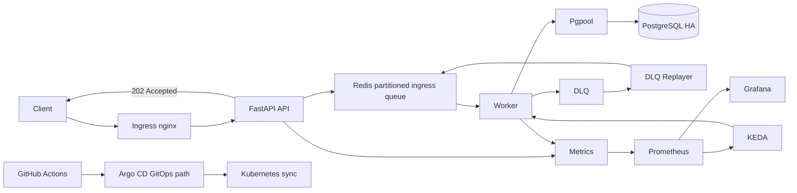

# Event Stream Systems Portfolio

DB 중심의 동기 처리 구조에서 장애가 API까지 전파되고 쓰기 요청을 수락하지 못하는 문제를 줄이기 위해,
request intake와 persistence를 분리한 queue-backed async processing pipeline을 설계하고 검증한 포트폴리오입니다.

API는 event request를 즉시 PostgreSQL에 쓰지 않고 Redis ingress queue에 적재한 뒤 `202 Accepted`를 반환하며, Worker가 queue를 소비해 PostgreSQL HA에 비동기 영속화합니다.

## Architecture


처리 흐름:
- API는 event request를 PostgreSQL에 바로 쓰지 않고 Redis ingress queue에 적재한 뒤 `202 Accepted`를 반환합니다.
- Worker는 queue를 소비해 PostgreSQL HA에 비동기 영속화합니다.
- 실패한 job은 retry 후 DLQ로 이동하고, DLQ Replayer가 복구 조건에서 다시 ingress queue로 재주입합니다.
- Prometheus는 API / Worker metrics를 수집하고, Grafana는 latency, queue depth, replica 변화를 보여줍니다.
- Worker는 CPU가 아니라 KEDA + Prometheus queue depth 기준으로 scale-out합니다.

Design choice: 이 시스템은 최소 latency보다 요청 수락 안정성과 복구 가능성을 우선합니다. Redis queue와 Worker persistence를 거치며 일부 latency를 감수하지만, DB 장애 전파를 줄이고 retry / DLQ / replay 기반 복구 경로를 확보합니다.

## Key Features
- Queue-backed async event intake
- Redis partitioned ingress queue
- PostgreSQL HA + Pgpool
- Redis HA + Sentinel
- Retry / DLQ / DLQ Replayer
- API CPU HPA
- Worker KEDA queue-depth autoscaling
- Prometheus / Grafana observability
- PostgreSQL backup / restore
- Ingress nginx + local self-signed TLS
- Argo CD GitOps sync path
- AWS Terraform IaC extension path

## Verified Scenarios
현재 로컬 `kind` 환경에서 아래 시나리오를 검증했습니다.

- Smoke test
- DB outage and recovery
- Redis complete outage and recovery
- Redis single-node failover
- DLQ flow
- Prometheus alert firing / resolution
- API HPA scaling
- Worker KEDA scaling
- PostgreSQL backup / restore
- Argo CD GitOps sync

상세 결과는 [TEST_RESULTS.md](docs/TEST_RESULTS.md)에 정리했습니다.

## Performance Summary
`k6` 기준 최근 측정 요약입니다.

| 기준 | Accepted requests | API intake avg latency | API intake p95 latency |
| --- | ---: | ---: | ---: |
| Initial | `5434` | `3660ms` | `8175ms` |
| Current | `19528` | `811ms` | `1954ms` |

Latency는 k6 `http_req_duration` 기준으로, event request가 Redis ingress queue에 적재되고 API 응답을 받을 때까지의 intake latency입니다. PostgreSQL persisted 완료까지의 lag는 `messaging_event_persist_lag_seconds`로 별도 관측합니다.

초기 기준 대비:
- 처리 요청 수 약 `259%` 증가
- 평균 응답 시간 약 `78%` 감소
- p95 응답 시간 약 `76%` 감소

중간 개선 과정과 실험별 결과는 [TEST_RESULTS.md](docs/TEST_RESULTS.md)의 `k6 Load Test` 섹션에 정리했습니다.

## Quick Start
Windows PowerShell:

```powershell
powershell -ExecutionPolicy Bypass -File scripts/quick_start_all.ps1
```

Linux:

```bash
bash scripts/quick_start_all.sh
```

Linux에서 DB / Redis 장애 테스트까지 포함하려면:

```bash
RUN_FAILURE_TESTS=true bash scripts/quick_start_all.sh
```

기본 접근 경로:
- API: `http://localhost`
- Grafana: `http://localhost/grafana`
- Prometheus: `http://localhost/prometheus/`

Grafana 기본 계정:
- ID: `admin`
- Password: `1q2w3e4r`

자세한 실행 방법은 [QUICK_START.md](docs/QUICK_START.md)를 참고합니다.

## GitOps / CI
이 저장소는 기존 `kubectl apply` 실행 경로 외에 Argo CD 기반 GitOps 경로를 포함합니다.

- GitOps sync path: `k8s/gitops/overlays/local-ha`
- Argo CD bootstrap scripts:
  - `k8s/scripts/install-argocd.ps1`
  - `k8s/scripts/bootstrap-argocd-app.ps1`
- GitHub Actions CI:
  - Python compile check
  - Docker image build check
  - Kustomize manifest render check

자세한 내용은 [GITOPS.md](docs/GITOPS.md)에 정리했습니다.

## AWS IaC Path
현재 로컬 검증 구조를 AWS로 확장하기 위한 Terraform 골격도 포함되어 있습니다.

포함된 AWS 구성:
- VPC
- EKS
- ECR
- RDS PostgreSQL
- ElastiCache Redis
- Secrets Manager
- optional Route 53 + ACM

현재 AWS IaC는 실제 리소스 운영 배포가 아니라 `terraform plan` 검증 단계입니다. 설계 의도와 구성은 [AWS_IAC_PLAN.md](docs/AWS_IAC_PLAN.md)와 [infra/terraform/README.md](infra/terraform/README.md)에 정리했습니다.

## Current Limits
- HTTPS는 production certificate가 아니라 local self-signed TLS 검증용입니다.
- k6 latency threshold tuning은 계속 개선 과제로 남아 있습니다.
- 멀티 파드 환경에서 stream 단위 event ordering guarantee는 추가 검증 과제입니다.
- Grafana / Prometheus는 데모 확인을 위해 노출되어 있으며 production access control은 별도 과제입니다.
- AWS IaC는 plan 검증 단계이며 실제 EKS 운영 배포까지 검증한 상태는 아닙니다.

## Documentation
- [QUICK_START.md](docs/QUICK_START.md): 실행 가이드
- [ARCHITECTURE.md](docs/ARCHITECTURE.md): 구조와 처리 흐름
- [OPERATIONS.md](docs/OPERATIONS.md): 운영 지침
- [OBSERVABILITY.md](docs/OBSERVABILITY.md): 지표, 대시보드, 병목 해석
- [RELIABILITY_POLICY.md](docs/RELIABILITY_POLICY.md): readiness / degraded / not_ready 정책
- [TEST_RESULTS.md](docs/TEST_RESULTS.md): 검증 결과
- [GITOPS.md](docs/GITOPS.md): Argo CD GitOps
- [AWS_IAC_PLAN.md](docs/AWS_IAC_PLAN.md): AWS 확장 설계
- [PATCH_NOTES.md](docs/PATCH_NOTES.md): 변경 이력
- [REPOSITORY_STRUCTURE.md](docs/REPOSITORY_STRUCTURE.md): 저장소 구조
