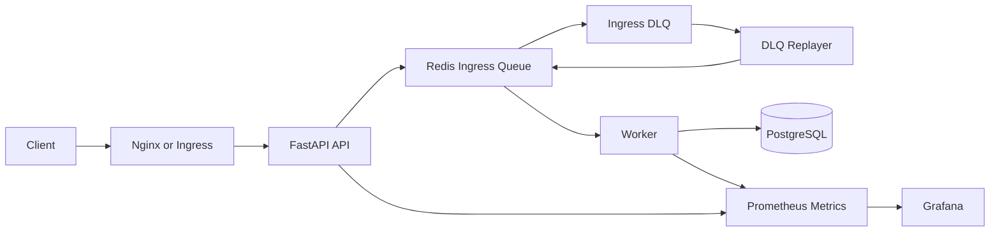

# Messaging Systems Portfolio

## Summary
장애 상황에서도 요청 유실을 줄이고 복구 흐름을 유지하는 메시징 시스템을 목표로 만든 프로젝트입니다.

핵심 포인트:
- Queue 기반 비동기 처리
- DB 장애 시 요청 보존 및 재처리
- Redis 장애 시 상태 노출 및 복구 검증
- DLQ + Replayer 구조
- Prometheus / Grafana 기반 관측
- Kubernetes(kind) 기반 HA 실험

## Prerequisites
필수:
- Docker Desktop 실행 중
- Windows PowerShell

저장소에 포함된 도구:
- `kind` (`tools/kind.exe`)
- `helm` (`tools/helm/windows-amd64/helm.exe`)

로컬에서 사용하는 포트:
- `30080` for API
- `30300` for Grafana
- `9090` for Prometheus when alert validation is enabled

`scripts/quick_start_all.ps1`는 실행 전에 이 포트들이 비어 있는지 확인하고, 충돌이 있으면 배포 전에 중단합니다.

## Architecture


요약 흐름:
- API는 요청을 바로 DB에 쓰지 않고 Redis queue에 적재
- Worker가 비동기로 DB에 영속화
- 실패한 요청은 DLQ로 이동
- DLQ Replayer가 재투입
- Prometheus/Grafana로 상태와 지표를 관측

## What This Project Covers
### Normal Path
- 메시지 요청 수락
- 비동기 영속화
- 읽음 처리 / unread count 조회

### Failure Recovery
- DB down 시 요청 수락 유지 후 복구 시 재처리
- Redis down 시 readiness 변화 및 요청 실패 확인
- 재시도 초과 시 DLQ 이동

### Operations
- health / readiness
- queue depth / worker 처리량 / reconnect / latency 지표
- Alert rule
- k8s 기반 HA 구성 및 failover 실험

## Quick View
기본 검증 시나리오는 아래 스크립트로 한 번에 실행할 수 있습니다.

```powershell
powershell -ExecutionPolicy Bypass -File scripts/quick_start_all.ps1
```

포함 범위:
- 클러스터 재생성
- `metrics-server` 설치
- 이미지 빌드 및 kind load
- HA PostgreSQL / Redis 배포
- 앱 배포
- `http://localhost:30080` readiness 확인
- smoke test
- DB 장애 복구 테스트
- Redis 장애 복구 테스트
- HPA scaling 테스트

부하 테스트는 별도 유지:

```powershell
powershell -ExecutionPolicy Bypass -File scripts/test_k6_load.ps1
```

## Latest Changes
최근 반영된 내용:
- kind host port 매핑 추가 (`30080`, `30300`)
- quick start preflight check 추가
- tool path 해석(`kind`, `helm`) 보강
- readiness / reset / scenario 스크립트 안정화
- 기본 시나리오 일괄 실행 스크립트 개선

자세한 변경 이력:
- [PATCH_NOTES.md](docs/PATCH_NOTES.md)

## Current Limits
- Helm chart 출력이 첫 실행에서 다소 길다
- 외부 진입 구조는 아직 Ingress 중심으로 완전히 정리되지 않았다
- 멀티 파드 환경에서 메시지 순서 보장 검증은 더 필요하다
- `k6`는 실행은 정상이나 현재 latency threshold는 통과하지 못한다

## Service Readiness Checklist
실제 서비스 단계로 가기 전에 남아 있는 주요 작업입니다.

1. 인증 / 인가 추가
   - 로그인, 토큰, 사용자 권한 검증
   - room membership 검증
   - 운영 도구 접근 제어
2. 외부 진입 구조를 `Ingress + TLS` 기준으로 전환
   - `NodePort` 중심 접근 제거
   - API / 운영 도구 공개 범위 분리
   - 도메인 및 HTTPS 처리
3. 운영 안정성 보강
   - 백업 / 복구 전략
   - 로그 수집 및 장애 대응 runbook
   - 배포 / rollback 절차 정리
4. 배포 체계 정리
   - local / staging / prod 환경 분리
   - secret 관리 고도화
   - CI/CD 및 자동 테스트 연결
5. 데이터 정합성 보강
   - 멀티 파드 환경에서 메시지 순서 보장 검증
   - retry / DLQ / replay 정책 명확화
   - idempotency 경계 보강
6. 성능 개선
   - `k6` latency 병목 분석
   - API / Worker / DB / Redis 튜닝
   - 목표 TPS / p95 / p99 기준 정리

## Documents
- 빠른 실행 가이드: [QUICK_START.md](docs/QUICK_START.md)
- 구조와 장애 흐름: [ARCHITECTURE.md](docs/ARCHITECTURE.md)
- 변경 이력: [PATCH_NOTES.md](docs/PATCH_NOTES.md)
- 저장소 구조: [REPOSITORY_STRUCTURE.md](docs/REPOSITORY_STRUCTURE.md)
- 테스트 결과: [TEST_RESULTS.md](docs/TEST_RESULTS.md)

## Suggested Reading Order
1. 이 README에서 전체 구조와 실행 전제 파악
2. [QUICK_START.md](docs/QUICK_START.md)로 실행 방법 확인
3. [ARCHITECTURE.md](docs/ARCHITECTURE.md)에서 장애 흐름과 설계 상세 확인
4. [TEST_RESULTS.md](docs/TEST_RESULTS.md)에서 현재 검증 상태 확인
5. [PATCH_NOTES.md](docs/PATCH_NOTES.md)로 어떤 문제를 어떻게 개선했는지 확인
