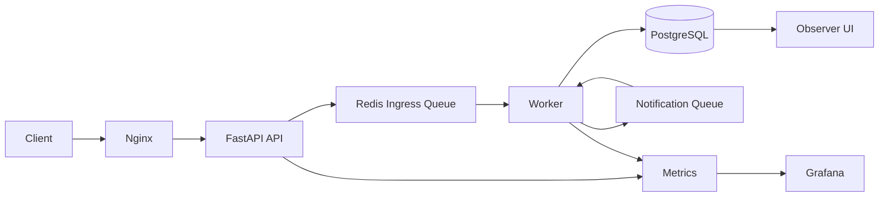
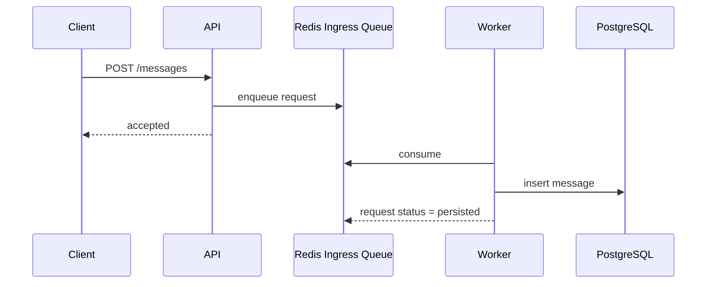
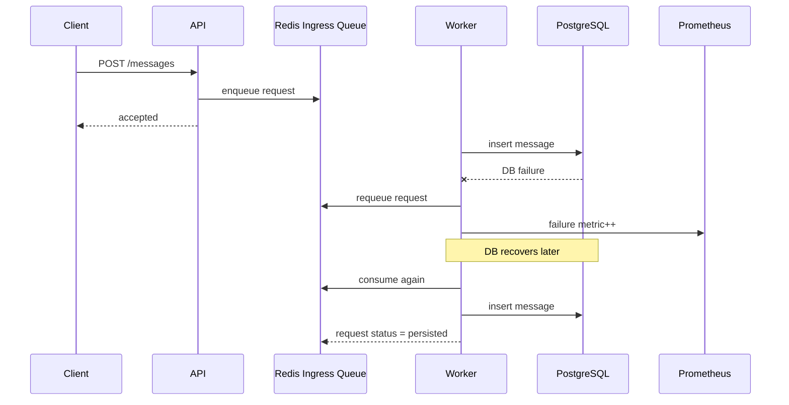

# Messaging Systems Portfolio

대용량 메시징 서비스를 가정하고, 메시지 요청 처리 경로를 어떻게 분리하고, 장애 상황에서 어떻게 보존하고, 어떤 식으로 복구와 관측을 설계할지 보여주기 위해 만든 프로젝트입니다.

단순히 채팅 기능을 구현하는 것보다 아래 질문에 답할 수 있도록 만드는 데 초점을 뒀습니다.

- 메시지 요청을 왜 동기 DB 쓰기로 끝내지 않고 queue와 worker로 분리하는가
- DB가 내려간 동안 들어온 요청을 어떻게 보존할 것인가
- 장애가 났을 때 "복구된다"가 아니라 "왜 장애가 났고 얼마나 걸려 복구됐는가"를 어떻게 관측할 것인가
- 로컬 데모 구조를 `Kubernetes` HA 구조로 어떻게 확장 설명할 것인가

## 설계 의도

이 프로젝트에서 가장 중요하게 둔 판단은 두 가지입니다.

첫째, 메시지 생성 요청은 `queue-first` 로 처리합니다.  
API가 먼저 Redis에 요청을 적재하고, 실제 저장은 worker가 담당합니다. 이렇게 하면 DB가 잠시 내려가더라도 요청 자체를 먼저 보존할 수 있습니다.

둘째, 장애는 "예외 처리"가 아니라 "운영 이벤트"로 봅니다.  
그래서 DB/Redis 재연결, 장애 원인 분류, failover, 복구 시간 측정을 `Prometheus` / `Grafana`로 확인할 수 있도록 구성했습니다.

## 아키텍처


## 요청 처리 흐름

### 정상 흐름


### DB 장애 시 흐름


클라이언트는 `GET /v1/message-requests/{request_id}` 로 최종 상태를 확인할 수 있습니다.

상태는 아래처럼 나뉩니다.

- `accepted`: API가 요청을 정상 수신했고 queue에 적재함
- `queued`: 아직 최종 저장 전
- `persisted`: PostgreSQL 저장 완료
- `failed`: 유효하지 않은 요청이거나 최종 저장 실패

## 구현 범위

- 사용자 생성
- 방 생성 및 멤버 연결
- 메시지 생성
- 메시지 목록 조회
- 읽음 처리 / 안 읽은 수 조회
- `X-Idempotency-Key` 기반 중복 방지
- Redis ingress queue 기반 비동기 저장
- Worker 기반 후처리
- `/health/live`, `/health/ready`
- `/metrics`, `Prometheus`, `Grafana`
- `Observer UI`

## 이 구조를 택한 이유

### 1. API와 저장 경로 분리
메시지 API를 바로 DB 쓰기로 처리하면, DB 상태가 곧바로 사용자 요청 실패로 이어집니다.  
이 프로젝트에서는 API를 요청 수신과 적재에 집중시키고, worker가 저장을 담당하게 해서 쓰기 경로를 분리했습니다.

### 2. 장애 중 요청 보존
메시징 시스템에서는 "장애가 났을 때 실패 응답을 잘 준다"보다 "장애 중에도 요청을 유실하지 않는다"가 더 중요하다고 봤습니다.  
그래서 DB 장애 시에도 요청은 Redis ingress queue에 남고, DB 복구 후 worker가 다시 저장하도록 만들었습니다.

### 3. 중복 요청 처리
네트워크 재시도나 클라이언트 재전송 상황을 고려해서 `X-Idempotency-Key` 를 지원합니다.  
메시지 생성 계열 API에서 흔한 중복 저장 문제를 줄이기 위한 선택입니다.

### 4. 운영 관측
장애를 단순 로그 확인으로 끝내지 않고 메트릭으로 보이게 했습니다.  
특히 DB 장애 원인을 `dns_resolution`, `connection_refused`, `server_closed_connection`, `timeout` 등으로 분류해서 집계하도록 했습니다.

## Observability

현재 `Prometheus` / `Grafana` 에서 아래 항목을 볼 수 있습니다.

- API 요청 수와 지연 시간
- DB reconnect 성공 / 실패 횟수
- DB 장애 원인별 카운트
- Redis reconnect 횟수
- queue depth
- worker 처리 성공 / 실패 / 처리 시간
- component health status

대표 메트릭

- `messaging_db_failure_total{reason="..."}`
- `messaging_db_reconnect_total`
- `messaging_queue_depth`
- `messaging_worker_processed_total`
- `messaging_api_request_latency_seconds`

실제로 운영형으로 더 발전시키려면 아래 지표를 함께 보는 게 적절합니다.

- `DB failover time`
- `DB old primary rejoin time`
- `Redis failover time`
- `Redis old master rejoin time`
- `readiness recovery time`

## 실제 failover 검증

로컬 `kind` 기반 `Kubernetes`에서 `PostgreSQL HA`와 `Redis Sentinel` failover를 실제로 실행했습니다.

### PostgreSQL
- 초기 상태: `postgresql-1` primary, `postgresql-0`, `postgresql-2` standby
- 실험: current primary pod 삭제
- 결과: `postgresql-0` 이 새 primary로 승격
- 실측 failover 시간: 약 `14.91초`
- 기존 primary standby 재합류 시간: 약 `2.48초`

### Redis
- 초기 상태: `messaging-redis-node-0` master, `messaging-redis-node-1` replica
- 실험: current master pod 삭제
- 결과: `messaging-redis-node-1` 이 새 master로 승격
- 실측 failover 시간: 약 `24.13초`
- 기존 master replica 재합류 시간: 약 `2.81초`

## 로컬 실행
```powershell
Copy-Item .env.example .env
docker compose up --build -d
```

접속 주소

- Frontend: `http://localhost`
- Swagger: `http://localhost/api/docs`
- Observer UI: `http://localhost/observer/`
- Readiness: `http://localhost/api/health/ready`
- API Metrics: `http://localhost/api/metrics`
- Prometheus: `http://localhost:9090`
- Grafana: `http://localhost:3000`

## 로컬 Kubernetes

로컬 `Kubernetes` 실습도 가능합니다. 기본 데모는 `Docker Compose` 이고, HA 실험은 별도 경로로 구성했습니다.

- `k8s/scripts/setup-kind.ps1`
- `k8s/scripts/install-ha.ps1`

관련 문서

- [k8s/README.md](/C:/Users/rhwkd/VSC/Cloud_portfolio/k8s/README.md)
- [setup-kind.ps1](/C:/Users/rhwkd/VSC/Cloud_portfolio/k8s/scripts/setup-kind.ps1)
- [install-ha.ps1](/C:/Users/rhwkd/VSC/Cloud_portfolio/k8s/scripts/install-ha.ps1)

## 한계와 다음 단계

현재 구조는 메시지 처리 경로와 장애 대응 흐름을 설명하는 데 초점을 두고 있습니다.  
아래 항목은 아직 더 발전시킬 여지가 있습니다.

- WebSocket / SSE 기반 실시간 push
- DLQ와 retry 정책 고도화
- 부하 테스트와 처리량 수치화
- `Grafana` 대시보드 고도화
- AWS 기준 `SQS -> Worker -> RDS/Aurora` 구성으로의 확장 정리

## 요약

이 프로젝트는 메시징 시스템에서 자주 나오는 문제를 실제로 손에 잡히는 수준으로 정리하려고 만든 포트폴리오입니다.

- 요청을 queue-first 로 처리한 이유
- DB 장애 중 요청을 어떻게 보존하는지
- 장애 원인을 어떻게 분류하고 관측하는지
- failover가 실제로 일어났을 때 얼마나 걸려 복구되는지

이 네 가지를 코드와 실험 결과로 같이 보여주는 것이 목표였습니다.
