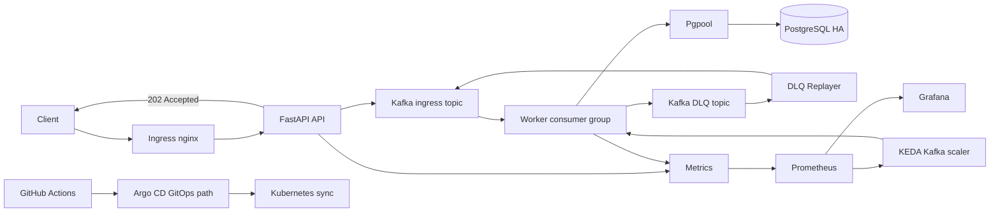
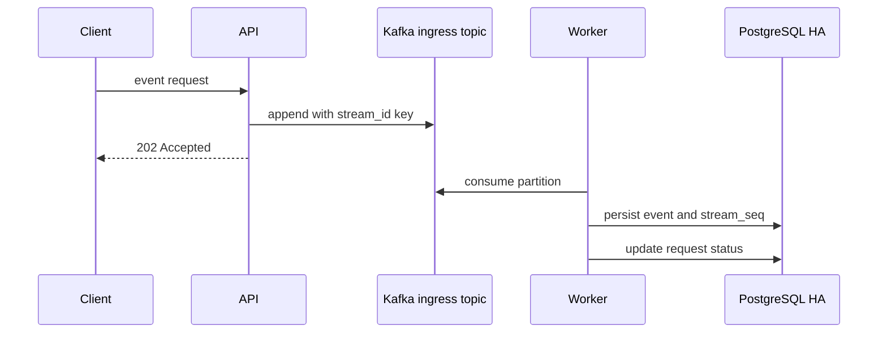
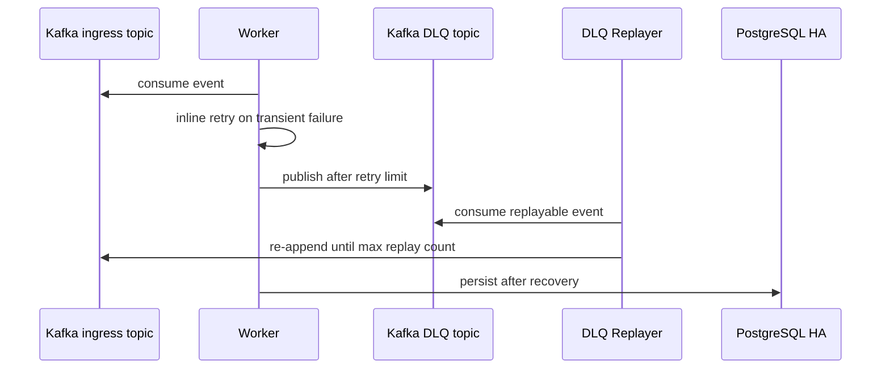

# Kafka 이벤트 스트림 시스템 포트폴리오

DB 중심 동기 처리 구조에서 발생하는 장애 전파와 write path 병목을 줄이기 위해, Kafka 기반 event log를 request intake 경로에 두고 persistence를 Worker consumer group으로 분리한 이벤트 처리 파이프라인입니다.

API는 event request를 PostgreSQL에 직접 쓰지 않고 Kafka ingress topic에 append한 뒤 `202 Accepted`를 반환합니다. Worker는 Kafka consumer group으로 partition을 소비해 PostgreSQL HA에 비동기 영속화하고, 실패 이벤트는 retry 후 Kafka DLQ topic과 DLQ Replayer를 통해 복구합니다.

## 아키텍처


정상 event 흐름:



장애 / DLQ 흐름:



처리 흐름:
- API는 event request를 Kafka ingress topic에 append하고 `202 Accepted`를 반환합니다.
- Kafka message key는 `stream_id`로 두어 같은 stream 이벤트의 ordering boundary를 partition 단위로 유지합니다.
- Worker consumer group은 Kafka partition을 나눠 소비하고 PostgreSQL HA에 영속화합니다.
- 실패한 job은 retry 후 Kafka DLQ topic으로 이동하고, DLQ Replayer가 복구 조건에서 ingress topic으로 재주입합니다.
- Prometheus는 API / Worker metrics를 수집하고, Grafana는 latency, consumer lag, replica 변화를 보여줍니다.
- Worker는 CPU가 아니라 KEDA Kafka scaler의 consumer lag 기준으로 scale-out합니다.

설계 선택: 이 시스템은 최소 latency보다 요청 수락 안정성과 복구 가능성을 우선합니다. Kafka event log와 Worker persistence를 거치며 일부 latency를 감수하지만, DB 장애 전파를 줄이고 partition ordering, consumer group scale-out, DLQ replay 기반 복구 경로를 확보합니다.

## 운영 포인트
- API는 Kafka append 중심의 빠른 intake path를 유지하고, PostgreSQL persistence는 Worker가 비동기로 처리합니다.
- 같은 stream은 Kafka key와 Worker inline retry로 순서를 지키며, 실패 event는 DLQ와 replay guard로 격리합니다.
- Prometheus alert, Grafana dashboard, Runbook, incident signal script가 같은 운영 신호를 바라봅니다.
- DLQ 운영자는 `GET /v1/dlq/ingress/summary`로 `by_reason`, replayable, blocked, stream 분포를 먼저 확인합니다.
- 핵심 운영 API는 FastAPI `response_model`, `/docs`, `/openapi.json`, API contract test로 응답 형태를 고정합니다.

## 핵심 기능
- Kafka-backed async event intake
- Partition key 기반 stream ordering boundary
- Worker consumer group processing
- Kafka DLQ topic / DLQ Replayer
- DLQ replay count guard
- Kafka consumer lag based KEDA autoscaling
- PostgreSQL HA + Pgpool
- API CPU HPA
- Prometheus / Grafana observability
- PostgreSQL backup / restore
- Ingress nginx + local self-signed TLS
- Runtime secret separation
- Argo CD GitOps sync path
- AWS Terraform IaC extension path

## 검증한 시나리오
로컬 `kind` 환경에서 아래 시나리오를 검증했습니다. 최신 수치는 [TEST_RESULTS.md](docs/TEST_RESULTS.md)에 기록합니다.

- Kafka mode smoke test
- Kafka ingress topic append / Worker consume / PostgreSQL persisted
- Kafka DLQ topic listing through `GET /v1/dlq/ingress`
- DLQ operating summary through `GET /v1/dlq/ingress/summary`
- API contract validation for auth, stream membership, request status, unread count, and DLQ summary
- KEDA Kafka scaler readiness and external metric lookup
- API HPA scaling
- PostgreSQL backup / restore
- Argo CD GitOps sync

상세 결과와 Kafka-native 설계 trade-off는 [TEST_RESULTS.md](docs/TEST_RESULTS.md)와 [KAFKA_EXPERIMENT.md](docs/KAFKA_EXPERIMENT.md)에 정리했습니다.

## 성능 요약
Kafka 포트폴리오의 성능 기준은 기능 테스트와 분리해서 봅니다. 기능 검증은 `quick_start_all.ps1`에서 확인하고, 성능 기준선은 아래 suite로 측정합니다.

측정 / 재현 환경:

| 항목 | 값 |
| --- | --- |
| Host CPU | AMD Ryzen 5 5600, 6 cores / 12 threads, max 3.5GHz |
| Host memory | 약 32GiB |
| Docker Desktop 노출 사양 | 12 CPU, 약 15.6GiB memory |
| Kubernetes node | kind single-node, `messaging-ha-control-plane` |
| Kubernetes allocatable | 12 CPU, `16338128Ki` memory |
| Pod resource requests | 5.1 CPU, `6768Mi` memory |
| Pod resource limits | 13.725 CPU, `14782Mi` memory |

```powershell
powershell -ExecutionPolicy Bypass -File scripts/run_kafka_performance_suite.ps1
```

이 suite는 Kafka-native 구조를 기준으로 아래 값을 함께 확인합니다.

| 기준 | 결과 | 해석 |
| --- | --- | --- |
| Kafka smoke | 통과 | event accepted -> Kafka ingress topic -> Worker -> PostgreSQL persisted |
| Kafka DLQ listing | 통과 | `GET /v1/dlq/ingress`로 DLQ topic 최근 메시지 조회 |
| DLQ operating summary | 통과 | `GET /v1/dlq/ingress/summary`로 reason / replayable / blocked / stream 분포 조회 |
| 같은 stream 순차 보증 | 통과 | 100개 순차 이벤트, `stream_seq 1..100` 및 body 순서 일치 |
| Kafka 비동기 영속화 latency | 통과 | 50 events, accept avg `53.34ms`, accept p95 `63.59ms`, persist p95 `7.67ms` |
| Kafka intake 부하 | 통과 | 100 VU / 30s, `31676` requests, `0.00%` error, avg `44.13ms`, p95 `80.65ms`, p99 `103.57ms` |
| HPA와 metrics 점검 | 통과 | 부하 중 API HPA 6 replicas, Worker KEDA 4 replicas까지 증가 |

Latency는 k6 `http_req_duration` 기준으로, event request가 intake path에서 수락되고 API 응답을 받을 때까지의 시간입니다. PostgreSQL persisted 완료까지의 lag는 `messaging_event_persist_lag_seconds`로 별도 관측합니다.
현재 Kafka intake load baseline은 `X-Idempotency-Key`를 보내지 않는 Kafka append 중심 경로입니다. Idempotency header를 켜면 PostgreSQL state path가 다시 hot path가 되어 별도 병목으로 봅니다.

Kafka 실험의 핵심 결과:
- Kafka ingress / DLQ transport는 동작했습니다.
- DLQ topic listing과 replay 흐름도 확인했습니다.
- API intake path는 Kafka append 중심으로 동작합니다.
- Worker가 persistence 시점에 sequence를 배정하고 request status를 갱신합니다.

성능 suite 결과는 실행 후 `results/kafka-performance/latest.txt`에 남습니다. Kafka 설계 검증 내용은 [TEST_RESULTS.md](docs/TEST_RESULTS.md)와 [KAFKA_EXPERIMENT.md](docs/KAFKA_EXPERIMENT.md)에 정리했습니다.

## 빠른 실행
Windows PowerShell:

```powershell
powershell -ExecutionPolicy Bypass -File scripts/quick_start_all.ps1
```

Linux:

```bash
bash scripts/quick_start_all.sh
```

Kafka runtime:

```powershell
kubectl apply -f k8s/gitops/base/kafka-ha.yaml
kubectl rollout status statefulset/kafka -n messaging-app --timeout=600s
kubectl wait --for=condition=complete job/kafka-topic-bootstrap -n messaging-app --timeout=300s
kubectl -n messaging-app set env deployment/api KAFKA_BOOTSTRAP_SERVERS=kafka.messaging-app.svc.cluster.local:9092
kubectl -n messaging-app set env deployment/worker KAFKA_BOOTSTRAP_SERVERS=kafka.messaging-app.svc.cluster.local:9092
kubectl -n messaging-app set env deployment/dlq-replayer KAFKA_BOOTSTRAP_SERVERS=kafka.messaging-app.svc.cluster.local:9092
```

기본 접근 경로:
- API: `http://localhost`
- Grafana: `http://localhost/grafana`
- Prometheus: `http://localhost/prometheus/`

Grafana 기본 계정:
- ID: `admin`
- 비밀번호: `1q2w3e4r`

자세한 실행 방법은 [QUICK_START.md](docs/QUICK_START.md)를 참고합니다.

## GitOps / CI
이 저장소는 직접 배포 경로와 Argo CD 기반 GitOps 경로를 함께 포함합니다.

- GitOps sync path: `k8s/gitops/overlays/local-ha`
- Argo CD bootstrap scripts:
  - `k8s/scripts/install-argocd.ps1`
  - `k8s/scripts/bootstrap-argocd-app.ps1`
- GitHub Actions CI:
  - Python compile check
  - Docker image build check
  - Kustomize manifest render check

자세한 내용은 [GITOPS.md](docs/GITOPS.md)에 정리했습니다.

## AWS IaC 경로
현재 로컬 검증 구조를 AWS로 확장하기 위한 Terraform 골격도 포함되어 있습니다.

포함된 AWS 구성:
- VPC
- EKS
- ECR
- RDS PostgreSQL
- managed messaging path 검토
- Secrets Manager
- optional Route 53 + ACM

현재 AWS IaC는 실제 리소스 운영 배포가 아니라 `terraform plan` 검증 단계입니다. 설계 의도와 구성은 [AWS_IAC_PLAN.md](docs/AWS_IAC_PLAN.md)와 [infra/terraform/README.md](infra/terraform/README.md)에 정리했습니다.

## 운영 메모
- Kafka broker는 로컬 기준 3-broker KRaft StatefulSet으로 실행합니다.
- 최신 Kafka intake baseline은 100 VU / 30초 기준 `31676` requests, error `0.00%`, p95 `80.65ms`, p99 `103.57ms`입니다.
- HTTPS는 production certificate가 아니라 local self-signed TLS 검증용입니다.
- Grafana / Prometheus는 로컬 포트폴리오 확인을 위해 ingress로 노출합니다.
- AWS IaC 문서는 운영형 확장 설계를 설명합니다.

## 문서
- [QUICK_START.md](docs/QUICK_START.md): 실행 가이드
- [ARCHITECTURE.md](docs/ARCHITECTURE.md): 구조와 처리 흐름
- [KAFKA_EXPERIMENT.md](docs/KAFKA_EXPERIMENT.md): Kafka 설계와 검증 기록
- [OPERATIONS.md](docs/OPERATIONS.md): 운영 지침
- [RUNBOOK.md](docs/RUNBOOK.md): 장애 대응 절차
- [OBSERVABILITY.md](docs/OBSERVABILITY.md): 지표, 대시보드, 병목 해석
- [RELIABILITY_POLICY.md](docs/RELIABILITY_POLICY.md): readiness / degraded / not_ready 정책
- [TEST_RESULTS.md](docs/TEST_RESULTS.md): 검증 결과
- [GITOPS.md](docs/GITOPS.md): Argo CD GitOps
- [AWS_IAC_PLAN.md](docs/AWS_IAC_PLAN.md): AWS 확장 설계
- [PATCH_NOTES.md](docs/PATCH_NOTES.md): 변경 이력
- [REPOSITORY_STRUCTURE.md](docs/REPOSITORY_STRUCTURE.md): 저장소 구조
