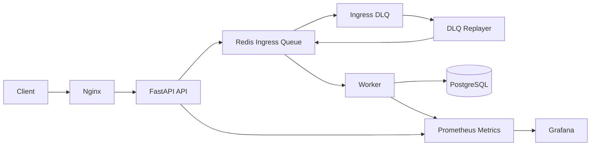

## Summary

이 프로젝트는 서비스 구현이 아니라 운영 가능한 시스템을 설계하고, 장애 상황에서도 유지/복구할 수 있는 능력을 보여주기 위함.

## Key Capabilities

* Queue 기반 비동기 처리 (DB 장애 시 요청 유실 방지)
* DLQ + 재처리 구조 (운영 복구 가능)
* Prometheus / Grafana 기반 모니터링
* Nginx Reverse Proxy 기반 트래픽 제어
* 장애 감지 및 자동 복구 스크립트
* EC2 기반 실제 운영 환경 배포 가능

---

## Operational Focus

이 시스템은 “기능 구현”이 아니라 운영 관점에서 설계되었습니다.

### 장애 대응

* Redis 장애 → 요청 수락 중단 및 상태 노출
* DB 장애 → 요청 보존 후 재처리
* Worker 장애 → queue depth 기반 감지

### 자동 복구

* `health_check.sh` → 상태 점검
* `restart.sh` → 비정상 서비스 재시작
* `deploy.sh` → 무중단 재배포

### 모니터링 기반 대응

* queue depth 증가 → 처리 지연 감지
* error rate 증가 → 장애 탐지
* latency 증가 → 성능 문제 분석

---

## Architecture (Summary)

* API: 요청 수락 및 Queue 전달
* Queue: 요청 버퍼링 및 장애 대응
* Worker: 비동기 처리 및 DB 반영
* DLQ: 실패 요청 보존 및 재처리
* Monitoring: Prometheus + Grafana

---

## Request Flow

### Normal Flow

* API는 요청을 즉시 처리하지 않고 Queue에 저장
* Worker가 비동기적으로 DB에 반영
* Client는 상태를 조회하여 최종 결과 확인

### Failure Flow (DB Down)

* API는 요청을 계속 수락
* Worker는 재시도 및 DLQ 적재
* DB 복구 후 재처리 수행

---

## Failure Handling

### Redis Down

* 요청 수락 불가
* 상태 API를 통해 장애 노출
* Redis 재시작 후 정상화

### DB Down

* 요청은 Queue에 보존
* Worker 재시도 수행
* 재시도 초과 시 DLQ 이동

### Worker Crash

* Queue 적체 증가
* restart 스크립트로 복구

---

## Recovery Procedures

1. 장애 감지 (Monitoring / Health Check)
2. 장애 도메인 식별 (API / Redis / DB / Worker)
3. 서비스 재시작 (`restart.sh`)
4. 상태 확인 (`health_check.sh`)
5. DLQ 및 Queue 상태 확인

---

## Observability

주요 모니터링 항목:

* API latency / request count
* Queue depth
* Worker 처리 성공/실패율
* DB/Redis reconnect 횟수

대표 메트릭:

* `messaging_queue_depth`
* `messaging_worker_processed_total`
* `messaging_db_failure_total`

---

## Automation Scripts

운영 자동화를 위한 스크립트:

* `health_check.sh` → 상태 점검
* `restart.sh` → 장애 복구
* `deploy.sh` → 배포 자동화
* `log_cleanup.sh` → 로그 관리

---

## Load Testing

k6 기반 부하 테스트:

* 100 / 500 / 1000 동시 사용자 시뮬레이션
* latency / error rate 측정

### Latest k6 Run Result (2026-04-09)

테스트 조건:
* Base URL: `http://localhost/api`
* Stage duration: `20s` (100 -> 500 -> 1000 concurrent users)

실측 결과:
* Total HTTP requests: `252,447`
* Error rate: `95.57%`
* Latency avg: `66.96ms`
* Latency p95: `222.34ms`
* Latency p99: `0.00ms` (실패 요청 비중이 매우 높아 왜곡 가능)

결론:
* 현재 로컬 단일 구성에서는 1000 동시 사용자 구간에서 연결 거부/EOF가 다수 발생하여 안정적인 처리 한계를 초과함.
* 결과 아티팩트는 루트 경로 `k6-summary.txt`, `k6-summary.json`에 저장됨.

### k6 Single Profile Result (500 Concurrent, 2026-04-09)

테스트 조건:
* Base URL: `http://localhost/api`
* Profile: `single500` (`K6_PROFILE=single500`)
* Stage duration: `20s` (500 concurrent users 고정)

실측 결과:
* Total HTTP requests: `68,782`
* Error rate: `95.51%`
* Latency avg: `94.20ms`
* Latency p95: `95.69ms`
* Latency p99: `0.00ms` (실패 요청 비중이 매우 높아 왜곡 가능)

해석:
* 500 동시 사용자 단독 테스트에서도 연결 거부/EOF가 대량 발생하여, 현재 로컬 단일 노드 구성의 처리 한계가 확인됨.
* 병목 구간 분석은 `k6-summary.txt`, `k6-summary.json` 및 API/Nginx 로그를 함께 확인하는 것을 권장.

---

## Deployment (AWS EC2)

* Docker Compose 기반 배포
* Nginx → API Reverse Proxy
* Worker 분리 실행
* RDS 연동 가능 구조

---

## What This Demonstrates

이 프로젝트를 통해 다음을 설명할 수 있습니다:

* 장애 상황에서 데이터 유실을 방지하는 방법
* Queue 기반 아키텍처의 필요성
* 운영 중 장애 탐지 및 복구 절차
* 트래픽 증가 상황에서의 대응 전략

---
