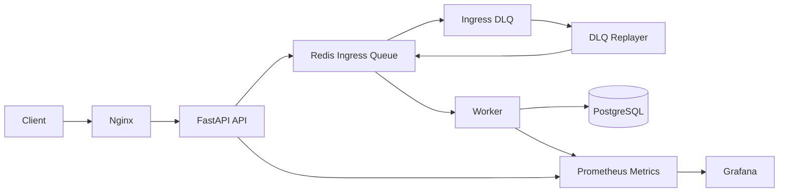

# Messaging Systems Portfolio

## Summary
이 프로젝트는 기능 구현 자체보다, 운영 가능한 메시징 시스템을 설계하고 장애 상황에서 유지/복구하는 능력을 보여주기 위한 포트폴리오입니다.

## Key Capabilities
- Queue 기반 비동기 처리 (DB 장애 시 요청 유실 방지)
- DLQ + 재처리 구조
- Prometheus / Grafana 모니터링
- Nginx Reverse Proxy 기반 트래픽 제어
- 장애 감지 및 자동 복구 스크립트
- EC2 기반 배포 확장 가능

---

## Operational Focus
### 장애 대응
- Redis 장애: 요청 수락 중단 및 상태 노출
- DB 장애: 요청 보존 후 재시도/재처리
- Worker 장애: queue depth 기반 감지

### 자동 복구
- `health_check.sh`: 상태 점검
- `restart.sh`: 비정상 서비스 재시작
- `deploy.sh`: 재배포 자동화 (코드 업데이트 + 컨테이너 재기동)

### 모니터링 기반 대응
- queue depth 증가: 처리 지연 감지
- error rate 증가: 장애 탐지
- latency 증가: 성능 문제 분석

---

## Architecture (Summary)
- API: 요청 수락 및 Queue 전달
- Queue: 요청 버퍼링
- Worker: 비동기 처리 및 DB 반영
- DLQ: 실패 요청 보존 및 재처리
- Monitoring: Prometheus + Grafana

---

## Request Flow
### Normal Flow
- API는 요청을 즉시 DB에 쓰지 않고 Queue에 적재
- Worker가 비동기로 DB 반영
- Client는 상태 조회로 최종 결과 확인

### Failure Flow (DB Down)
- API는 요청 수락 지속
- Worker는 재시도 후 필요 시 DLQ 적재
- DB 복구 후 재처리

---

## Failure Handling
### Redis Down
- 신규 요청 수락 불가
- 상태 API로 장애 노출
- Redis 복구 후 정상화

### DB Down
- 요청은 Queue에 보존
- Worker 재시도 수행
- 재시도 초과 시 DLQ 이동

### Worker Crash
- Queue 적체 증가
- `restart.sh`로 복구

---

## Recovery Procedures
1. 장애 감지 (Monitoring / Health Check)
2. 장애 도메인 식별 (API / Redis / DB / Worker)
3. 서비스 재시작 (`restart.sh`)
4. 상태 재확인 (`health_check.sh`)
5. DLQ/Queue 적체 확인

---

## Observability
주요 항목:
- API latency / request count
- Queue depth
- Worker 처리 성공/실패율
- DB/Redis reconnect 횟수

대표 메트릭:
- `messaging_queue_depth`
- `messaging_worker_processed_total`
- `messaging_db_failure_total`

---

## Automation Scripts
- `health_check.sh`: 상태 점검
- `restart.sh`: 장애 복구
- `deploy.sh`: 배포 자동화
- `log_cleanup.sh`: 로그 정리

---

## Load Testing
k6 기반 부하 테스트:
- 100 / 500 / 1000 동시 사용자 시뮬레이션
- latency / error rate 측정

### Latest k6 Run Result (2026-04-09)
테스트 조건:
- Base URL: `http://localhost/api`
- Stage duration: `20s` (100 -> 500 -> 1000 concurrent users)

실측 결과:
- Total HTTP requests: `252,447`
- Error rate: `95.57%`
- Latency avg: `66.96ms`
- Latency p95: `222.34ms`
- Latency p99: `0.00ms` (실패 요청 비중이 높아 왜곡 가능)

해석:
- 1000 동접 구간에서 연결 거부/EOF가 다수 발생
- 현재 로컬 단일 구성의 처리 한계를 초과

### k6 Single Profile Result (500 Concurrent, 2026-04-09)
테스트 조건:
- Base URL: `http://localhost/api`
- Profile: `single500` (`K6_PROFILE=single500`)
- Stage duration: `20s` (500 concurrent users 고정)

실측 결과:
- Total HTTP requests: `68,782`
- Error rate: `95.51%`
- Latency avg: `94.20ms`
- Latency p95: `95.69ms`
- Latency p99: `0.00ms` (실패 요청 비중이 높아 왜곡 가능)

해석:
- 500 동접 단독 테스트에서도 연결 거부/EOF가 대량 발생
- 병목 분석은 `k6-summary.txt`, `k6-summary.json`, API/Nginx 로그를 함께 확인 권장

---

## Validation Scope
현재 결과는 로컬 Docker 단일 노드 환경 기준입니다.

AWS 실환경에서 별도 검증이 필요한 항목:
- ALB/NLB 경로 포함 네트워크 안정성
- 다중 API 인스턴스 수평 확장 시 처리량/지연
- 오토스케일 및 장애 조치 포함 운영 시나리오

따라서 본 문서의 k6 결과는 로컬 한계 확인용으로 해석해야 합니다.

---

## Deployment (AWS EC2)
- Docker Compose 기반 배포
- Nginx -> API Reverse Proxy
- Worker 분리 실행
- RDS 연동 가능 구조

---

## What This Demonstrates
- 장애 상황에서 데이터 유실을 줄이는 설계
- Queue 기반 아키텍처의 운영적 장점
- 장애 탐지 및 복구 절차 정립
- 트래픽 증가 시 병목을 확인하고 개선 포인트를 도출하는 과정

---
