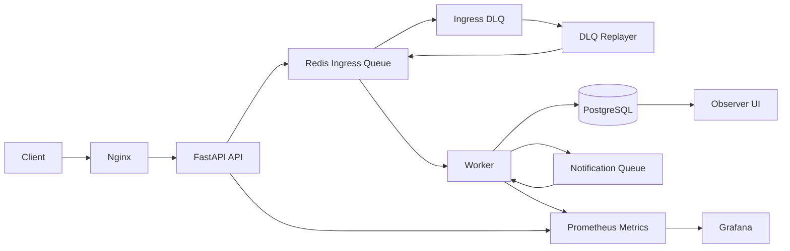
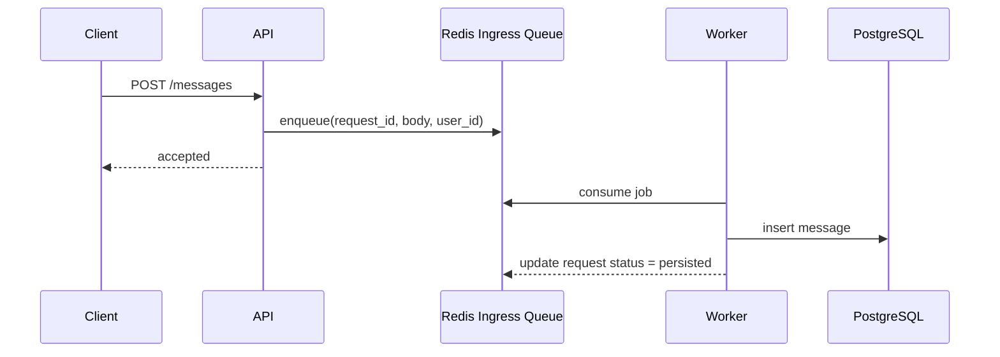
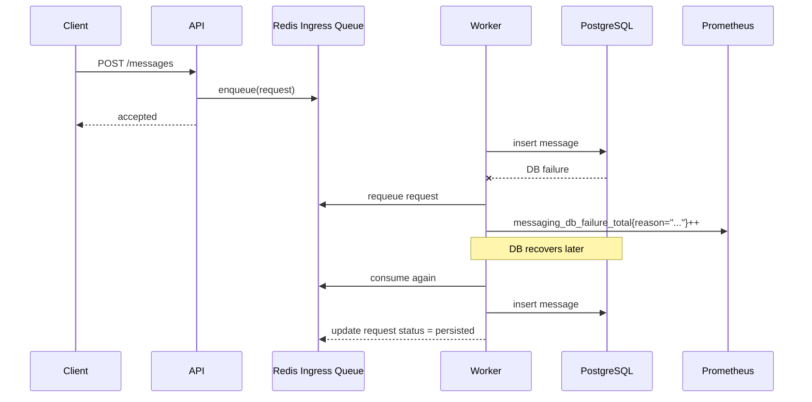

# Messaging Systems Portfolio

라인, 카카오 같은 대용량 메시징 서비스 조직을 목표로 만든 서버 / 클라우드 / DevOps 포트폴리오입니다.  
핵심은 "채팅 기능을 만들었다"가 아니라, "메시지 요청을 운영 가능한 구조로 받고, 장애 상황에서도 보존하고, 관측할 수 있다"를 보여주는 데 있습니다.

## What This Shows
- `queue-first` 메시지 처리 구조
- `FastAPI + PostgreSQL + Redis + Worker` 분리
- DB 장애 시 요청 보존 및 재처리
- Prometheus / Grafana 기반 관측
- 로컬 구성에서 시작해 Kubernetes HA 설명까지 가능한 구조

## Architecture


## Request Flow

### 1. Normal Request


### 2. When DB Is Down


### 3. What The Client Sees
- Immediate response: `accepted`
- Intermediate state: `queued`
- Final success state: `persisted`
- Final failure state: `failed`
- Retry exhausted state: `failed_dlq`

Client는 `GET /v1/message-requests/{request_id}` 로 최종 상태를 조회할 수 있습니다.
운영 시 `GET /v1/dlq/ingress` 로 DLQ 항목을 조회할 수 있습니다.

## Ordering Model
- 순서 보장은 전역(global)이 아니라 `room` 단위로 설계합니다.
- API는 메시지 수락 시 room별 `room_seq` 를 부여합니다.
- Worker는 `room_seq` 기반으로 방 내부 순서를 검증해 DB에 반영합니다.
- 룸 내부 순서 gap이 감지되면 즉시 실패시키지 않고 재큐잉/재시도 후 처리합니다.

## Why Queue-First
- API가 DB에 직접 의존하지 않아도 요청을 먼저 보존할 수 있습니다.
- DB 장애 중에도 요청 유실 없이 재처리 흐름을 설명할 수 있습니다.
- AWS 운영 환경에서는 같은 패턴을 `SQS -> Worker -> RDS/Aurora` 로 확장해 설명할 수 있습니다.

## Implemented
- 사용자 생성
- 방 생성 및 멤버 연결
- 메시지 생성
- 메시지 목록 조회
- 읽음 처리 / 안 읽은 수 조회
- `X-Idempotency-Key` 기반 중복 방지
- Redis ingress queue 기반 비동기 저장
- room 파티션 큐(`message_ingress:pN`) 기반 처리
- `room_seq` 기반 방 내부 순서 보장
- Worker 기반 후처리
- 재시도(backoff) + DLQ(`message_ingress_dlq`)
- DLQ 재처리 워커(`dlq_replayer`)
- DLQ 조회 API (`GET /v1/dlq/ingress`)
- `/health/live`, `/health/ready`
- `/metrics`, Prometheus, Grafana
- Observer UI

## Observability
현재 Prometheus / Grafana에서 아래를 볼 수 있습니다.

- API request count / latency
- DB reconnect success / failure
- DB failure reason count
- Redis reconnect count
- queue depth
- worker success / failure / processing time
- component health status

대표 메트릭:
- `messaging_db_failure_total{reason="..."}`
- `messaging_db_reconnect_total`
- `messaging_queue_depth`
- `messaging_worker_processed_total`
- `messaging_api_request_latency_seconds`

## HA Extension
로컬은 빠른 검증용 단일 인스턴스 구조입니다.  
Kubernetes 확장 시에는 아래 흐름으로 설명합니다.

- PostgreSQL: `primary 1 + replicas 2`
- Redis: `master 1 + replicas 2`
- quorum 기반 failover
- Prometheus / Grafana / kube-state-metrics 기반 장애 원인 관측

관련 문서:
- [k8s/README.md](/C:/Users/rhwkd/VSC/Cloud_portfolio/k8s/README.md)
- [postgresql-ha-values.yaml](/C:/Users/rhwkd/VSC/Cloud_portfolio/k8s/values/postgresql-ha-values.yaml)
- [redis-ha-values.yaml](/C:/Users/rhwkd/VSC/Cloud_portfolio/k8s/values/redis-ha-values.yaml)

## Local Run
```powershell
Copy-Item .env.example .env
docker compose up --build -d
```

## Failure Test Scripts
아래 스크립트로 장애 복구 시나리오를 로컬에서 재현할 수 있습니다.

```powershell
powershell -ExecutionPolicy Bypass -File scripts/smoke_test.ps1
powershell -ExecutionPolicy Bypass -File scripts/test_db_down.ps1
powershell -ExecutionPolicy Bypass -File scripts/test_redis_down.ps1
powershell -ExecutionPolicy Bypass -File scripts/test_dlq_flow.ps1
```

접속 주소:
- Frontend: `http://localhost`
- Swagger: `http://localhost/api/docs`
- Observer: `http://localhost/observer/`
- Readiness: `http://localhost/api/health/ready`
- API Metrics: `http://localhost/api/metrics`
- Prometheus: `http://localhost:9090`
- Grafana: `http://localhost:3000`
