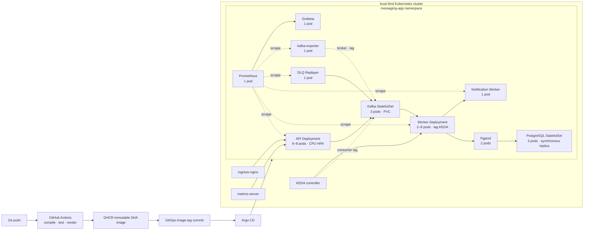

# Kubernetes 기반 이벤트 처리 운영 플랫폼

Kubernetes & GitOps Operations Platform for an Event-Processing Workload

이 포트폴리오는 Kubernetes 위에서 workload를 배포하고 확장하며 관측·복구하는 DevOps·플랫폼 엔지니어링 프로젝트입니다. 직접 만든 **Kafka 기반 고신뢰 이벤트 처리 시스템**(`Reliable Event Processing System`)은 운영 설계를 검증하기 위한 workload입니다. Kafka는 API와 Worker 사이의 비동기 buffer와 scaling signal을 제공합니다.

This project demonstrates Kubernetes workload design, GitOps delivery, autoscaling, observability, failure recovery, and restore validation. The order lifecycle is a reference scenario built on the generic event contract.

## 핵심 요약 / Executive Summary

| 항목 | 현재 구현과 검증 범위 |
| --- | --- |
| 지원 방향 | DevOps / Platform / Cloud Operations |
| Kubernetes 운영 | StatefulSet·Deployment·Job, probes, HPA·KEDA, Argo CD sync wave, `API → Kafka → Worker → PostgreSQL` |
| 관측·복구 | Prometheus·Grafana, lag·replica·persistence·restore 지표, DB outage·ordering·backup/restore 검증 |
| Cloud boundary | EKS·MSK·RDS·ECR 중심 Terraform migration blueprint; AWS `plan/apply`와 실제 배포 증거 없음 |

현재 상태 — 2026-07-27:

| 대상 | 확인된 버전·상태 | 증거 경계 |
| --- | --- | --- |
| `master` source | UI `2.0.0`, API `2.0.0`, tests `365 passed` | generic v2·`202` source와 local test |
| local `dev-kafka` runtime | API `2.0.0`, image `9349ba9` | 2026-07-21 cache ready·hydrated, Argo `Synced / Healthy`, lag `0` |
| public demo-lite runtime | UI `2.1.0`, API `2.0.0` | 2026-07-27 live generic v2·`202`; Worker `1→2`, peak lag `828` |
| `demo-dev` candidate | UI `2.3.0`, API `2.0.0`, tests `368 passed` | 저사양 source·test 완료, public deployment 미확인 |

## Kubernetes 설계 / Kubernetes Architecture


```mermaid
flowchart LR
    Git[Git push] --> CI[GitHub Actions<br/>compile · test · render]
    CI --> Image[GHCR immutable SHA image]
    Image --> Tag[GitOps image-tag commit]
    Tag --> Argo[Argo CD]

    subgraph Cluster[local kind Kubernetes cluster]
        Ingress[ingress-nginx]
        Metrics[metrics-server]
        KEDA[KEDA controller]

        subgraph App[messaging-app namespace]
            API[API Deployment<br/>6–8 pods · CPU HPA]
            Kafka[Kafka StatefulSet<br/>3 pods · PVC]
            Worker[Worker Deployment<br/>2–8 pods · lag KEDA]
            Notify[Notification Worker<br/>1 pod]
            DLQ[DLQ Replayer<br/>1 pod]
            Pool[Pgpool<br/>2 pods]
            DB[PostgreSQL StatefulSet<br/>3 pods · synchronous replica]
            Exporter[kafka-exporter<br/>1 pod]
            Prom[Prometheus<br/>1 pod]
            Grafana[Grafana<br/>1 pod]
        end

        Ingress --> API
        API --> Kafka
        Kafka --> Worker
        Worker --> Pool --> DB
        Worker --> Notify
        DLQ --> Kafka
        Metrics --> API
        KEDA -. consumer lag .-> Kafka
        KEDA --> Worker
        Exporter -. broker · lag .-> Kafka
        Prom -. scrape .-> API
        Prom -. scrape .-> Worker
        Prom -. scrape .-> Notify
        Prom -. scrape .-> DLQ
        Prom -. scrape .-> Exporter
        Prom --> Grafana
    end

    Argo --> App
```

### 설계 결정

| 설계 영역 | 적용 내용 | 운영 목적 |
| --- | --- | --- |
| Workload 격리 | application resource를 `messaging-app` namespace에 배치 | lifecycle, secret, monitoring scope 고정 |
| Stateless workload | API·Worker·notification-worker·DLQ replayer를 Deployment로 구성 | rollout, replica 교체, 수평 확장 |
| Stateful workload | Kafka와 PostgreSQL을 StatefulSet·PVC로 구성 | stable identity와 데이터 지속성 |
| API scaling | CPU `65%`, HPA `6→8`, scale-up·down stabilization | 부하 중 동시 cold start와 replica 진동 억제 |
| Worker scaling | KEDA Kafka scaler, lag threshold `100`, `2→8` | backlog를 처리 수요로 사용 |
| Rollout ordering | Secret wave `-3` → migration Job `-2` → Worker `-1` → API `0` | schema와 consumer 호환 경계 보호 |
| Health gate | startup·readiness·liveness probe, DB HA guardrail, cache hydration gate | traffic 진입과 process 생존 상태 분리 |
| Delivery provenance | tested commit, registry digest, overlay tag, Argo revision, runtime image 확인 | source와 실제 실행 artifact 연결 |
| Namespace lifecycle | Namespace에 `Prune=false`, stateful bootstrap과 application rollout 분리 | namespace prune에 따른 PVC 연쇄 삭제 방지 |

현재 kind는 single-node 환경입니다. 여러 replica는 process 장애와 rollout 경계를 검증합니다. node 장애, topology spread, AZ failover는 EKS 전환 검증 항목입니다.

## Pod 구성 / Workload Inventory

### Application namespace

| Kubernetes object | 기준 replica | 역할 | 확장·복구 기준 |
| --- | ---: | --- | --- |
| `api` Deployment | `6→8` | ingress 요청, Kafka append, status·snapshot read, `/metrics` | CPU HPA, readiness, pod별 materialized cache hydration |
| `worker` Deployment | `2→8` | event consume, PostgreSQL persistence, retry·DLQ | KEDA consumer lag, record 단위 offset commit |
| `notification-worker` Deployment | `1` | notification attempt 저장 | 별도 consumer lag과 처리량 관측 |
| `dlq-replayer` Deployment | `1` | replay guard 확인 뒤 ingress 재주입 | terminal record 단위 offset commit |
| `kafka` StatefulSet | `3` | workload buffer, partition ordering, compacted snapshot topics | replication factor `3`, `min.insync.replicas=2`, pod별 PVC |
| PostgreSQL StatefulSet | `3` | durable source of truth | `synchronous_commit=on`, `ANY 1`, sync/quorum standby 확인 |
| Pgpool Deployment | `2` | writable primary routing과 connection entrypoint | PDB `minAvailable=1`, readiness |
| `kafka-exporter` Deployment | `1` | broker·topic·consumer group metric 제공 | Prometheus scrape |
| `prometheus` Deployment | `1` | application·Kafka·Kubernetes metric 수집과 alert 평가 | scrape target missing alert |
| `grafana` Deployment | `1` | latency·lag·replica·DB·DLQ dashboard | Prometheus datasource |
| Schema migration Job | release마다 | Alembic schema 적용 | Argo sync wave `-2` 완료 gate |
| Topic bootstrap Job | bootstrap 시 | topic partition·replication·compaction 설정 | Kafka ready 이후 실행 |
| PostgreSQL backup CronJob | 주 1회 | logical backup을 backup PVC에 기록 | restore drill과 별도 검증 |

PostgreSQL·Pgpool은 local HA 설치·복구 경로에서 관리합니다. Argo CD, KEDA, metrics-server, ingress-nginx는 platform controller 영역에 배치됩니다. 세부 manifest는 [GitOps base](k8s/gitops/base), [Architecture](docs/ARCHITECTURE.md), [Quick Start](docs/QUICK_START.md)에 있습니다.

## AWS Migration Blueprint

로컬 Kubernetes 책임을 AWS managed service와 EKS add-on 책임으로 나눈 설계입니다.

| Local Kubernetes design | AWS target | 대응 기능 | Terraform 현재 범위 |
| --- | --- | --- | --- |
| kind control plane·node | Amazon EKS + managed node group | managed control plane, private worker nodes, IRSA | cluster·node group·private endpoint skeleton |
| GHCR SHA image | Amazon ECR | immutable tag, scan-on-push, workload image source | repository 구현 |
| ingress-nginx | AWS Load Balancer Controller + ALB | public entrypoint와 target registration | controller·ALB 미구현 |
| self-signed TLS·local host | ACM + Route 53 | certificate validation, application DNS | certificate validation 구현, ALB alias 미구현 |
| Kafka StatefulSet `3` | Amazon MSK | broker 운영, replicated event log, KEDA lag source | provisioned cluster skeleton |
| PostgreSQL `3` + Pgpool `2` | RDS PostgreSQL Multi-AZ / Aurora PostgreSQL | managed primary·standby, backup, failover endpoint | encrypted Multi-AZ RDS skeleton |
| Kubernetes Secret | AWS Secrets Manager + IRSA + ESO/CSI | secret 저장·pod 전달·rotation | secret resource 구현, pod injection 미구현 |
| Prometheus·Grafana | AMP·AMG 또는 EKS 내부 운영 | metrics retention, dashboard, alert | design only |
| backup CronJob·PVC | RDS automated backup·snapshot·PITR + S3 logical copy | host·cluster loss 복구 | retention setting만 구현 |
| Argo CD·KEDA·metrics-server | EKS add-ons | GitOps reconciliation과 autoscaling | 설치 자동화 미구현 |

목표 network topology:

```text
Internet → ALB(public subnet) → EKS nodes(private subnet)
                                  ├─ MSK brokers(private subnet)
                                  └─ RDS PostgreSQL(database subnet)
```

현재 AWS에 배포된 Terraform stack은 없습니다. Terraform `1.15.8`의 SHA256을 확인했고 `fmt -recursive`, `init -backend=false`, `validate`를 통과했습니다. AWS credential과 비용이 필요한 `plan` / `apply`는 실행하지 않았습니다. Security hardening과 구현 경계는 [AWS IaC Plan](docs/AWS_IAC_PLAN.md)에 있습니다.

English: The Terraform source maps the validated local Kubernetes responsibilities to EKS, ECR, MSK, RDS, ALB, ACM, Route 53, and Secrets Manager. The repository currently contains blueprint validation evidence and no AWS deployment evidence.

## 관측 설계 / Observability Map

Prometheus는 application pod의 headless Service, kafka-exporter, Kubernetes metrics를 수집합니다. Grafana는 요청 수락부터 backlog drain과 최종 persistence까지 같은 시간축에서 보여줍니다.

| 관측 지점 | 대표 지표 | 판단 |
| --- | --- | --- |
| Ingress·API pod | request rate, API p95/p99, stage latency, HPA desired·available replica | 수락 경로 지연, Kafka publish stage, CPU scale 상태 |
| Kafka buffer | broker count, topic offset, `message-worker` consumer lag | ingress rate와 처리 capacity 차이 |
| Worker pod | throughput by result, last success age, queue wait, accepted-to-commit lag, DB stage latency | consume 정지, DB write·lock·pool 병목 |
| KEDA·Deployment | desired replica, available replica, scale transition, drain time | scale trigger 실행과 backlog 회복 시간 |
| Notification worker | notification consumer lag, attempt throughput | core Worker 가속 뒤 downstream backlog 이동 |
| PostgreSQL·Pgpool | primary reachability, standby·sync standby count, replication delay, DB pool in use | writable path와 HA guardrail, connection pressure |
| DLQ path | DLQ event·replay counter, failure reason, replay guard | retry exhaustion과 재처리 결과 |
| Pod·rollout | restart, unavailable replica, readiness, Argo revision, runtime image | crash, OOM, scheduling, 잘못된 artifact rollout |
| Read cache | `source`, `degraded`, `snapshot_age_seconds`, hydration ready | DB membership/watermark 검증과 degraded cache 동작 |
| Backup·restore | Job/PVC 상태, dump size, schema version, table count, max sequence | backup 생성과 실제 restore 성공 분리 |

판정 규칙:

- API `202`와 API p95: Kafka append 수락 경로
- consumer lag·queue wait·accepted-to-commit lag: 비동기 persistence capacity
- Worker replica·lag·drain time: KEDA scale-out 결과
- Argo `Synced / Healthy`: desired state reconciliation 상태
- source commit·image digest·overlay tag·runtime image: 실제 배포 revision
- backup Job 완료: backup artifact 생성 상태
- disposable DB restore와 row/schema 비교: 복원 성공 증거

Materialized cache는 consumer group을 사용하지 않습니다. pod별 position, captured end offset, remaining record, hydration duration은 개선 예정 custom metric입니다. 현재 dashboard에서 `snapshot consumer group lag`로 표현하지 않습니다. 지표 정의와 alert 연결은 [Observability](docs/OBSERVABILITY.md), [Metrics Reference](docs/METRICS_REFERENCE.md), [Runbook](docs/RUNBOOK.md)에 있습니다.

## STAR 운영 문제 해결 경험 / Operational STAR Cases

### Current cases

### STAR 1 — HPA scale-out과 cache hydration 경합 해결

- **S**: 첫 generic v2 후보 event `25,378`, p95 `123.96ms`, drain `751.76초`; 부하 중 증가한 API pod마다 full cache replay 실행
- **T**: intake, cache startup, post-commit publish, DB 처리량을 분리한 clean benchmark 확보
- **A**: cache frame·fetch·poll 조정, producer `linger_ms=0`, API HPA min `3→6`·stabilization, DB·topic reset과 hydration·CPU·lag steady-state gate 적용
- **R**: 3회 평균 event `29,168`, p95 `101.27ms`; event `14.93%` 증가, p95 `18.30%` 감소, drain 처리율 `69.3%` 증가

### STAR 2 — KEDA scale-out의 병목 이동 확인

- **S**: single hot stream의 partition 순차 처리로 replica 숫자와 API request count의 KEDA 설명력 부족
- **T**: multi-stream workload에서 fixed Worker와 KEDA의 lag·replica·drain 비교
- **A**: 64 streams, fixed `2` / KEDA `2→8`, arm별 DB·topic reset과 lag `0` gate, message·notification lag와 p95 수집
- **R**: drain `301.42초→261.17초` (`13.35%` 감소); notification lag `11,536`, event `7.35%` 감소, p95 `25.62%` 증가로 downstream·single-node contention 식별

### STAR 3 — GitOps namespace prune 사고 복구

- **S**: Namespace desired-state 전환 중 prune으로 PostgreSQL·Pgpool·PVC와 local backup 소실
- **T**: workload·동기 복제 guardrail 복구, 재발 방지, restore 검증 경계 수립
- **A**: DB stack 재설치, `synchronous_commit=on`·`ANY 1` 지속 적용, Namespace `Prune=false`, disposable DB restore 비교
- **R**: PostgreSQL `3/3 ready`, sync/quorum standby `2`; 10개 table, Alembic `0008`, generic v2 `33,840` rows, max id·sequence 일치

### Historical cases

과거 실험은 당시 queue와 계약을 그대로 표기합니다. Redis와 Kafka 결과는 서로 다른 baseline입니다.

### STAR 4 — CPU HPA에서 queue-depth KEDA로 전환

- **S**: Redis queue-first Worker의 DB connection·lock·commit 대기 중 낮은 CPU와 backlog 증가; 초기 `5,434` requests, p95 `8,175ms`
- **T**: DB connection pressure 축소와 실제 처리 대기량 기반 scaling
- **A**: Pgpool·DB pool 조정, Worker CPU HPA를 Redis queue-depth KEDA로 전환
- **R**: pool 단계 `11,314` requests·p95 `3,333ms`; KEDA 단계 `19,528` requests·p95 `1,954ms` — Redis historical evidence

### STAR 5 — Pgpool HA와 same-stream ordering 보강

- **S**: 첫 Kafka baseline의 Pgpool `1` replica와 Worker tail retry ordering 위험; `31,710` requests, p95 `86.95ms`
- **T**: database entrypoint 가용성·partition ordering 보강 후 intake 유지 검증
- **A**: Pgpool `1→2`, Pgpool/PostgreSQL PDB, pool 축소, same-offset inline retry 적용
- **R**: `31,676` requests, error `0.00%`, p95 `80.65ms`, `stream_seq 1..100`, Pgpool `2/2`, PostgreSQL `3/3`; historical stable Kafka intake baseline 채택

### 현재 검증 수치 / Current Evidence

Current generic v2 recovery candidate는 3회 평균 `29,168` event `202`, p95 `101.27ms`입니다. Multi-stream Worker A/B candidate는 fixed/KEDA `22,125`/`20,499`, p95 `169.24ms`/`212.60ms`입니다. Historical Kafka intake baseline은 legacy contract `31,676` requests, p95 `80.65ms`입니다.

Current v2는 첫 v2 후보보다 event 수 `14.93%` 증가, p95 `18.30%` 감소를 3회 반복에서 확인했습니다. Historical baseline보다 event 수 `7.92%` 낮고 p95 `25.57%` 높습니다. 계약과 실행 조건이 달라 직접적인 세대 간 성능 결론에서 제외합니다. 세부 조건과 원본은 [Validation Results](docs/TEST_RESULTS.md)와 [results evidence guide](results/README.md)에 있습니다.

## Demo

| Target | Observed / expected version | Contract state |
| --- | --- | --- |
| `dev-kafka` source | UI `2.3.0`, API `2.0.0` | generic v2 + `202`; Kafka append·DB persistence 동시 갱신, DB 저장 컬럼을 pipeline 내부에 배치, 처리 중 Advisor 판정 분리 |
| local `dev-kafka` live, 2026-07-27 | UI `2.2.0`, API `2.0.0`, image `1cd84d4df742` | API `6/6`, Worker `2/2`, Argo `Synced / Healthy`; UI `2.3.0` 배포 전 |
| public demo-lite, 마지막 live 확인 | UI `2.1.0`, API `2.0.0` | generic v2 + `202`; UI `2.2.0` release `626e8296b79d` 게시, runtime 확인 대기 |

### Local Quick Start

```powershell
powershell -ExecutionPolicy Bypass -File scripts/quick_start_all.ps1
```

Windows에서는 Docker Desktop만 설치하고 실행하면 됩니다. Quick start는 `scripts/bootstrap_tools.ps1`을 호출해 pinned kind·kubectl·Helm을 `tools/`에 준비합니다.

- Local: [Demo UI](http://localhost/demo/order-dashboard.html) · [Swagger](http://localhost/docs) · [Grafana](http://localhost/grafana/d/messaging-portfolio-overview/reliable-event-processing-operations-overview?orgId=1&refresh=5s)
- 화면: `Reserved → Kafka Appended → DB Persisted`; `DLQ summary`의 `by_reason`·`replayable`·`blocked` 확인
- 절차: [Quick Start](docs/QUICK_START.md) · [Demo Guide](docs/DEMO_GUIDE.md)

### Public demo-lite

2코어급 축소 deployment: [Demo UI](https://vm118.js-banjiha.cloud/demo/order-dashboard.html) · [Swagger](https://vm118.js-banjiha.cloud/docs) · [Readiness](https://vm118.js-banjiha.cloud/health/ready) · [Grafana](https://vm118.js-banjiha.cloud/grafana/d/messaging-portfolio-overview/reliable-event-processing-operations-overview?orgId=1&refresh=5s). 2026-07-27 기준 UI `2.1.0` / API `2.0.0`, generic v2, event `202` 확인. `demo-dev` UI `2.3.0`은 public deployment 확인 전입니다.

## Validation Summary

- 최신 병합 전 suite `365 passed`; same-stream ordering: `100/100`; failure injection missing·duplicate·mixed payload·DLQ `0`
- DB 장애 중 Kafka append `202`; 복구 뒤 persistence·consumer lag `0`
- DB membership/watermark 검증 뒤 fresh cache; DB 장애 중 hydrated degraded cache
- PostgreSQL restart `3/3 ready`, sync/quorum standby `2`; host dump restore의 schema·table·row·sequence 일치

`202 Accepted`의 완료 범위는 Kafka append입니다. Workload contract와 reliability 경계는 [Architecture](docs/ARCHITECTURE.md)와 [Service Requirements](docs/SERVICE_REQUIREMENTS.md)에 있습니다.

## Trade-offs

| Choice | Operational effect | Cost / risk |
| --- | --- | --- |
| single-node kind | 전체 운영 경로를 로컬에서 재현 | node·AZ 장애 검증 제외 |
| KEDA lag scaling | backlog 기반 Worker 확장 | downstream DB·notification 병목 이동 가능 |
| GitOps sync waves | schema·Worker·API rollout 순서 고정 | release orchestration 복잡도 |
| Kafka append-first intake | DB 장애 중 수락 경로 유지 | accepted와 persisted 사이 eventual consistency |

## Next Improvements

- EKS multi-node·multi-AZ topology spread, disruption drill
- fixed/KEDA 3회 반복, notification capacity 분리
- ALB·ACM·Route 53, IRSA·ESO/CSI, AMP·AMG 구현
- RDS failover·PITR, S3 restore, Worker crash·consumer group rebalance·offset recovery
- transactional outbox와 accepted-state read model

완료 기준은 [Improvement Roadmap](docs/IMPROVEMENT_ROADMAP.md)에 있습니다.

## Operations

```powershell
powershell -ExecutionPolicy Bypass -File scripts/check_portfolio_status.ps1 -SkipArgoCd
```

Argo CD cluster에서는 `-SkipArgoCd`를 제거합니다. 장애 신호와 대응 절차는 [Observability](docs/OBSERVABILITY.md), [Runbook](docs/RUNBOOK.md), [Operations](docs/OPERATIONS.md)에 있습니다.

## Documentation Map

- 설계·배포: [Architecture](docs/ARCHITECTURE.md) · [GitOps](docs/GITOPS.md) · [AWS IaC Plan](docs/AWS_IAC_PLAN.md)
- 관측·대응: [Observability](docs/OBSERVABILITY.md) · [Metrics Reference](docs/METRICS_REFERENCE.md) · [Runbook](docs/RUNBOOK.md) · [Reliability Policy](docs/RELIABILITY_POLICY.md)
- 실행·검증: [Quick Start](docs/QUICK_START.md) · [SERVICE_PROCESS_CHECKLIST.md](docs/SERVICE_PROCESS_CHECKLIST.md) · [Test Results](docs/TEST_RESULTS.md)
- 요구·개선: [SERVICE_REQUIREMENTS.md](docs/SERVICE_REQUIREMENTS.md) · [Improvement Roadmap](docs/IMPROVEMENT_ROADMAP.md)
