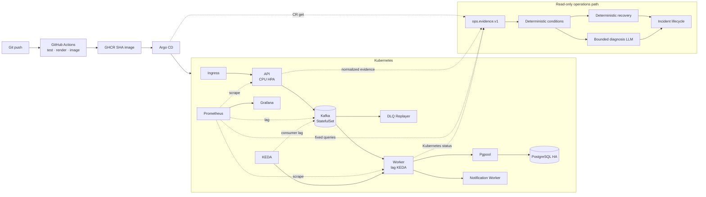

# Kubernetes 기반 이벤트 처리 운영 플랫폼

Kubernetes & GitOps Operations Platform for an Event-Processing Workload

이 프로젝트는 Kubernetes workload의 배포, 확장, 관측, evidence-driven incident handling, 복구 검증을 구현한 DevOps·플랫폼 엔지니어링 포트폴리오입니다. 직접 만든 **Kafka 기반 고신뢰 이벤트 처리 시스템**은 운영 설계를 시험하는 workload이며, bounded AI diagnosis는 deterministic condition 판정 뒤의 read-only 조사에만 사용합니다.

This portfolio demonstrates Kubernetes architecture, GitOps delivery, metric-driven autoscaling, incident recovery, and restore validation through a working event-processing workload.

## 한눈에 보기 / Executive Summary

| 영역 | 구현·검증 범위 |
| --- | --- |
| Kubernetes | StatefulSet·Deployment·Job, probes, PDB, HPA·KEDA, Argo CD sync wave |
| 처리 경로 | `API → Kafka → Worker → PostgreSQL`, retry·DLQ·replay; 실제 DB entrypoint는 Pgpool |
| 관측 | API latency, consumer lag, Worker replica, commit lag, drain time, PostgreSQL HA |
| Incident handling | immutable evidence → deterministic detection → bounded diagnosis → deterministic recovery verification → lifecycle record |
| 복구 | DB outage, same-stream ordering, PostgreSQL restart, logical backup·restore, backlog recovery envelope |
| 대표 트러블슈팅 | CPU HPA→queue backlog KEDA 전환, scale-out 뒤 DB 경합, GitOps namespace prune, 장애 중 retry·log 폭증 |
| Cloud blueprint | EKS·ECR·MSK·RDS·ALB·ACM·Route 53·Secrets Manager Terraform 설계 |

## 프로젝트 발전 단계 / Project Evolution

| 단계 | 추가한 운영 능력 | 검증 경계 |
| --- | --- | --- |
| Initial | API·Worker·PostgreSQL 비동기 처리 | legacy Redis 결과는 Kafka 결과와 분리 |
| Kafka | append-first intake, partition ordering, explicit offset commit, retry·DLQ | exactly-once·global ordering 주장은 하지 않음 |
| Kubernetes | StatefulSet·Deployment·HPA·KEDA·PDB·GitOps | single-node local cluster |
| Ops Phase 1 | read-only source를 `ops.evidence.v1`로 정규화 | 수집 completeness와 system health 분리 |
| Ops Phase 2 | single bundle과 ordered sequence의 deterministic condition | positive·negative calibration으로 activation rule 고정 |
| Ops Phase 3 | PRESENT condition에만 bounded diagnosis | allowlisted normalized tools, evidence ID citation, no write |
| Ops Phase 4 | ACTIVE·RECOVERING·RECOVERED deterministic recovery | actual `75→330→75/s` local-ha calibration |
| Ops Phase 5 | incident identity, timeline, closure, current observation 분리 | 실제 zero-drop Gate 2 E2E와 canonical local artifact |

## Kubernetes 설계 / Kubernetes Architecture

```mermaid
flowchart LR
    Git[Git push] --> CI[GitHub Actions<br/>test · render · image]
    CI --> GHCR[GHCR SHA image]
    GHCR --> Argo[Argo CD]

    subgraph K8s[Kubernetes]
      Ingress[Ingress] --> API[API<br/>CPU HPA]
      API --> Kafka[(Kafka<br/>StatefulSet)]
      Kafka --> Worker[Worker<br/>lag KEDA]
      Worker --> Pool[Pgpool] --> DB[(PostgreSQL HA)]
      Worker --> Notify[Notification Worker]
      Kafka --> DLQ[DLQ Replayer]
      Metrics[Prometheus] -. scrape .-> API
      Metrics -. scrape .-> Worker
      Metrics -. lag .-> Kafka
      Metrics --> Grafana[Grafana]
      KEDA[KEDA] -. consumer lag .-> Kafka
      KEDA --> Worker
    end

    Argo --> K8s

    subgraph Ops[Read-only operations path]
      Evidence[ops.evidence.v1]
      Conditions[Deterministic conditions]
      Diagnosis[Bounded diagnosis LLM]
      Recovery[Deterministic recovery]
      Incident[Incident lifecycle]
      Evidence --> Conditions --> Diagnosis
      Conditions --> Recovery --> Incident
      Diagnosis --> Incident
    end

    API -. normalized evidence .-> Evidence
    Metrics -. fixed queries .-> Evidence
    Worker -. Kubernetes status .-> Evidence
    Argo -. CR get .-> Evidence
```

Runtime data path와 Ops 판단 path는 분리되어 있습니다. LLM은 API→Kafka→Worker→PostgreSQL 처리 경로 밖에서 deterministic `PRESENT`를 입력으로 받으며, incident 선언·recovery 판정·runtime 변경 권한이 없습니다.

### 핵심 설계 결정

| 결정 | Kubernetes 구현 | 운영 목적 |
| --- | --- | --- |
| stateless·stateful 분리 | API·Worker는 Deployment, Kafka·PostgreSQL은 StatefulSet·PVC | rollout과 데이터 lifecycle 분리 |
| backlog 기반 확장 | API CPU HPA `6→8`, core Worker KEDA `2→4`, notification `1→2` | 수락 부하와 비동기 처리 수요를 서로 다른 신호로 확장 |
| release ordering | Secret `-3` → migration Job `-2` → Worker `-1` → API `0` | schema·consumer 호환 경계 보호 |
| traffic gate | startup·readiness·liveness probe 분리 | process 생존, dependency 준비, traffic 진입 구분 |
| state 보호 | Namespace `Prune=false`, PDB, PostgreSQL sync standby | GitOps prune·rollout 중 연쇄 장애 방지 |
| artifact 추적 | source commit → CI → immutable image tag → overlay commit → runtime image | README와 실제 배포 revision 연결 |

Full profile의 API 최소 `6`은 로컬 100 VU 측정에서 CPU 포화와 늦은 HPA 반응을 줄이기 위한 실험값입니다. production 권장값이 아니며 demo-lite는 API `1→2`로 낮춥니다. 현재 kind는 single-node이므로 node·AZ 장애 증거는 AWS 전환 과제로 분리합니다.

세부 구조와 ordering·idempotency 경계: [Architecture](docs/ARCHITECTURE.md)

## Pod 구성 / Workload Inventory

| Workload | Full profile | 책임·운영 신호 |
| --- | ---: | --- |
| `api` Deployment | `6→8` | Kafka append와 PostgreSQL read; CPU, p95, readiness |
| `worker` Deployment | `2→4` | DB persistence·retry·DLQ; consumer lag, commit lag, drain |
| `notification-worker` | `1→2` | notification attempt 기록; 전용 lag와 처리량 |
| `dlq-replayer` | `1` | replay guard 확인과 ingress 재주입 |
| `kafka` StatefulSet | `3` | 8 partitions, RF `3`, `min.insync.replicas=2`, PVC |
| PostgreSQL StatefulSet | `3` | durable source of truth, `synchronous_commit=on`, `ANY 1` |
| Pgpool Deployment | `2` | writable primary routing, PDB `minAvailable=1` |
| Prometheus·Grafana | 각 `1` | metric 수집, alert, 운영 dashboard |
| migration·bootstrap Job | release·설치 시 | schema와 topic을 workload보다 먼저 준비 |
| backup CronJob | 주 1회 | atomic dump, 7일 retention, restore 검증용 PVC |

Argo CD, KEDA, metrics-server, ingress controller는 platform controller 영역에 둡니다. application resource는 `messaging-app` namespace에서 관리합니다.

실행 방법과 manifest 경계: [Quick Start](docs/QUICK_START.md) · [GitOps](docs/GITOPS.md)

## AWS Migration Blueprint

| Local design | AWS 대응 | 이전 시 검증할 기능 |
| --- | --- | --- |
| kind node | EKS managed node group | multi-node·multi-AZ, topology spread, IRSA |
| GHCR SHA image | ECR immutable image | scan-on-push와 배포 provenance |
| ingress-nginx | AWS Load Balancer Controller·ALB | public entrypoint와 target health |
| Kafka StatefulSet | MSK | broker replication, private networking, KEDA lag |
| PostgreSQL·Pgpool | RDS Multi-AZ / Aurora PostgreSQL | managed failover, backup, PITR |
| Kubernetes Secret | Secrets Manager + ESO/CSI | rotation과 least-privilege 전달 |
| local Prometheus·Grafana | AMP·AMG 또는 EKS 내부 운영 | 장기 보존과 alert delivery |
| backup PVC | RDS backup·snapshot·PITR + S3 logical copy | cluster-loss restore와 RPO/RTO |

Terraform은 EKS·ECR·MSK·RDS·ACM·Route 53·Secrets Manager skeleton을 제공하며 `fmt`, offline `init`, `validate`를 통과했습니다. 현재 AWS에 배포된 Terraform stack은 없습니다. AWS credential과 비용이 필요한 `plan` / `apply`는 실행하지 않았습니다.

English: The Terraform source is a migration blueprint. It maps validated local responsibilities to managed AWS services; it does not claim a deployed AWS environment.

상세 구현 범위와 보안 경계: [AWS IaC Plan](docs/AWS_IAC_PLAN.md)

## 관측 설계 / Observability Map

| 구간 | 보는 지표 | 판단 질문 |
| --- | --- | --- |
| API | request rate, p95/p99, Kafka publish stage, HPA replica | 요청 수락 경로가 느린가 |
| Kafka | topic offset, `message-worker` lag | ingress가 persistence capacity를 넘었는가 |
| Worker | result throughput, queue wait, accepted-to-commit lag, DB stage | DB·lock·pool 중 어디서 지연되는가 |
| KEDA | desired·available replica, scale transition, drain time | replica 증가가 backlog 회복으로 이어졌는가 |
| downstream | notification lag와 attempt throughput | 병목이 다음 consumer로 이동했는가 |
| PostgreSQL | primary, standby·sync standby, replication delay, pool usage | writable path와 HA guardrail이 유지되는가 |
| delivery | Argo revision, runtime image, unavailable replica, restart | 검증한 artifact가 실제 실행 중인가 |
| recovery | backup Job, dump size, schema·row·sequence comparison | 파일 생성 뒤 실제 restore도 성공했는가 |

API acceptance latency는 Kafka append까지의 수락 경로를 나타냅니다. KEDA 효과는 consumer lag, commit lag, backlog drain time으로 판정합니다. Argo `Synced / Healthy`는 runtime image 확인과 함께 사용합니다.

Phase 1 read-only Ops Agent는 Application·Prometheus·Kubernetes·Argo CD 신호를 `ops.evidence.v1` bundle로 보존합니다. 2026-08-12 `local-ha` live capture에서 Kafka partition `8/8`, lag `0`, Worker `2/2`, PostgreSQL sync standby `2`, Argo `Synced / Healthy`를 실제 source로 확인했습니다. 두 label-on-use Worker series의 부재는 `0`이 아닌 `MISSING/UNKNOWN`으로 유지했습니다.

Phase 2 v1 evaluator는 이 `PARTIAL` bundle을 condition별 dependency로 평가해 backlog·partition concentration·DB degradation·Worker replica unavailable을 모두 `ABSENT`로, `NO_BACKLOG_PRESSURE_DETECTED`를 `PRESENT`로 기록했습니다. 별도 v2 sequence evaluator는 실제 positive backlog 세 run을 모두 `PRESENT`로 재생했고 short burst·sustainable high·transient spike에서는 `PRESENT`를 만들지 않았습니다. Phase 3 single Diagnosis Agent는 확정된 `PRESENT` 뒤에서만 allowlisted read-only 조사를 선택하고 evidence ID 기반 hypothesis를 출력하며 condition, recovery, remediation은 결정하지 않습니다.

Phase 4 calibration harness는 actual `local-ha`에서 arrival-rate A/B/C/E/F를 실행해 load-aware operating envelope와 continuous/zero-ingress drain을 측정했습니다. Phase 4.1 deterministic recovery v1은 연속 drain에서 `WORKER_BACKLOG_RECOVERING`을 반환합니다. Phase 4.2 recovery policy v2는 continuous `75/s` E run 6회 중 5회와 신규 3/3에서 검증한 MEDIUM envelope 3-capture 재진입만 incident-scope `WORKER_BACKLOG_RECOVERED`로 판정합니다. `N=1/2`는 brief re-entry를 허용해 제외했고 `N=4`는 6회 중 3회만 통과해, `N=3`을 local calibration contract로 고정했습니다.

Phase 5 lifecycle은 condition·diagnosis·recovery artifact를 하나의 deterministic incident identity와 timeline에 연결합니다. Lifecycle closure 뒤 새 관측은 과거 incident를 다시 쓰거나 자동 reopen하지 않고 `current_observation`으로 분리합니다. 자동 remediation, multi-agent manager, recovery LLM은 구현하지 않았습니다.

English: The Ops Agent captures normalized read-only evidence, evaluates calibrated deterministic conditions, performs one bounded evidence-grounded diagnosis after backlog is `PRESENT`, and verifies recovery deterministically. The LLM cannot declare the incident, recovery, or remediation.

지표 정의·evidence 계약·대응 연결: [Observability](docs/OBSERVABILITY.md) · [Ops Agent](docs/OPS_AGENT.md) · [Metrics Reference](docs/METRICS_REFERENCE.md) · [Runbook](docs/RUNBOOK.md)

## Verified Incident Case Study

2026-08-23 actual `local-ha`에서 KEDA·Worker 설정을 바꾸지 않고 64 streams에 `75→330→75 records/s`를 가해 Worker backlog incident를 끝까지 재현했습니다.

| 단계 | 실제 결과 |
| --- | --- |
| Workload quality gate | accepted `6,750 / 29,697 / 135,000`, HTTP failure `0`, dropped iteration `0`, phase attainment 모두 통과 |
| Deterministic detection | lag `7,205→10,497→13,936`, 60초 slope `120.07→174.47→230.77 records/s`; 3개 capture freshness·8/8 coverage·identity·offset arithmetic 통과 |
| Peak/KEDA | peak lag `20,574`, Worker desired/available `4/4`, KEDA Active |
| Bounded diagnosis | `gpt-5.6-luna`, normalized tool 4개; `WORKER_PATH_PRESSURE_SUSPECTED=SUPPORTED`, 나머지는 evidence gap 보존 |
| Deterministic recovery | ACTIVE → RECOVERING → RECOVERED; `75/s`, lag `0 / 7 / 0`, slope `0 / -2.9 / -10.77`, committed rate `75 / 77.9 / 85.77`, PostgreSQL ready |
| Lifecycle | incident `inc-88a1eeaa17897f6a8a929bba`, `CLOSED / RECOVERED`, detection-to-closure `809.557s` |
| Artifact integrity | Evidence Bundle `133/133`, raw projection `532/532` hash 검증 PASS |

폐쇄 뒤 `2026-08-23T15:57:38Z`의 later observation은 `WORKER_BACKLOG_ACTIVE`였습니다. 기존 incident는 `CLOSED`로 보존하고 해당 관측을 별도 current state로 기록했습니다. 이후 live 확인에서는 core·notification lag가 다시 `0`이었지만, 현재 MVP는 closed incident의 자동 reopen이나 새 incident correlation을 수행하지 않습니다.

## STAR 운영 문제 해결 경험 / Operational STAR Cases

### 사례 1 — Worker scaling 기준을 CPU에서 queue backlog로 전환

- **S**: Worker가 DB connection·lock·commit을 기다리는 동안 CPU는 낮게 유지됐지만 Redis queue backlog와 API latency는 계속 증가
- **T**: Worker의 실제 처리 대기량을 반영하는 scaling signal 선정과 DB connection pressure 축소
- **A**: Pgpool·DB pool을 먼저 조정한 뒤 Worker CPU HPA를 KEDA queue-depth scaler로 교체
- **R**: 초기 `5,434 requests·p95 8,175ms`에서 pool 조정 후 `11,314·3,333ms`, KEDA 적용 후 `19,528·1,954ms`로 개선. 현재 Kafka 구조에서도 같은 판단을 적용해 consumer lag를 Worker scaling signal로 사용

### 사례 2 — Worker 확장 뒤 DB 경합

- **S**: Worker replica 증가 뒤 DB stage latency와 notification backlog 증가, KEDA drain 이점 불안정
- **T**: record 단위 offset 안전성을 유지하며 PostgreSQL roundtrip과 downstream commit 경합 축소
- **A**: authorization read 통합, sequence atomic upsert, notification 최대 20건 batch transaction, 성공 event INFO log 제거; clean fixed/KEDA 각 3회
- **R**: KEDA backlog 처리율 `13.38%` 증가, drain `222.49→194.05초`로 `12.78%` 감소; 오류 `0%`, ordering `100/100`, final lag `0/0`. API p95는 `6.49%` 증가해 trade-off로 기록

### 사례 3 — GitOps namespace prune 사고 복구

- **S**: Namespace desired-state 전환 중 prune으로 PostgreSQL·Pgpool·PVC와 in-cluster backup 소실
- **T**: workload와 동기 복제 guardrail 복구, 같은 유형의 연쇄 삭제 차단
- **A**: DB stack 재설치, `synchronous_commit=on`·`ANY 1` 지속 적용, Namespace `Prune=false`, disposable DB restore 비교
- **R**: PostgreSQL `3/3`, sync/quorum standby `2`; 10개 table의 schema·row count·max id·sequence 일치

### 사례 4 — DB 장애 중 API pod 재시도·로그 폭증

- **S**: PostgreSQL 미연결 시 API 6개 pod가 2초마다 연결을 재시도하고 warning을 기록해 분당 최대 180회 연결 시도·로그 발생
- **T**: readiness 차단과 자동 복구를 유지하면서 장애가 길어질 때 control plane·DB·node disk 부하 제한
- **A**: retry를 `2→4→8→16→30초` exponential backoff로 변경, 반복 warning을 60초당 1회로 제한, Uvicorn lifecycle log와 Prometheus request metric 분리
- **R**: DB 미연결 smoke에서 12초간 initial·retry warning 각 1건; full cluster에서 API 6개 lifecycle log 유지, health access log `0`, readiness 복구 확인

### 추가 트러블슈팅 기록

| 문제 | 조치 | 결과·해석 |
| --- | --- | --- |
| Kafka Worker tail retry의 ordering 위험 | Pgpool `1→2`, PDB, same-offset inline retry | p95 `80.65ms`, ordering `1..100` 유지 |
| API pod별 cache replay가 scale-out 때 DB·memory 경합 생성 | cache·snapshot topic 제거, PostgreSQL read model 단일화 | pod별 replay 제거, p95·drain 개선, 운영 경계 축소 |

실험 조건·원본·stable 채택 여부: [Validation Results](docs/TEST_RESULTS.md) · [Evidence Guide](results/README.md)

## 트러블슈팅 검증 요약 / Troubleshooting Evidence

| 검증 | 결과 | 증명 범위 |
| --- | --- | --- |
| 64-stream fixed/KEDA 각 3회 | KEDA 처리율 `137.67 events/s`, drain `194.05초`; fixed `121.42 events/s`, `222.49초` | lag 기반 scale-out과 DB 경합 trade-off |
| same-stream ordering | `stream_seq 1..100`, missing·duplicate `0` | stream partition 경계의 순서 보존 |
| DB outage | 장애 중 요청 수락 유지, 복구 뒤 persistence와 lag `0` | intake와 durable persistence 분리 |
| PostgreSQL recovery | `3/3 ready`, sync/quorum standby `2` | local process restart와 동기 복제 guardrail |
| logical restore | schema, 10개 table, row count, max id·sequence 일치 | 같은 cluster의 disposable restore |

## Demo

- Public demo-lite: [Demo UI](https://vm118.js-banjiha.cloud/demo/order-dashboard.html) · [Swagger](https://vm118.js-banjiha.cloud/docs) · [Readiness](https://vm118.js-banjiha.cloud/health/ready) · [Grafana](https://vm118.js-banjiha.cloud/grafana/d/messaging-portfolio-overview/reliable-event-processing-operations-overview?orgId=1&refresh=5s)
- Local full profile: `powershell -ExecutionPolicy Bypass -File scripts/quick_start_all.ps1`; Windows에서는 Docker Desktop만 설치하고 실행하면 `bootstrap_tools.ps1`이 pinned kind·kubectl·Helm을 `tools/`에 준비
- Local links: [Demo UI](http://localhost/demo/order-dashboard.html) · [Swagger](http://localhost/docs) · [Grafana](http://localhost/grafana/d/messaging-portfolio-overview/reliable-event-processing-operations-overview?orgId=1&refresh=5s)

Demo는 `Reserved → Kafka Appended → DB Persisted`를 서로 독립적으로 갱신하고 Worker 현재/최대 replica를 표시합니다. DLQ summary는 최근 append-only 표본의 `by_reason`·`replayable`·`blocked`를 보여줍니다. demo-lite는 Kafka `1`, PostgreSQL `1`, API·core Worker `1→2`, notification Worker `1`의 저사양 profile입니다.

Demo UI `2.4.0` source candidate는 actual Phase 5.1 diagnosis를 sanitized static artifact로 재생합니다. 기록된 tool-call 순서, normalized evidence 요약, supporting/conflicting citation, evidence gap, deterministic validator 경계와 read-only 권한을 표시하며 OpenAI API를 다시 호출하지 않습니다. Public demo-lite 배포는 아직 기존 `2.3.1`이므로 source candidate와 배포 상태를 구분합니다.

시연 순서와 화면 의미: [Demo Guide](docs/DEMO_GUIDE.md)

## 운영 경계와 다음 단계

| 현재 경계 | 다음 검증·구현 |
| --- | --- |
| single-node local cluster | EKS multi-node·multi-AZ와 disruption drill |
| record 단위 explicit offset commit | Worker crash·consumer group rebalance·offset recovery 장애 주입 |
| node local container log | 중앙 log pipeline, sampling, retention, disk-pressure alert |
| 같은 host의 backup PVC·logical restore | S3 사본, RDS PITR, cluster-loss restore와 RPO/RTO |
| local secret | IRSA·Secrets Manager·ESO/CSI와 rotation |
| local-ha에서 보정한 condition·recovery threshold | 다른 cluster/profile의 재보정과 versioned policy |
| closed incident 뒤 current observation 분리 | reopen·새 incident correlation policy |
| rebalance·CPU throttling·exact DB commit latency 미계측 | 필요한 telemetry와 deterministic gate 추가 |
| local-only verified incident artifact | sanitized static replay 구현 완료; demo-lite `2.4.0` 별도 배포·검증 대기 |

현재 검증은 single-node local cluster와 workload 수준 장애에 한정됩니다. autonomous operations, self-healing, production-ready AI, node·AZ 장애, production SLA를 증명하지 않습니다. Transactional outbox, cluster-loss restore, rebalance telemetry도 후속 과제입니다. 상세 완료 기준은 [Improvement Roadmap](docs/IMPROVEMENT_ROADMAP.md)에 있습니다.

## 운영·문서 지도 / Operations & Docs

상태 점검: `powershell -ExecutionPolicy Bypass -File scripts/check_portfolio_status.ps1 -SkipArgoCd`

- 설계·배포: [Architecture](docs/ARCHITECTURE.md) · [GitOps](docs/GITOPS.md) · [AWS IaC Plan](docs/AWS_IAC_PLAN.md)
- 관측·대응: [Observability](docs/OBSERVABILITY.md) · [Runbook](docs/RUNBOOK.md) · [Reliability Policy](docs/RELIABILITY_POLICY.md)
- 실행·검증: [Quick Start](docs/QUICK_START.md) · [Ops Agent](docs/OPS_AGENT.md) · [Service Checklist](docs/SERVICE_PROCESS_CHECKLIST.md) · [Test Results](docs/TEST_RESULTS.md)
- 요구·개선: [Service Requirements](docs/SERVICE_REQUIREMENTS.md) · [Improvement Roadmap](docs/IMPROVEMENT_ROADMAP.md)
