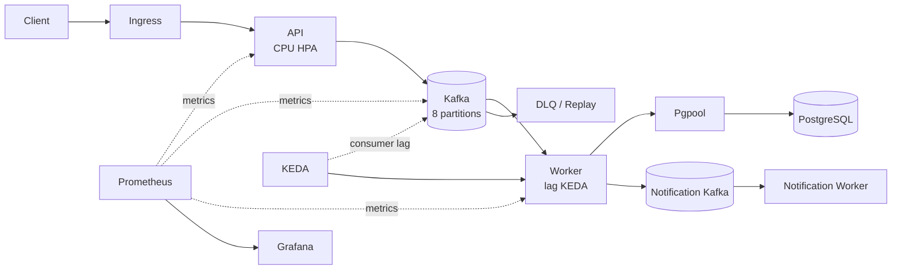
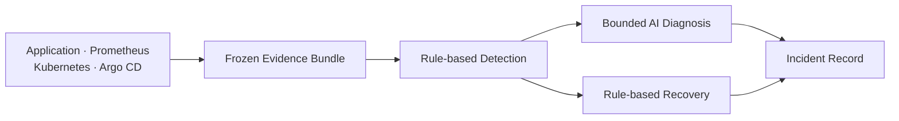

# Kubernetes 기반 이벤트 처리 운영 플랫폼

Kubernetes & GitOps Operations Platform for Event Processing

[한국어](README.md) | [English](README_EN.md)

Kafka 기반 비동기 이벤트 처리 시스템을 Kubernetes에서 운영하며 **consumer lag 기반 확장, 장애 재현, 복구 검증**을 직접 실험한 Cloud·DevOps 포트폴리오입니다. 애플리케이션은 운영 설계를 검증하는 workload이고, AI는 확정된 장애의 증거를 분류하는 제한된 보조 수단으로만 사용합니다.

[Public Demo](https://vm118.js-banjiha.cloud/demo/order-dashboard.html) · [Grafana](https://vm118.js-banjiha.cloud/grafana/d/messaging-portfolio-overview/reliable-event-processing-operations-overview?orgId=1&refresh=5s) · [Swagger](https://vm118.js-banjiha.cloud/docs) · [Architecture](docs/ARCHITECTURE.md) · [Test Results](docs/TEST_RESULTS.md)

**Core Stack:** Kubernetes · Kafka · PostgreSQL · KEDA · Prometheus · Grafana · Argo CD · GitHub Actions · Terraform

## 30초 요약

| 운영 문제 | 선택 | 검증 결과 |
| --- | --- | --- |
| DB 처리량보다 빠른 ingress | API 수락과 Worker persistence를 Kafka로 분리 | schema startup 완료 뒤 DB runtime outage 중 수락 경로 유지, 복구 후 lag `0` |
| CPU만으로 Worker backlog 판단이 어려움 | `message-worker` consumer lag 기반 KEDA | Worker `2→4`, drain `222.49→194.05초` |
| scale-out 뒤 DB 경합 증가 | DB roundtrip과 notification transaction 축소 | backlog 처리율 `121.42→137.67 events/s`, API p95 `6.49%` 증가 trade-off 기록 |
| 장애 판단 기준이 모호함 | lag·slope를 positive/negative workload로 보정 | positive 3회 `PRESENT`, short burst·sustainable high·transient spike는 `NOT_PRESENT` |

## 주요 검증 결과

| Experiment | Result |
| --- | ---: |
| KEDA scale-out | core Worker `2 → 4` |
| Backlog throughput | `121.42 → 137.67 events/s` |
| Backlog drain | `222.49 → 194.05초` (`12.78%` 감소) |
| Same-stream ordering | `100/100`, missing `0`, duplicate `0` |
| Kafka intake | stable baseline `31,676`, error `0.00%`, p95 `80.65ms` |
| DB outage recovery | final core·notification consumer lag `0/0` |
| PostgreSQL recovery | `3/3 ready`, sync/quorum standby `2` |
| Verified incident | `DETECTED → ACTIVE → RECOVERING → RECOVERED → CLOSED` |

수치는 서로 다른 실험 조건을 섞지 않습니다. Redis queue-first 결과, historical Kafka baseline, current v2 candidate는 [검증 결과](docs/TEST_RESULTS.md)에서 조건과 함께 분리해 기록합니다.

## 아키텍처

핵심 처리 경로는 `API → Kafka → Worker → PostgreSQL`입니다. Notification과 DLQ는 core persistence 경로에서 분리합니다.


```mermaid
flowchart LR
    Client --> Ingress --> API[API<br/>CPU HPA]
    API --> Kafka[(Kafka<br/>8 partitions)]
    Kafka --> Worker[Worker<br/>lag KEDA]
    Worker --> Pgpool --> PostgreSQL[(PostgreSQL)]
    Worker --> NotificationTopic[(Notification Kafka)] --> NotificationWorker[Notification Worker]
    Kafka --> DLQ[DLQ / Replay]

    Prometheus -. metrics .-> API
    Prometheus -. metrics .-> Kafka
    Prometheus -. metrics .-> Worker
    Prometheus --> Grafana
    KEDA -. consumer lag .-> Kafka
    KEDA --> Worker
```


```mermaid
flowchart LR
    Sources[Application · Prometheus<br/>Kubernetes · Argo CD] --> Evidence[Frozen Evidence Bundle]
    Evidence --> Detection[Rule-based Detection]
    Detection --> Diagnosis[Bounded AI Diagnosis]
    Detection --> Recovery[Rule-based Recovery]
    Diagnosis --> Incident[Incident Record]
    Recovery --> Incident
```

Runtime data path와 운영 판단 path는 분리되어 있습니다. LLM은 Kafka 처리 경로 밖에서 deterministic `PRESENT`를 입력으로 받으며 incident 발생, recovery, runtime 변경을 결정할 수 없습니다.

세부 구조: [Architecture](docs/ARCHITECTURE.md) · [GitOps](docs/GITOPS.md) · [Observability](docs/OBSERVABILITY.md)

## 왜 이렇게 설계했는가

### API와 Worker를 다른 신호로 확장

- API는 Kafka append까지의 동기 수락 경로이므로 CPU HPA를 사용합니다.
- Worker는 DB·lock·commit을 기다려 CPU가 낮아도 backlog가 증가할 수 있어 consumer lag를 사용합니다.
- KEDA 효과는 API request 수보다 peak lag, backlog 처리율, drain time으로 평가하고 API p95 변화도 함께 기록합니다.

### 순서와 offset 안전성

- `stream_id`를 Kafka key로 사용해 같은 stream을 같은 partition에 배치합니다.
- Worker는 record 처리와 PostgreSQL commit이 끝난 뒤 offset을 명시적으로 commit합니다.
- 처리 실패 시 해당 record로 seek-back하고 같은 partition의 후속 처리를 보류합니다.
- inline retry는 ordering과 구현 단순성을 얻는 대신 다른 할당 partition의 처리를 지연시킬 수 있습니다.
- DLQ summary는 append-only topic의 최근 표본이며 `by_reason`, `replayable`, `blocked`를 보여줍니다. 현재 unresolved backlog를 뜻하지 않습니다.

### GitOps release ordering

- Secret wave `-3` → migration Job `-2` → Worker `-1` → API `0` 순서로 schema와 consumer 호환 경계를 보호합니다.
- CI는 테스트·render·정적 검증 뒤 commit SHA image를 게시하고 overlay tag를 갱신합니다.
- Argo revision, desired image, Pod runtime imageID를 함께 확인해 source와 runtime을 연결합니다.

## 반드시 구분하는 계약

### `202 Accepted`

`202`는 **Kafka ingress append 성공**을 뜻합니다. 업무 authorization과 PostgreSQL persistence 성공을 뜻하지 않습니다. JWT는 API에서 확인하지만 stream membership, idempotency, sequence는 Worker persistence 단계에서 검증합니다.

Worker가 status row를 만들기 전에는 `GET /v1/event-requests/{request_id}`가 잠시 `404`를 반환할 수 있습니다. 현재 계약의 약점으로 공개하고 accepted-state read model을 후속 과제로 관리합니다.

최종 membership 검증을 Worker로 미룬 구조는 인증된 사용자의 잘못된 stream 요청도 Kafka·Worker 자원을 소비하게 합니다. production 전환 시 rate limit, per-user quota, authorization cache 또는 ACL snapshot이 필요합니다.

### PostgreSQL 장애와 readiness

API가 schema startup을 완료한 뒤 발생한 PostgreSQL runtime outage에서는 Kafka intake를 계속 받을 수 있습니다. DB가 없는 상태에서 새 API Pod가 기동하면 schema startup이 끝나지 않아 `/v1`·`/v2` 요청을 `503`으로 차단합니다.

`/health/ready`는 full dependency health보다 **Kafka intake를 서비스할 수 있는가**에 가깝습니다. PostgreSQL HA guardrail 이탈은 `degraded`와 HTTP `200`으로 노출하고, schema·Kafka·auth secret hard failure는 `503`으로 처리합니다. Worker Kubernetes probe는 처리 가능성 전체가 아니라 프로세스와 metrics endpoint 생존을 확인합니다.

### Ops Agent tool 경계

Evidence collector는 Application·Prometheus·Kubernetes·Argo CD를 read-only로 수집합니다. Diagnosis Agent의 `get_partition_lag`, `get_postgres_health` 같은 도구는 cluster를 새로 조회하지 않고 **이미 고정된 Evidence Bundle에서 허용된 evidence를 선택·정규화**합니다.

## 대표 장애 재현

2026-08-23 actual `local-ha`에서 KEDA·Worker 설정을 바꾸지 않고 64 streams에 `75→330→75 records/s`를 가해 Worker backlog incident를 재현했습니다.

```text
75/s baseline
  -> 330/s pressure
  -> lag 20,574
  -> KEDA Worker 2 -> 4
  -> 75/s recovery load
  -> lag drain
  -> deterministic recovery and closure
```

| 단계 | 결과 |
| --- | --- |
| Workload quality | accepted `6,750 / 29,697 / 135,000`, HTTP failure `0`, dropped iteration `0` |
| Detection | lag `7,205→10,497→13,936`, slope `120.07→174.47→230.77/s`, 연속 3 capture |
| Scaling | peak lag `20,574`, Worker desired/available `4/4` |
| Diagnosis | recorded tool 4개, `WORKER_PATH_PRESSURE_SUSPECTED=SUPPORTED`; causal truth 확정 아님 |
| Recovery | `ACTIVE → RECOVERING → RECOVERED`, PostgreSQL ready |
| Lifecycle | incident `inc-88a1eeaa17897f6a8a929bba`, `CLOSED / RECOVERED` |

Public Demo의 Investigation은 이 실행의 sanitized static artifact를 재생합니다. OpenAI API를 다시 호출하지 않으며 현재 demo-lite 상태와 recorded `local-ha` incident를 구분합니다.

상세 evidence와 정책: [Ops Agent](docs/OPS_AGENT.md) · [Evidence Guide](results/README.md)

## 이 프로젝트에서 보여주는 역량

### Cloud / Infrastructure

Kubernetes workload 설계 · StatefulSet/PVC · PostgreSQL replication · Pgpool · PDB · backup/restore · Terraform 기반 AWS 전환 설계

### DevOps / Platform

GitHub Actions · immutable SHA image · GHCR · Argo CD · sync wave · Kustomize/Helm render · KEDA/HPA · deployment provenance

### Reliability / Operations

Kafka offset·ordering·idempotency · retry/DLQ/replay · Prometheus/Grafana · 장애 주입 · recovery calibration · incident lifecycle

## 현재 한계와 다음 우선순위

| 현재 경계 | 다음 작업 |
| --- | --- |
| DB commit 뒤 notification publish 사이 crash gap | transactional outbox |
| `202` 직후 status row가 없어 짧은 `404` 가능 | accepted-state 계약 또는 read model |
| record commit 직전 Worker crash·rebalance 미검증 | kill/restart/rebalance 장애 주입 |
| migration Job과 API startup이 모두 Alembic 실행 | Kubernetes migration owner를 Job으로 단일화 |
| Worker probe가 metrics TCP 생존만 확인 | consumer 처리 상태용 health endpoint |
| degraded grace가 만료돼도 HTTP 동작이 바뀌지 않음 | grace를 제거하거나 만료 행동 구현 |
| backup이 같은 host/PVC에 존재 | object storage copy와 cluster-loss restore |
| local kind가 single-node | multi-node·multi-AZ disruption drill |

이 프로젝트는 production-ready HA, exactly-once, global ordering, autonomous remediation, 배포된 AWS 환경을 주장하지 않습니다. 로컬 replica/failover 메커니즘과 workload 수준 장애 복구를 검증한 범위입니다.

<details>
<summary><b>프로젝트 발전 과정</b></summary>

| 단계 | 추가한 운영 능력 |
| --- | --- |
| Initial | API·Worker·PostgreSQL 비동기 처리 |
| Kafka | append-first intake, partition ordering, explicit offset commit, retry·DLQ |
| Kubernetes | StatefulSet·Deployment·HPA·KEDA·PDB·GitOps |
| Ops Phase 1–2 | normalized evidence와 deterministic condition |
| Ops Phase 3 | single bounded evidence-grounded diagnosis |
| Ops Phase 4 | deterministic recovery calibration/evaluation |
| Ops Phase 5 | incident identity, timeline, closure, current observation 분리 |

</details>

<details>
<summary><b>주요 workload 구성</b></summary>

| Workload | Full profile | 책임 |
| --- | ---: | --- |
| API | `6→8` | Kafka append, PostgreSQL read, CPU HPA |
| core Worker | `2→4` | persistence, retry, DLQ, lag KEDA |
| notification Worker | `1→2` | notification attempt 기록 |
| Kafka | `3` | 8 partitions, RF `3`, `min.insync.replicas=2` |
| PostgreSQL | `3` | durable source of truth, sync standby |
| Pgpool | `2` | writable primary routing |
| Prometheus·Grafana | 각 `1` | metrics, alert, dashboard |

</details>

<details>
<summary><b>추가 트러블슈팅 사례</b></summary>

- GitOps namespace prune로 PostgreSQL·Pgpool·PVC가 삭제된 뒤 DB stack과 sync guardrail을 복구하고 Namespace `Prune=false`를 적용했습니다.
- DB 장애 중 API 6개 Pod의 retry·warning 폭증을 exponential backoff와 log rate limit으로 줄였습니다.
- API Pod별 cache와 snapshot topic이 scale-out 때 DB·memory 경합을 만들어 제거하고 PostgreSQL read model로 단일화했습니다.
- notification batch와 DB roundtrip 축소 뒤 KEDA drain 개선과 API p95 증가를 함께 기록했습니다.

</details>

<details>
<summary><b>AWS Migration Blueprint — 설계 및 정적 검증</b></summary>

| Local design | AWS target |
| --- | --- |
| kind | EKS managed node group |
| GHCR SHA image | ECR immutable image |
| ingress-nginx | ALB Controller |
| Kafka StatefulSet | MSK |
| PostgreSQL·Pgpool | RDS Multi-AZ / Aurora PostgreSQL |
| Kubernetes Secret | Secrets Manager + ESO/CSI |
| backup PVC | RDS backup·PITR + S3 logical copy |

Terraform은 EKS·ECR·MSK·RDS·ACM·Route 53·Secrets Manager skeleton을 제공하며 `fmt`, offline `init`, `validate`를 통과했습니다. 현재 AWS에 배포된 Terraform stack은 없습니다. AWS credential과 비용이 필요한 `plan` / `apply`는 실행하지 않았습니다.

[AWS IaC Plan](docs/AWS_IAC_PLAN.md)

</details>

<details>
<summary><b>로컬 실행</b></summary>

```powershell
powershell -ExecutionPolicy Bypass -File scripts/quick_start_all.ps1
```

Windows에서는 Docker Desktop이 필요합니다. 스크립트가 pinned kind·kubectl·Helm을 `tools/`에 준비합니다.

`quick_start_all.ps1`은 `scripts/bootstrap_tools.ps1`로 도구를 준비합니다. Windows에서는 Docker Desktop만 설치하고 실행하면 됩니다.

```powershell
powershell -ExecutionPolicy Bypass -File scripts/check_portfolio_status.ps1 -SkipArgoCd
```

- Demo: `http://localhost/demo/order-dashboard.html`
- Swagger: `http://localhost/docs`
- Grafana: `http://localhost/grafana/d/messaging-portfolio-overview/reliable-event-processing-operations-overview?orgId=1&refresh=5s`

[Quick Start](docs/QUICK_START.md) · [Demo Guide](docs/DEMO_GUIDE.md)

</details>

## 문서 지도

- 설계: [Architecture](docs/ARCHITECTURE.md) · [Service Requirements](docs/SERVICE_REQUIREMENTS.md)
- 배포: [GitOps](docs/GITOPS.md) · [AWS IaC Plan](docs/AWS_IAC_PLAN.md)
- 관측·대응: [Observability](docs/OBSERVABILITY.md) · [Runbook](docs/RUNBOOK.md) · [Reliability Policy](docs/RELIABILITY_POLICY.md)
- Agent: [Ops Agent](docs/OPS_AGENT.md) · [Ops Agent CLI](ops_agent/README.md)
- 검증: [Test Results](docs/TEST_RESULTS.md) · [Evidence Guide](results/README.md)
- 개선: [Improvement Roadmap](docs/IMPROVEMENT_ROADMAP.md)
- 전체 운영 점검: [Service Process Checklist](docs/SERVICE_PROCESS_CHECKLIST.md)
