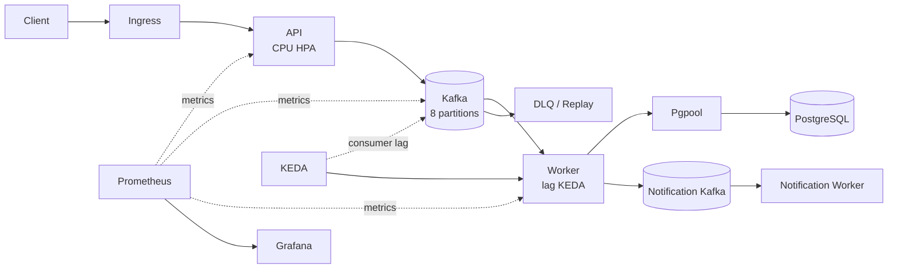
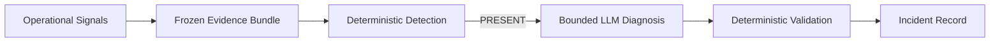

# Kubernetes 기반 이벤트 처리 운영 플랫폼

Kubernetes & GitOps Operations Platform for Event Processing

[한국어](README.md) | [English](README_EN.md)

Kafka 기반 비동기 이벤트 처리 시스템을 Kubernetes에서 운영하며 **consumer lag 기반 확장, 장애 재현, 복구 검증**을 직접 실험한 Cloud·DevOps 포트폴리오입니다. 장애 조사에는 수집된 운영 증거만 사용하는 bounded LLM Agent를 추가했습니다.

[Public Demo](https://vm118.js-banjiha.cloud/demo/order-dashboard.html) · [Grafana](https://vm118.js-banjiha.cloud/grafana/d/messaging-portfolio-overview/reliable-event-processing-operations-overview?orgId=1&refresh=5s) · [Swagger](https://vm118.js-banjiha.cloud/docs) · [Architecture](docs/ARCHITECTURE.md) · [Test Results](docs/TEST_RESULTS.md)

**Core Stack:** Kubernetes · Kafka · PostgreSQL · KEDA · Prometheus · Grafana · Argo CD · GitHub Actions · Terraform (AWS migration blueprint)

## 30초 요약

| 운영 문제 | 선택 | 검증 결과 |
| --- | --- | --- |
| Worker backlog 증가 | `message-worker` consumer lag 기반 KEDA | Worker `2→4`, drain `12.78%` 감소 |
| 확장 후 DB 경합 | DB 왕복과 notification transaction 수 축소 | backlog 처리율 `13.38%` 증가, API p95 trade-off 확인 |
| PostgreSQL runtime 장애 | API 수락과 Worker persistence를 Kafka로 분리 | 복구 후 core·notification lag `0/0` |
| 같은 stream 순서 보장 | `stream_id` partition과 DB commit 이후 offset commit | ordering `100/100`, missing·duplicate `0` |

## 아키텍처

핵심 처리 경로는 `API → Kafka → Worker → PostgreSQL`입니다. Notification과 DLQ는 core persistence 경로에서 분리합니다.


```mermaid
flowchart LR
    Client --> Ingress --> API[API<br/>CPU HPA]
    API --> Kafka[(Kafka<br/>8 partitions)]
    Kafka --> Worker[Worker<br/>lag KEDA]
    Worker --> Pgpool --> PostgreSQL[(PostgreSQL)]
    Worker --> NotificationTopic[(Notification Kafka)] --> NotificationWorker[Notification Worker]
    Kafka --> DLQ[DLQ / Replay]

    Prometheus -. metrics .-> API
    Prometheus -. metrics .-> Kafka
    Prometheus -. metrics .-> Worker
    Prometheus --> Grafana
    KEDA -. consumer lag .-> Kafka
    KEDA --> Worker
```

세부 구조: [Architecture](docs/ARCHITECTURE.md) · [GitOps](docs/GITOPS.md) · [Observability](docs/OBSERVABILITY.md)

## 핵심 운영 판단

### API와 Worker를 다른 신호로 확장

- API는 Kafka append까지의 동기 수락 경로이므로 CPU HPA를 사용합니다.
- Worker는 DB·lock·commit을 기다려 CPU가 낮아도 backlog가 증가할 수 있어 consumer lag를 사용합니다.
- KEDA 효과는 API request 수보다 peak lag, backlog 처리율, drain time으로 평가하고 API p95 변화도 함께 기록합니다.

### 순서와 offset 안전성

- `stream_id`를 Kafka key로 사용해 같은 stream을 같은 partition에 배치합니다.
- Worker는 record 처리와 PostgreSQL commit이 끝난 뒤 offset을 명시적으로 commit합니다.
- 처리 실패 시 해당 record로 seek-back하고 같은 partition의 후속 처리를 보류합니다.

### GitOps release ordering

- migration → Worker → API 순서로 배포해 schema와 consumer 호환 경계를 보호합니다.
- CI는 테스트·render·정적 검증 뒤 commit SHA image를 게시하고 overlay tag를 갱신합니다.
- Argo revision, desired image, Pod runtime imageID를 함께 확인해 source와 runtime을 연결합니다.

## 대표 장애 재현

2026-08-23 `local-ha` 환경에서 KEDA·Worker 설정을 바꾸지 않고 64개 stream에 `75→330→75 records/s` 부하를 가해 Worker backlog 장애를 재현했습니다.

| 단계 | 결과 |
| --- | --- |
| 부하 증가 | `75 → 330 records/s` |
| Backlog | peak lag `20,574` |
| Scale-out | Worker `2 → 4` |
| 복구 부하 | `330 → 75 records/s` |
| 결과 | lag 회복, `ACTIVE → RECOVERING → RECOVERED` |
| 요청 실패 | HTTP failure `0`, dropped iteration `0` |

[전체 incident evidence](docs/OPS_AGENT.md)

## Ops Agent — Evidence-grounded Incident Diagnosis

장애 판정 이후 운영 증거를 조사하는 bounded LLM Diagnosis Agent를 구현했습니다. 실제 incident 진단은 미리 수집한 Frozen Evidence Bundle을 사용합니다. Local Scenario Lab은 같은 deterministic activation에 통제된 normalized observation을 공급해 직전 관측에 따라 다음 read-only tool 선택이 달라지는지 검증합니다. 실시간 cluster 임의 조회는 허용하지 않습니다.


```mermaid
flowchart LR
    Signals[Operational Signals] --> Evidence[Frozen Evidence Bundle]
    Evidence --> Detection[Deterministic Detection]
    Detection -->|PRESENT| Diagnosis[Bounded LLM Diagnosis]
    Diagnosis --> Validation[Deterministic Validation]
    Validation --> Incident[Incident Record]
```

- 필요한 evidence를 선택해 정의된 장애 가설별로 이를 지지하거나 반박하는 evidence와 부족한 evidence를 분류합니다.
- 존재하지 않는 evidence ID나 recovery·remediation 판단처럼 허용 범위를 벗어난 출력은 validator가 거부합니다.
- incident 발생과 recovery 판정, runtime 변경 권한은 deterministic logic에 유지합니다.
- `ops.diagnosis.v2`는 Worker capacity와 PostgreSQL path 가설, acquisition provenance, branch evaluation을 추가합니다. 현재 배포된 Public Demo `2.4.1`은 검증된 과거 incident를 재생합니다. `demo-dev` UI `2.5.0` 후보는 같은 activation에 대한 네 controlled scenario를 별도 static artifact로 투영하며 아직 public runtime에 배포되지 않았습니다.

[Ops Agent 상세 설계 및 검증](docs/OPS_AGENT.md)

## 이 프로젝트에서 보여주는 역량

### Cloud / Infrastructure

- Kubernetes에서 stateless·stateful workload와 persistent storage를 구성했습니다.
- PostgreSQL replication·Pgpool 기반 DB failover 경로를 검증했습니다.
- 로컬 구성을 EKS·MSK·RDS로 이전하기 위한 Terraform blueprint를 작성했습니다.

### DevOps / Platform

- GitHub Actions에서 test·manifest render·image 검증을 통과한 immutable SHA image를 게시합니다.
- Argo CD sync wave로 migration → Worker → API 배포 순서를 구성했습니다.
- API는 CPU HPA, Worker는 consumer lag KEDA로 workload 특성에 따라 분리했습니다.

### Reliability / Operations

- consumer lag·latency·replica 상태로 병목 구간을 확인합니다.
- 장애 주입 뒤 ordering·offset·recovery 상태를 검증했습니다.
- Prometheus와 Grafana로 intake, persistence, backlog, PostgreSQL HA 지표를 관측합니다.

## 검증 범위

- single-node kind 환경이므로 node·AZ failure-domain HA는 검증하지 않았습니다.
- Worker crash·consumer rebalance 직후 offset recovery는 추가 장애 주입 대상입니다.
- AWS 구성은 Terraform migration blueprint이며 실제 AWS stack을 배포하지 않았습니다.

[전체 개선 우선순위](docs/IMPROVEMENT_ROADMAP.md)

<details>
<summary><b>상세 검증 결과</b></summary>

| Experiment | Result |
| --- | ---: |
| KEDA scale-out | core Worker `2 → 4` |
| Backlog throughput | `121.42 → 137.67 events/s` |
| Backlog drain | `222.49 → 194.05초` (`12.78%` 감소) |
| Same-stream ordering | `100/100`, missing `0`, duplicate `0` |
| Kafka intake | stable baseline `31,676`, error `0.00%`, p95 `80.65ms` |
| DB outage recovery | final core·notification consumer lag `0/0` |
| PostgreSQL recovery | `3/3 ready`, sync/quorum standby `2` |
| Verified incident | `DETECTED → ACTIVE → RECOVERING → RECOVERED → CLOSED` |

수치는 서로 다른 실험 조건을 섞지 않습니다. Redis queue-first 결과, historical Kafka baseline, current v2 candidate는 [검증 결과](docs/TEST_RESULTS.md)에서 조건과 함께 분리해 기록합니다.

</details>

<details>
<summary><b>추가 트러블슈팅 사례</b></summary>

- GitOps namespace prune로 PostgreSQL·Pgpool·PVC가 삭제된 뒤 DB stack과 sync guardrail을 복구하고 Namespace `Prune=false`를 적용했습니다.
- DB 장애 중 API 6개 Pod의 retry·warning 폭증을 exponential backoff와 log rate limit으로 줄였습니다.
- API Pod별 cache와 snapshot topic이 scale-out 때 DB·memory 경합을 만들어 제거하고 PostgreSQL read model로 단일화했습니다.
- notification batch와 DB roundtrip 축소 뒤 KEDA drain 개선과 API p95 증가를 함께 기록했습니다.

</details>

<details>
<summary><b>AWS Migration Blueprint — 설계 및 정적 검증</b></summary>

| Local design | AWS target |
| --- | --- |
| kind | EKS managed node group |
| GHCR SHA image | ECR immutable image |
| ingress-nginx | ALB Controller |
| Kafka StatefulSet | MSK |
| PostgreSQL·Pgpool | RDS Multi-AZ / Aurora PostgreSQL |
| Kubernetes Secret | Secrets Manager + ESO/CSI |
| backup PVC | RDS backup·PITR + S3 logical copy |

Terraform은 EKS·ECR·MSK·RDS·ACM·Route 53·Secrets Manager skeleton을 제공하며 `fmt`, offline `init`, `validate`를 통과했습니다. 현재 AWS에 배포된 Terraform stack은 없습니다. AWS credential과 비용이 필요한 `plan` / `apply`는 실행하지 않았습니다.

[AWS IaC Plan](docs/AWS_IAC_PLAN.md)

</details>

<details>
<summary><b>주요 workload 구성</b></summary>

| Workload | Full profile | 책임 |
| --- | ---: | --- |
| API | `6→8` | Kafka append, PostgreSQL read, CPU HPA |
| core Worker | `2→4` | persistence, retry, DLQ, lag KEDA |
| notification Worker | `1→2` | notification attempt 기록 |
| Kafka | `3` | 8 partitions, RF `3`, `min.insync.replicas=2` |
| PostgreSQL | `3` | durable source of truth, sync standby |
| Pgpool | `2` | writable primary routing |
| Prometheus·Grafana | 각 `1` | metrics, alert, dashboard |

</details>

<details>
<summary><b>설계 계약과 알려진 제약</b></summary>

### `202 Accepted`

`202`는 **Kafka ingress append 성공**을 뜻하며 PostgreSQL persistence 완료를 보장하지 않습니다. JWT는 API에서 확인하지만 stream membership, idempotency, sequence는 Worker persistence 단계에서 검증합니다.

Worker가 status row를 만들기 전에는 `GET /v1/event-requests/{request_id}`가 잠시 `404`를 반환할 수 있습니다. 최종 membership 검증을 Worker로 미뤄 인증된 잘못된 stream 요청도 Kafka·Worker 자원을 소비할 수 있으므로 운영 환경 전환에는 rate limit, per-user quota, authorization cache 또는 ACL snapshot이 필요합니다.

### PostgreSQL 장애와 readiness

API가 schema startup을 완료한 뒤 발생한 PostgreSQL runtime outage에서는 Kafka intake를 계속 받을 수 있습니다. DB가 없는 상태에서 새 API Pod가 기동하면 schema startup이 끝나지 않아 `/v1`·`/v2` 요청을 `503`으로 차단합니다.

`/health/ready`는 Kafka intake 가능 여부를 중심으로 판정합니다. PostgreSQL HA guardrail 이탈은 `degraded`와 HTTP `200`, schema·Kafka·auth secret hard failure는 `503`으로 노출합니다. Worker probe는 프로세스와 metrics endpoint 생존만 확인합니다.

### 처리·관측 계약

- inline retry는 ordering과 구현 단순성을 얻는 대신 다른 할당 partition의 처리를 지연시킬 수 있습니다.
- DLQ summary는 append-only topic의 최근 표본이며 `by_reason`, `replayable`, `blocked`를 보여줍니다. 현재 unresolved backlog를 뜻하지 않습니다.
- Argo CD sync wave는 Secret `-3` → migration Job `-2` → Worker `-1` → API `0`으로 구성합니다.

### 알려진 제약

| 현재 경계 | 다음 작업 |
| --- | --- |
| DB commit 뒤 notification publish 사이 crash gap | transactional outbox |
| `202` 직후 짧은 status `404` 가능 | accepted-state 계약 또는 read model |
| record commit 직전 Worker crash·rebalance 미검증 | kill/restart/rebalance 장애 주입 |
| migration Job과 API startup이 모두 Alembic 실행 | Kubernetes migration owner를 Job으로 단일화 |
| Worker probe가 metrics TCP 생존만 확인 | consumer 처리 상태용 health endpoint |
| degraded grace 만료가 HTTP 동작을 바꾸지 않음 | grace 제거 또는 만료 행동 구현 |
| backup이 같은 host/PVC에 존재 | object storage copy와 cluster-loss restore |

exactly-once, global ordering, production-grade HA, autonomous remediation을 주장하지 않습니다.

</details>

<details>
<summary><b>Ops Agent 구현 경계와 recorded replay</b></summary>

Runtime data path와 운영 판단 path는 분리되어 있습니다. Diagnosis Agent는 cluster를 새로 조회하지 않고 이미 고정된 Evidence Bundle에서 허용된 evidence를 선택·정규화합니다. LLM은 deterministic `PRESENT`를 입력으로 받으며 incident 발생, recovery, runtime 변경을 결정할 수 없습니다.

Public Demo의 Investigation은 실제 incident의 sanitized static artifact를 재생합니다. OpenAI API를 다시 호출하지 않으며 현재 demo-lite 상태와 recorded `local-ha` incident를 구분합니다.

[Ops Agent](docs/OPS_AGENT.md) · [Evidence Guide](results/README.md)

</details>

<details>
<summary><b>프로젝트 발전 과정</b></summary>

| 단계 | 추가한 운영 능력 |
| --- | --- |
| Initial | API·Worker·PostgreSQL 비동기 처리 |
| Kafka | append-first intake, partition ordering, explicit offset commit, retry·DLQ |
| Kubernetes | StatefulSet·Deployment·HPA·KEDA·PDB·GitOps |
| Ops Phase 1–2 | normalized evidence와 deterministic condition |
| Ops Phase 3 | single bounded evidence-grounded diagnosis |
| Ops Phase 4 | deterministic recovery calibration/evaluation |
| Ops Phase 5 | incident identity, timeline, closure, current observation 분리 |

</details>

<details>
<summary><b>로컬 실행</b></summary>

```powershell
powershell -ExecutionPolicy Bypass -File scripts/quick_start_all.ps1
```

Windows에서는 Docker Desktop만 설치하면 되며, `quick_start_all.ps1`이 `scripts/bootstrap_tools.ps1`을 호출해 pinned kind·kubectl·Helm을 `tools/`에 준비합니다.

```powershell
powershell -ExecutionPolicy Bypass -File scripts/check_portfolio_status.ps1 -SkipArgoCd
```

- Demo: `http://localhost/demo/order-dashboard.html`
- Swagger: `http://localhost/docs`
- Grafana: `http://localhost/grafana/d/messaging-portfolio-overview/reliable-event-processing-operations-overview?orgId=1&refresh=5s`

[Quick Start](docs/QUICK_START.md) · [Demo Guide](docs/DEMO_GUIDE.md)

</details>

## 문서 지도

- 설계: [Architecture](docs/ARCHITECTURE.md) · [Service Requirements](docs/SERVICE_REQUIREMENTS.md)
- 배포: [GitOps](docs/GITOPS.md) · [AWS IaC Plan](docs/AWS_IAC_PLAN.md)
- 관측·대응: [Observability](docs/OBSERVABILITY.md) · [Runbook](docs/RUNBOOK.md) · [Reliability Policy](docs/RELIABILITY_POLICY.md)
- Agent: [Ops Agent](docs/OPS_AGENT.md) · [Ops Agent CLI](ops_agent/README.md)
- 검증: [Test Results](docs/TEST_RESULTS.md) · [Evidence Guide](results/README.md)
- 개선: [Improvement Roadmap](docs/IMPROVEMENT_ROADMAP.md)
- 전체 운영 점검: [Service Process Checklist](docs/SERVICE_PROCESS_CHECKLIST.md)
