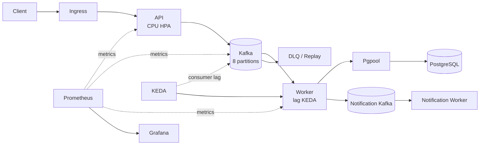
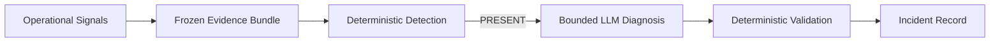

# Kubernetes Event Processing Operations Platform

[Korean](README.md) | [English](README_EN.md)

A hands-on Kubernetes operations project built around an asynchronous Kafka workload, focused on **lag-based autoscaling, observability, failure recovery, and GitOps delivery**. Incident investigation includes a bounded LLM Agent that can use only previously collected operational evidence.

[Public Demo](https://vm118.js-banjiha.cloud/demo/order-dashboard.html) · [Grafana](https://vm118.js-banjiha.cloud/grafana/d/messaging-portfolio-overview/reliable-event-processing-operations-overview?orgId=1&refresh=5s) · [Swagger](https://vm118.js-banjiha.cloud/docs) · [Architecture](docs/ARCHITECTURE.md) · [Test Results](docs/TEST_RESULTS.md)

**Core Stack:** Kubernetes · Kafka · PostgreSQL · KEDA · Prometheus · Grafana · Argo CD · GitHub Actions · Terraform (AWS migration blueprint)

## What I validated

| Operational problem | Decision | Measured result |
| --- | --- | --- |
| Worker backlog grows while CPU stays low | Scale from `message-worker` consumer lag | Worker `2→4`; drain time decreased `12.78%` |
| Scale-out increases database contention | Reduce database round trips and batch notification writes | Backlog throughput increased `13.38%`; API p95 trade-off recorded |
| PostgreSQL runtime outage | Separate API acceptance from Worker persistence with Kafka | Core and notification lag returned to `0/0` after recovery |
| Same-stream ordering | Partition by `stream_id` and commit offsets after database commit | Ordering `100/100`, missing and duplicate `0` |

## Architecture

The core processing path is `API -> Kafka -> Worker -> PostgreSQL`. Notification and DLQ processing remain separate from core persistence.



## Key engineering decisions

### Different scaling signals for API and Worker

- The API uses a CPU HPA because its synchronous path ends after a Kafka append.
- The Worker can wait on database connections, locks, and commits while CPU remains low.
- KEDA therefore uses consumer lag, and its effect is measured through peak lag, throughput, and drain time.

### Ordering and offset safety

- `stream_id` is the Kafka key and defines the ordering boundary.
- The Worker explicitly commits each offset after PostgreSQL commit.
- A failed record is retried from the same offset, and later records in that partition are held back.

### GitOps delivery

- Deploying migration -> Worker -> API in order protects schema and consumer compatibility.
- CI runs tests, rendering, and static checks before publishing an immutable commit-SHA image.
- Argo revision, desired image, Pod image, and imageID connect source to the running workload.

## Verified incident

On 2026-08-23, an actual `local-ha` run applied `75→330→75 records/s` across 64 streams without changing the existing Worker or KEDA policy.

| Stage | Recorded result |
| --- | --- |
| Pressure load | `75 → 330 records/s` |
| Backlog | peak lag `20,574` |
| Scale-out | Worker `2 → 4` |
| Recovery load | `330 → 75 records/s` |
| Result | lag recovered; `ACTIVE → RECOVERING → RECOVERED` |
| Request failures | HTTP failures `0`, dropped iterations `0` |

[Full incident evidence](docs/OPS_AGENT.md)

## Ops Agent: Evidence-grounded Incident Diagnosis

I implemented a bounded LLM Diagnosis Agent for investigating evidence after deterministic incident detection. It cannot query the live cluster arbitrarily. It selects only allowlisted evidence from Frozen Evidence Bundles collected through Application, Prometheus, Kubernetes, and Argo CD read-only paths.



- It classifies supporting evidence, conflicting evidence, and gaps for predefined hypotheses.
- The validator rejects fabricated evidence IDs and attempts to declare recovery or remediation.
- Deterministic logic retains authority over incident detection, recovery, and runtime changes.

[Ops Agent design and validation](docs/OPS_AGENT.md)

## Skills demonstrated

### Cloud / Infrastructure

- Configured stateless and stateful Kubernetes workloads with persistent storage.
- Validated PostgreSQL replication and the Pgpool failover path.
- Built a Terraform blueprint for mapping the local design to EKS, MSK, and RDS.

### DevOps / Platform

- Publish immutable commit-SHA images after tests, manifest rendering, and image checks in GitHub Actions.
- Enforce migration -> Worker -> API release order with Argo CD sync waves.
- Use CPU HPA for the API and consumer-lag KEDA for the Worker.

### Reliability / Operations

- Locate bottlenecks through consumer lag, latency, and replica state.
- Verify ordering, offsets, and recovery after controlled failure injection.
- Observe intake, persistence, backlog, and PostgreSQL HA through Prometheus and Grafana.

## Validation scope

- The single-node kind environment does not validate node or availability-zone failure-domain HA.
- Offset recovery immediately after Worker crash or consumer rebalance remains a planned failure-injection test.
- The AWS configuration is a Terraform migration blueprint; no AWS stack has been deployed.

[Full improvement roadmap](docs/IMPROVEMENT_ROADMAP.md)

<details>
<summary><b>Detailed validation results</b></summary>

| Experiment | Result |
| --- | ---: |
| Stable Kafka intake baseline | `31,676` requests, `0.00%` errors, p95 `80.65ms` |
| Same-stream ordering | `100/100`, missing `0`, duplicate `0` |
| Core Worker scaling | `2 → 4` |
| Backlog throughput | `121.42 → 137.67 events/s` |
| Backlog drain | `222.49 → 194.05s` |
| PostgreSQL recovery | `3/3 ready`, sync/quorum standbys `2` |
| Verified incident lifecycle | `DETECTED → ACTIVE → RECOVERING → RECOVERED → CLOSED` |

Results from Redis, historical Kafka baselines, and current v2 candidates remain separated by experiment conditions in [Test Results](docs/TEST_RESULTS.md).

</details>

<details>
<summary><b>AWS migration blueprint</b></summary>

The Terraform source maps the validated local responsibilities to EKS, ECR, MSK, RDS/Aurora PostgreSQL, ALB, ACM, Route 53, and Secrets Manager. It passes `fmt`, offline `init`, and `validate`.

No AWS `plan`, `apply`, or deployed stack is claimed. See [AWS IaC Plan](docs/AWS_IAC_PLAN.md).

</details>

<details>
<summary><b>Design contracts and known gaps</b></summary>

### What `202 Accepted` means

`202` means that the request was appended to the Kafka ingress topic. It does not guarantee PostgreSQL persistence. The API validates JWT authentication, while the Worker validates stream membership, idempotency, and sequence during persistence.

Before the Worker creates a durable status row, `GET /v1/event-requests/{request_id}` can briefly return `404`. Deferring final membership validation also lets authenticated invalid-stream requests consume Kafka and Worker capacity. A production design needs rate limiting, per-user quotas, and an authorization cache or ACL snapshot.

### PostgreSQL outages and readiness

Kafka intake can continue during a PostgreSQL runtime outage only after the API has completed schema startup. A new API Pod cannot serve `/v1` or `/v2` while database startup is incomplete.

`/health/ready` primarily answers whether Kafka intake can be served. PostgreSQL HA degradation returns HTTP `200` with a degraded body, while schema, Kafka, and unsafe-secret failures return `503`. Worker probes only verify process and metrics-endpoint availability.

### Processing and delivery details

- Inline retry protects ordering and keeps the implementation small, but it can delay other partitions assigned to the same consumer.
- Argo CD sync waves are Secret `-3` -> migration Job `-2` -> Worker `-1` -> API `0`.

### Known gaps

| Current gap | Next work |
| --- | --- |
| Crash gap between database commit and notification publish | transactional outbox |
| Brief status `404` after `202` | accepted-state contract or read model |
| Worker crash and consumer rebalance before offset commit | failure-injection test |
| Both migration Job and API startup run Alembic | single Kubernetes migration owner |
| Worker probes check the metrics TCP endpoint | consumer health endpoint |
| Expired degraded grace does not change HTTP behavior | remove grace or implement an expiry action |
| Backup remains on the same host/PVC | object-storage copy and cluster-loss restore |

Exactly-once processing, global ordering, production-grade HA, and autonomous remediation are not claimed.

</details>

<details>
<summary><b>Ops Agent implementation boundaries and recorded replay</b></summary>

The runtime data path and the operations decision path are separate. Diagnosis tools do not query the live system again; they select and normalize evidence from already frozen Evidence Bundles. The LLM receives a deterministic `PRESENT` condition and cannot declare an incident, verify recovery, remediate, or change runtime state.

The public Investigation UI replays a sanitized static artifact from the actual incident. It does not call the OpenAI API and separates the recorded `local-ha` incident from the current low-resource demo runtime.

[Ops Agent](docs/OPS_AGENT.md) · [Evidence Guide](results/README.md)

</details>

<details>
<summary><b>Local run</b></summary>

```powershell
powershell -ExecutionPolicy Bypass -File scripts/quick_start_all.ps1
```

Docker Desktop is required on Windows. The script installs pinned kind, kubectl, and Helm binaries under `tools/`.

- Demo: `http://localhost/demo/order-dashboard.html`
- Swagger: `http://localhost/docs`
- Grafana: `http://localhost/grafana/d/messaging-portfolio-overview/reliable-event-processing-operations-overview?orgId=1&refresh=5s`

</details>

## Documentation

- Design: [Architecture](docs/ARCHITECTURE.md) · [Service Requirements](docs/SERVICE_REQUIREMENTS.md)
- Delivery: [GitOps](docs/GITOPS.md) · [AWS IaC Plan](docs/AWS_IAC_PLAN.md)
- Operations: [Observability](docs/OBSERVABILITY.md) · [Runbook](docs/RUNBOOK.md) · [Reliability Policy](docs/RELIABILITY_POLICY.md)
- Agent: [Ops Agent](docs/OPS_AGENT.md) · [Ops Agent CLI](ops_agent/README.md)
- Evidence: [Test Results](docs/TEST_RESULTS.md) · [Evidence Guide](results/README.md)
- Roadmap: [Improvement Roadmap](docs/IMPROVEMENT_ROADMAP.md)
