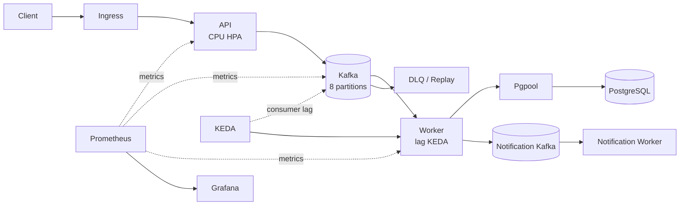
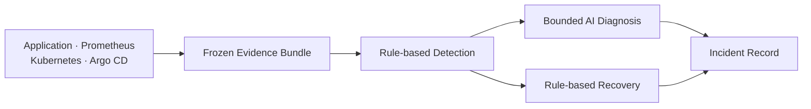

# Kubernetes Event Processing Operations Platform

[Korean](README.md) | [English](README_EN.md)

A hands-on Kubernetes operations project built around an asynchronous Kafka workload, focused on **lag-based autoscaling, observability, failure recovery, and GitOps delivery**. The application provides a real workload for operational experiments. AI is restricted to evidence-grounded hypothesis classification after deterministic incident detection.

[Public Demo](https://vm118.js-banjiha.cloud/demo/order-dashboard.html) · [Grafana](https://vm118.js-banjiha.cloud/grafana/d/messaging-portfolio-overview/reliable-event-processing-operations-overview?orgId=1&refresh=5s) · [Swagger](https://vm118.js-banjiha.cloud/docs) · [Architecture](docs/ARCHITECTURE.md) · [Test Results](docs/TEST_RESULTS.md)

**Core Stack:** Kubernetes · Kafka · PostgreSQL · KEDA · Prometheus · Grafana · Argo CD · GitHub Actions · Terraform

## What I validated

| Operational problem | Decision | Measured result |
| --- | --- | --- |
| Ingress can exceed database persistence capacity | Separate API acceptance from Worker persistence with Kafka | Intake remains available during a PostgreSQL runtime outage after schema startup; final lag returns to `0` |
| CPU does not represent Worker backlog | Scale the Worker from `message-worker` consumer lag | Worker `2→4`; drain time `222.49→194.05s` |
| Scale-out increases database contention | Reduce database round trips and batch notification writes | Backlog throughput `121.42→137.67 events/s`; API p95 increased `6.49%` |
| Incident thresholds can create false positives | Calibrate lag and slope with positive and negative workloads | Three positive runs reached `PRESENT`; three negative controls did not |

| Experiment | Result |
| --- | ---: |
| Stable Kafka intake baseline | `31,676` requests, `0.00%` errors, p95 `80.65ms` |
| Same-stream ordering | `100/100`, missing `0`, duplicate `0` |
| Core Worker scaling | `2 → 4` |
| Backlog drain | `222.49 → 194.05s` |
| PostgreSQL recovery | `3/3 ready`, sync/quorum standbys `2` |
| Verified incident lifecycle | `DETECTED → ACTIVE → RECOVERING → RECOVERED → CLOSED` |

Results from Redis, historical Kafka baselines, and current v2 candidates remain separated by experiment conditions in [Test Results](docs/TEST_RESULTS.md).

## Architecture

The core processing path is `API -> Kafka -> Worker -> PostgreSQL`. Notification and DLQ processing remain separate from core persistence.





The runtime data path and the operations decision path are separate. The LLM receives a deterministic `PRESENT` condition and cannot declare the incident, verify recovery, or change runtime state.

## Key engineering decisions

### Different scaling signals for API and Worker

- The API uses a CPU HPA because its synchronous path ends after a Kafka append.
- The Worker can wait on database connections, locks, and commits while CPU remains low.
- KEDA therefore uses consumer lag, and its effect is measured through peak lag, throughput, and drain time.

### Ordering and offset safety

- `stream_id` is the Kafka key and defines the ordering boundary.
- The Worker explicitly commits each offset after PostgreSQL commit.
- A failed record is retried from the same offset, and later records in that partition are held back.
- Inline retry protects ordering and keeps the implementation small, but it can delay other partitions assigned to the same consumer.

### GitOps delivery

- Release order is Secret wave `-3` -> migration Job `-2` -> Worker `-1` -> API `0`.
- CI runs tests, rendering, and static checks before publishing an immutable commit-SHA image.
- Argo revision, desired image, Pod image, and imageID connect source to the running workload.

## Contract boundaries

### What `202 Accepted` means

`202` means that the request was appended to the Kafka ingress topic. It does not mean that business authorization or PostgreSQL persistence succeeded. The API validates JWT authentication, while the Worker validates stream membership, idempotency, and sequence during persistence.

Before the Worker creates a durable status row, `GET /v1/event-requests/{request_id}` can briefly return `404`. This is a known contract limitation and an accepted-state read model remains future work.

Deferring final membership validation to the Worker also lets authenticated invalid-stream requests consume Kafka and Worker capacity. A production design needs rate limiting, per-user quotas, and an authorization cache or ACL snapshot.

### PostgreSQL outages and readiness

Kafka intake can continue during a PostgreSQL runtime outage only after the API has completed schema startup. A new API Pod cannot serve `/v1` or `/v2` while database startup is incomplete.

`/health/ready` primarily answers whether Kafka intake can be served. PostgreSQL HA degradation returns HTTP `200` with a degraded body, while schema, Kafka, and unsafe-secret failures return `503`. Worker Kubernetes probes verify process and metrics-endpoint availability; they do not prove successful Kafka consumption or database persistence.

### What the Diagnosis Agent tools do

The collector reads Application, Prometheus, Kubernetes, and Argo CD through fixed read-only paths. Diagnosis tools such as `get_partition_lag` and `get_postgres_health` do not query the live system again. They select and normalize evidence from already frozen Evidence Bundles.

The single bounded agent can choose allowlisted evidence selectors and classify predefined hypotheses. It cannot execute shell commands, generate arbitrary PromQL, access arbitrary URLs, write to Kubernetes, remediate, or override deterministic detection and recovery.

## Verified incident

On 2026-08-23, an actual `local-ha` run applied `75→330→75 records/s` across 64 streams without changing the existing Worker or KEDA policy.

```text
75/s baseline
  -> 330/s pressure
  -> lag 20,574
  -> KEDA Worker 2 -> 4
  -> 75/s recovery load
  -> lag drain
  -> deterministic recovery and closure
```

| Stage | Recorded result |
| --- | --- |
| Workload quality | accepted `6,750 / 29,697 / 135,000`, HTTP failures `0`, dropped iterations `0` |
| Detection | lag `7,205→10,497→13,936`, slope `120.07→174.47→230.77/s`, three consecutive captures |
| Scaling | peak lag `20,574`, Worker desired/available `4/4` |
| Diagnosis | four recorded evidence tools; `WORKER_PATH_PRESSURE_SUSPECTED=SUPPORTED`, not a confirmed root cause |
| Recovery | `ACTIVE → RECOVERING → RECOVERED`, PostgreSQL ready |
| Lifecycle | incident `inc-88a1eeaa17897f6a8a929bba`, `CLOSED / RECOVERED` |

The public Investigation UI replays a sanitized static artifact from this run. It does not call the OpenAI API and clearly separates the recorded `local-ha` incident from the current low-resource demo runtime.

## Skills demonstrated

### Cloud / Infrastructure

Kubernetes workload design · StatefulSets and PVCs · PostgreSQL replication · Pgpool · PDBs · backup/restore · Terraform AWS migration blueprint

### DevOps / Platform

GitHub Actions · immutable SHA images · GHCR · Argo CD · sync waves · Kustomize/Helm rendering · KEDA/HPA · deployment provenance

### Reliability / Operations

Kafka offsets, ordering, and idempotency · retry/DLQ/replay · Prometheus/Grafana · failure injection · recovery calibration · incident lifecycle

## Scope and limitations

Validated:

- Kafka-based asynchronous intake and persistence
- Consumer-lag based KEDA scaling
- Argo CD GitOps delivery and immutable image provenance
- Prometheus/Grafana observability
- PostgreSQL process-level failure and recovery
- Same-stream ordering at the Kafka partition boundary
- Bounded evidence-grounded AI-assisted diagnosis

Not claimed:

- Production-grade or multi-AZ HA
- Deployed AWS infrastructure
- Exactly-once processing or global ordering
- Autonomous remediation or self-healing AI
- Cluster-loss disaster recovery

| Current gap | Next work |
| --- | --- |
| Crash gap between database commit and notification publish | transactional outbox |
| Brief status `404` after `202` | accepted-state contract or read model |
| Worker crash and consumer rebalance before offset commit | failure-injection test |
| Both migration Job and API startup run Alembic | single Kubernetes migration owner |
| Worker probes check the metrics TCP endpoint | consumer health endpoint |
| Expired degraded grace does not change HTTP behavior | remove grace or implement an expiry action |
| Backup remains on the same host/PVC | object-storage copy and cluster-loss restore |

<details>
<summary><b>AWS migration blueprint</b></summary>

The Terraform source maps the validated local responsibilities to EKS, ECR, MSK, RDS/Aurora PostgreSQL, ALB, ACM, Route 53, and Secrets Manager. It passes `fmt`, offline `init`, and `validate`.

No AWS `plan`, `apply`, or deployed stack is claimed. See [AWS IaC Plan](docs/AWS_IAC_PLAN.md).

</details>

<details>
<summary><b>Local run</b></summary>

```powershell
powershell -ExecutionPolicy Bypass -File scripts/quick_start_all.ps1
```

Docker Desktop is required on Windows. The script installs pinned kind, kubectl, and Helm binaries under `tools/`.

- Demo: `http://localhost/demo/order-dashboard.html`
- Swagger: `http://localhost/docs`
- Grafana: `http://localhost/grafana/d/messaging-portfolio-overview/reliable-event-processing-operations-overview?orgId=1&refresh=5s`

</details>

## Documentation

- Design: [Architecture](docs/ARCHITECTURE.md) · [Service Requirements](docs/SERVICE_REQUIREMENTS.md)
- Delivery: [GitOps](docs/GITOPS.md) · [AWS IaC Plan](docs/AWS_IAC_PLAN.md)
- Operations: [Observability](docs/OBSERVABILITY.md) · [Runbook](docs/RUNBOOK.md) · [Reliability Policy](docs/RELIABILITY_POLICY.md)
- Agent: [Ops Agent](docs/OPS_AGENT.md) · [Ops Agent CLI](ops_agent/README.md)
- Evidence: [Test Results](docs/TEST_RESULTS.md) · [Evidence Guide](results/README.md)
- Roadmap: [Improvement Roadmap](docs/IMPROVEMENT_ROADMAP.md)
