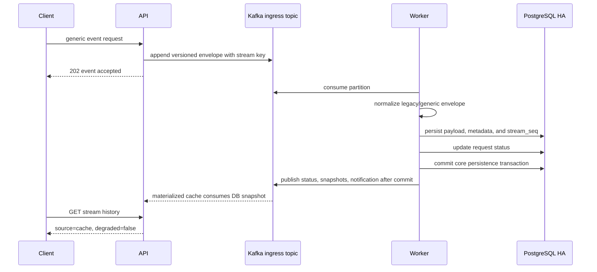
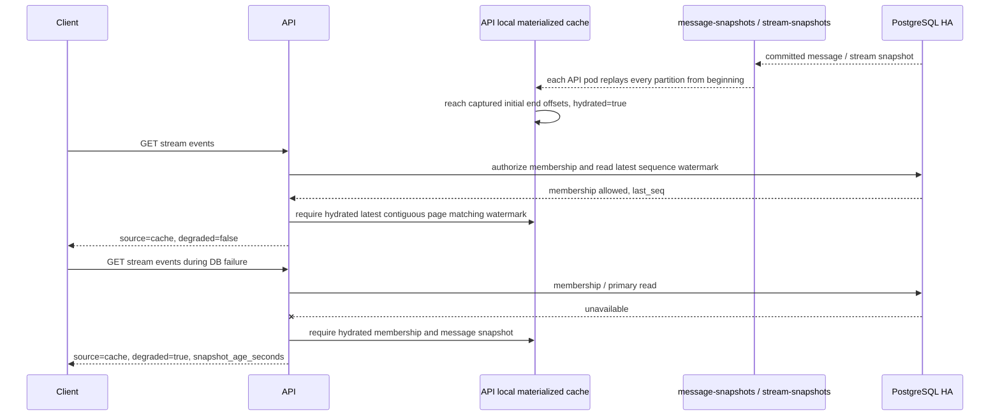
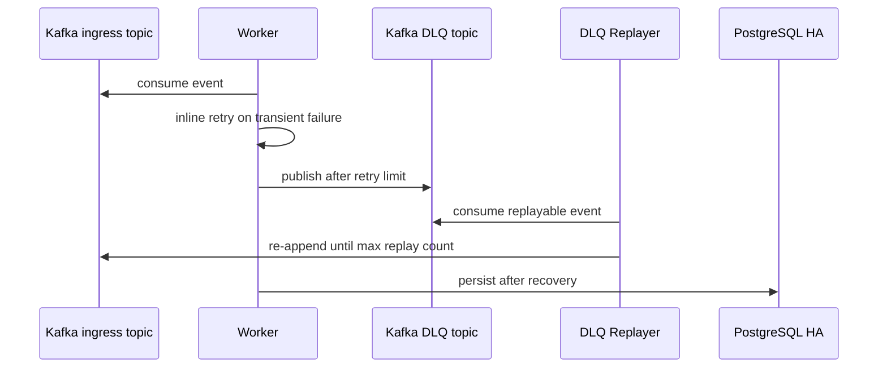

# Reliable Event Processing System 아키텍처

## 서비스 문제

서비스 기준:

- 대상: domain-neutral typed event acceptance와 비동기 영속화
- 공개 핵심 경계: `POST /v2/streams/{stream_id}/events`
- event envelope: client input `event_type`, JSON `payload`, JSON `metadata`; API-assigned `schema_version=2`
- reference scenario: 주문·결제 lifecycle과 `/v1/orders/{order_id}/events` compatibility adapter
- 운영자 관심: DB write 지연, 일시 장애, event 상태 분리 확인
- 분리 대상: intake, persistence, metadata, notification job, DLQ, replay

설계 기준:

- Kafka append 중심의 빠른 범용 event 수락
- 같은 업무 stream ordering boundary 유지
- PostgreSQL write path 장애 시 DLQ / replay 기반 복구
- Prometheus / Grafana / Runbook으로 장애 위치를 설명할 수 있는 운영성

서비스 요구와 SLO guardrail: [SERVICE_REQUIREMENTS.md](SERVICE_REQUIREMENTS.md)

## 구성 요소
- API (`FastAPI`)
  - 범용 event request 수락
  - Kafka ingress topic append
  - versioned event envelope 검증과 accepted response 구성
  - order reference adapter와 legacy body-only route 호환
  - DB snapshot local materialized cache
  - health / readiness / metrics 노출
- Kafka
  - ingress event log
  - 업무 stream 단위 partition ordering boundary
  - DLQ topic
  - request status compacted topic
  - message / stream snapshot compacted topics
  - consumer group offset 관리
- Worker
  - Kafka consumer group으로 ingress topic 소비
  - legacy/generic envelope 정규화
  - `schema_version`, `event_type`, `payload`, `metadata`를 포함한 PostgreSQL 영속화
  - retry / DLQ 처리
- Notification Worker
  - `message-notifications` topic 소비
  - core message transaction과 분리된 notification attempt 기록
- DLQ Replayer
  - Kafka DLQ topic 소비
  - ingress topic 재주입
- PostgreSQL HA
  - `bitnami/postgresql-ha` 기반
  - pgpool 경유 접근
  - 모든 PostgreSQL pod의 `postgresql.auto.conf`에 `synchronous_commit=on`, `synchronous_standby_names=ANY 1` 지속 설정
  - install/recovery helper가 현재 primary의 streaming `sync`/`quorum` standby 1개 이상을 확인한 뒤 완료
- Prometheus / Grafana
  - metrics 수집, alert, dashboard
- Kubernetes autoscaling
  - API CPU 기반 HPA
  - Worker KEDA Kafka lag scaling
- Schema Migration Job
  - GitOps 일반 Sync wave `-2`
  - Worker/API rollout 전 Alembic head 적용
- metrics-server
  - HPA용 resource metrics 제공
- ingress-nginx
  - 로컬 kind 환경의 ingress 진입
- Runtime Secrets
  - auth key와 운영 credential 분리
- PostgreSQL Backup / Restore
  - 수동 logical backup
  - backup본 기반 restore
  - 주 1회 backup `CronJob`
  - 2026-07-21 host logical dump의 disposable DB restore와 핵심 row/schema 정합성 확인
  - 같은 host 장애를 견디는 object storage 사본과 자동 restore는 미구현

## 외부 진입
현재 로컬 검증 기준 기본 진입점:

- API: `http://localhost`
- Grafana: `http://localhost/grafana`
- Prometheus: `http://localhost/prometheus/`

- Service: `ClusterIP`
- 외부 요청: `ingress-nginx` 라우팅
- 기본 문서와 데모 경로: HTTP 기준
- HTTPS: self-signed certificate 기반 TLS 종료 확인용 보조 경로

## 요청 처리 흐름
1. producer: `stream_id`, `event_type`, `payload`, `metadata`를 포함한 event request 전송
2. API: DB 직접 write 제외, Kafka ingress topic append
3. Kafka message key: `stream_id`; order reference adapter에서는 `order_id`를 같은 key로 매핑
4. Worker consumer group: partition 분산 consume
5. Worker: Kafka record key와 envelope `stream_id` 일치 검증
6. Worker: PostgreSQL event 영속화
7. Worker: generic envelope와 legacy alias를 함께 정규화해 구조화 필드 영속화
8. Worker: DB commit 이후 request status, snapshot, notification event를 best-effort 발행
9. 실패 event: retry 수행
10. retry 한도 초과: Kafka DLQ topic 이동
11. DLQ Replayer: 복구 조건 충족 시 ingress topic 재주입

정상 event 흐름:

DB snapshot cache / degraded read 흐름:

각 API pod의 materialized cache consumer는 `group_id` 없이 모든 snapshot partition을 직접 `assign`하고 `seek_to_beginning`합니다. Pod startup 시 partition별 end offset을 캡처하고 현재 position이 모두 해당 지점에 도달한 뒤에만 `hydrated=true`, `ready=true`로 cache gate를 엽니다. 따라서 이 경로에는 kafka-exporter가 보여 줄 snapshot consumer group lag이 없습니다. 현재 source의 readiness payload는 `ready`, `hydrated`, `last_error`를 노출하며 cache item count는 노출하지 않습니다. Position/end-offset/remaining record/hydration duration의 pod별 custom metric은 미구현입니다.

Compaction은 같은 key의 이전 값 제거에 유효합니다. `message-request-status`와 `message-snapshots`는 request/message별 unique key가 대부분이므로 key cardinality와 cold-start replay 길이는 계속 증가할 수 있습니다. Retention window, PostgreSQL consistent bootstrap 뒤 Kafka changelog 적용, per-stream latest-page snapshot은 [Improvement Roadmap](IMPROVEMENT_ROADMAP.md)의 비교·검증 대상입니다.

장애 / DLQ 흐름:

## Kafka 설계 선택
Kafka를 request intake 경로에 둔 이유:

- queue buffer 역할 확인
- event stream processing 특성 검증
- consumer group 기반 Worker 확장 확인
- DLQ / replay 운영 경로 확인

- `stream_id` key 기반 partitioning으로 같은 업무 stream ordering boundary 구분
- Worker가 key 누락·비 UTF-8·payload stream 불일치를 invalid ingress로 terminal 격리해 partition ordering 전제 보호
- Worker consumer group 기반 partition 분산 소비
- 처리 성공, validation rejection, DLQ terminal 처리 뒤 해당 record offset commit
- 예외 발생 record의 partition seek-back과 이후 같은 partition record 처리 보류
- DLQ topic 분리, 실패 이벤트 보존과 replay
- Worker scaling 기준: queue length 제외, consumer lag 사용
- Worker success path: message persistence와 request status update를 하나의 PostgreSQL transaction으로 처리
- 알림 처리: DB commit 이후 `message-notifications` topic best-effort 전달, 별도 `notification-worker`가 `notification_attempts` 기록. 외부 채널 실제 발송은 현재 범위 제외
- post-commit 발행: 현재 transactional outbox 미적용, DB commit 뒤 process crash 시 후속 event 누락 gap 존재
- compacted cache consumer: topic key와 request/event/stream payload identity, owner, BIGINT, envelope schema 검증 뒤 반영
- compacted cache replay: consumer group 공유 없이 API pod별 full replay, initial end offset 도달 뒤 hydrated gate 개방
- cache authorization: DB 정상 시 PostgreSQL membership과 latest sequence watermark에 연속으로 일치하는 fresh snapshot만 사용, DB 장애 시 hydrated membership/message cache가 함께 있을 때만 degraded fallback
- local Kafka trust boundary: self-consistent forged snapshot 방어용 application principal / topic producer ACL 미검증; production에서 인증·최소 권한 ACL 필요
- `event_type` 의미와 `metadata` 분류: producer/adapter 소유; generic Worker가 domain taxonomy를 강제하지 않음
- order reference adapter 분류 예시: `payment`, `order`, `delivery`, `refund`, `support`, `needs_review`
- AI 기반 운영 요약과 자동 응답: core persistence path 밖의 후속 과제

설계 선택: 이 시스템은 최소 latency보다 요청 수락 안정성과 복구 가능성을 우선합니다. Kafka event log와 Worker persistence를 거치며 일부 latency를 감수하지만, DB 장애 전파를 줄이고 replay 가능한 event 처리 경로를 확보합니다.

### 호환 식별자 경계

- 유지 대상: `message-*` Kafka topic, `message-worker` consumer group, `messaging-app` namespace, `rooms`/`messages` table
- 유지 이유: consumer offset, compacted state, deployment selector, database migration compatibility
- 범용 의미 모델: v2 public contract와 envelope column에서 제공
- 물리 이름 교체: 별도 migration·rollout·rollback 계획 없이 수행 제외

### Generic v2 Rollout Boundary

GitOps 순서:

1. gate `false`인 `messaging-env` Secret, sync wave `-3`: migration/Worker 공통 configuration 준비
2. 일반 Sync `messaging-schema-migration` Job, wave `-2`: Alembic head `0008`; `messaging-runtime-secrets` 의존 제외
3. Worker Deployment, sync wave `-1`: legacy/generic dual-read, generic/legacy dual-write
4. API Deployment, sync wave `0`: `local-ha` overlay의 container-level gate `true`, v2 공개

수동 local 순서:

1. `k8s/app/manifests-ha.yaml` 적용: `GENERIC_EVENTS_V2_ENABLED=false`
2. API startup migration 동안 v2 POST `503` 유지
3. quick start가 Worker rollout 완료 대기
4. `kubectl set env deployment/api ... GENERIC_EVENTS_V2_ENABLED=true`
5. API rollout/readiness와 v2 canary stored JSON 확인

호환성은 비대칭입니다. 새 Worker는 legacy producer payload를 정규화할 수 있습니다. 구 Worker가 v2 job을 처리하면 compatibility `body` preview만 저장하고 원본 JSON `payload`/`metadata`를 보존하지 못합니다. API v2 선행 rollout과 old/new Worker 혼합 상태의 v2 traffic은 허용하지 않습니다.

`GENERIC_EVENTS_V2_ENABLED`는 v2 POST intake만 제어합니다. GitOps base와 수동 app manifest의 Secret 값은 `false`이며, `local-ha` overlay가 API Deployment에만 `true` env를 추가합니다. 인증과 stream 생성은 공유 `/v1` resource API를 사용하고, request status와 event list는 `/v2` GET alias도 제공합니다.

## 인증 / 인가
현재 최소 범위의 인증 / 인가가 적용되어 있습니다.

- 사용자 생성 시 `password_hash` 저장
- `/v1/auth/login`으로 bearer token 발급
- 주요 API는 로그인 사용자 기준으로 처리
- stream membership 검증 적용

중요한 점:
- 인증: token payload 기준 처리, DB down 중 인증 경로 차단 방지
- Kafka-centered intake: membership / idempotency / request status 같은 state write를 Kafka append 앞에서 제외
- API: request를 Kafka에 먼저 append
- Worker persistence 단계: 최종 검증 / 상태 갱신
- idempotency state: actor와 route 단위로 격리하며, legacy plain-route response는 owner·stream·필수 persisted field 검증 뒤에만 승계
- DB read fallback: Kafka ingress event 읽기 제외
- local materialized cache 원본: DB commit 이후 `message-snapshots`, stream 생성 commit 이후 `stream-snapshots`
- request lifecycle status: `message-request-status` 보조 기록
- `accepted`: Kafka 수락 상태, DB snapshot 아님
- `GET /streams/{stream_id}/events`: hydrated cache 후보를 먼저 읽되 PostgreSQL 정상 시 DB membership authorization과 latest stream sequence watermark 조회 선행
- fresh snapshot: initial hydration 완료, cache ready, snapshot freshness 충족, cached page의 sequence가 DB watermark부터 끊김 없이 연속일 때 cache 응답
- cache miss 또는 stale: PostgreSQL 조회
- PostgreSQL 조회 실패 + hydrated membership / stale message snapshot 존재: `degraded=true` 반환
- initial hydration 미완료: fresh cache와 DB 장애 fallback 모두 사용 제외
- 응답 필드: `source`, `degraded`, `snapshot_age_seconds`, `items`
- API startup: PostgreSQL 초기화 실패만으로 process 종료 제외
- DB outage/recovery 중 새 API pod: Kafka intake는 기동 가능하지만 materialized cache는 initial hydration 완료 전 fallback 제공 제외
- PostgreSQL primary promotion: 설계상 Pgpool/repmgr 경로를 사용하지만 이번 cache fallback 검증은 전체 StatefulSet outage/recovery이며 promotion 성공 증거로 사용 제외

## 장애 시나리오별 동작

### PostgreSQL / Pgpool 병목
- API intake: Kafka append를 통해 persistence path와 state validation path에서 분리
- Worker: DB 쓰기 실패 시 retry 수행
- retry 한도 초과 요청: Kafka DLQ topic 이동
- DB recovery 후: worker와 replayer 영속화 재진행
- Kafka 모드: API sequence 선점 제외
- Worker: persistence 시점 sequence 배정
- request status: Worker persistence path에서 갱신, API intake DB hot path 결합 방지

### Kafka broker 장애
- API가 Kafka bootstrap에 연결하지 못하거나 ingress topic append 불가: event intake 실패
- bootstrap 연결 불가: readiness `not_ready`
- 일부 broker 손실: replication/ISR와 producer acknowledgment 조건에 따라 intake 지속 가능, broker count/ISR alert 별도 확인
- Worker topic 소비 중단
- Kafka recovery 후 API append와 Worker consume 정상화

### Worker backlog 증가
- API는 Kafka append를 통해 요청을 계속 수락할 수 있습니다.
- Worker 처리량이 ingress rate보다 낮음: consumer lag 증가
- KEDA Kafka scaler가 lag를 기준으로 Worker replica를 늘립니다.
- Worker replica 증가 또는 부하 감소 시 lag가 다시 줄어듭니다.

### DLQ replay
- Worker retry 한도 초과 job: Kafka DLQ topic publish
- `GET /v1/dlq/ingress`: append-only DLQ topic 최근 log sample 조회
- `/summary`: 조회 sample의 count / reason / age 통계, unresolved depth 또는 current backlog 제외
- DLQ Replayer: DLQ topic 소비 후 ingress topic 재주입
- replay event: Worker consumer group 재처리
- manual/automatic replay: `(request_id, replay_generation)` PostgreSQL claim 공유, persisted/published generation 재주입 제외
- automatic replayer: 각 poll batch 전에 PostgreSQL primary reachability 재확인

## 자동 확장
현재 autoscaling은 API와 Worker가 서로 다른 기준을 사용합니다.

- API HPA
  - min replicas: `6`
  - max replicas: `8`
  - target CPU: `65%`
  - scale-up stabilization: `60s`, 최대 `2 pods / 60s`
  - scale-down stabilization: `120s`, 최대 `50% / 60s`
- Worker KEDA
  - min replicas: `2`
  - max replicas: `8`
  - trigger: KEDA `type: kafka`
  - bootstrap servers: `kafka.messaging-app.svc.cluster.local:9092`
  - consumer group: `message-worker`
  - topic: `message-ingress`
  - lag threshold: `100` for the local demo cluster

### Worker 스케일링 기준 변경

변경 전:

- API와 Worker 모두 CPU 사용률 중심 HPA 적용
- Worker가 DB connection, lock, commit 대기 상태에 들어가면 CPU가 낮아도 미처리 요청 증가
- CPU 사용률만으로 Kafka 유입 속도와 Worker 영속화 속도의 차이 확인 불가

변경 과정:

- Redis queue 단계: Worker 기준을 CPU에서 queue depth 기반 KEDA로 변경
- Kafka 전환 단계: Redis queue depth 대신 `message-ingress`의 `message-worker` consumer lag 사용
- API: 요청 처리 자원 사용량을 반영하는 CPU HPA 유지
- Worker: 미처리 이벤트 수를 반영하는 KEDA Kafka scaler 적용

현재 동작:

- KEDA가 Kafka broker에서 topic, consumer group, partition별 lag 확인
- lag threshold `100`을 기준으로 `worker-keda-hpa` external metric 생성
- Worker replica를 최소 `2`, 최대 `8` 범위에서 조정
- Prometheus / kafka-exporter는 같은 lag를 운영자가 관측하고, replica / drain 흐름을 Grafana에 제공

판단 기준:

- API throughput 증가만으로 Worker scale-out 효과를 평가하지 않음
- consumer lag 최고치와 감소 추이 확인
- API queued-at-to-DB-commit histogram과 consumer lag 확인
- backlog가 `0`까지 줄어드는 drain time 확인

이 기준을 선택한 이유:

- Worker의 처리 압력은 CPU보다 ingress rate와 PostgreSQL persistence 처리량의 차이에서 먼저 발생
- DB 지연 중 CPU가 낮아도 Kafka backlog는 계속 증가
- consumer lag는 Worker가 아직 처리하지 못한 이벤트 수를 직접 표시
- DB 복구 후 Worker 확장과 backlog 해소 여부를 같은 지표로 추적 가능

2026-07-21 generic v2 회복 후보 3회에서는 Worker가 KEDA max `8`까지 확장된 main backlog를 평균 `508.58s`에 배출했습니다. Peak lag와 drain을 합친 처리율은 약 `55.2 events/s`입니다. 첫 v2 후보의 약 `32.6 events/s`보다 높지만 single hot-stream 조건이라 PostgreSQL sequence lock과 partition 집중의 영향을 함께 받습니다. Worker max 변경 전 Kafka partition 수, stream 분산도, DB connection / lock wait를 측정해야 합니다. fixed replica와 KEDA의 동일 조건 직접 비교값은 아직 없습니다.

replica 증가만으로 성능 개선을 단정하지 않습니다.

API pod는 consumer group 없이 compacted state topic 전체를 replay합니다. API HPA의 급격한 scale-out은 새 pod마다 cache hydration CPU와 Kafka fetch를 동시에 발생시킬 수 있습니다. 현재 min `6`과 scale-up stabilization은 100 VU 단기 부하에서 이 시작 부하를 억제하기 위한 local HA 설정입니다. 장기 해법은 bounded retention 또는 PostgreSQL bootstrap+Kafka changelog 경계입니다.

Stream 생성 직후 event append는 PostgreSQL read-after-write에 의존하지 않습니다. API는 Kafka append를 먼저 수행하고, Worker persistence 단계에서 stream / membership을 primary state 기준으로 검증합니다. 조회 API의 membership check는 Pgpool primary routing hint를 사용해 standby replication lag 영향을 줄입니다.

## 관측성
현재 관측 가능한 항목:
- API request count / latency
- API stage latency
- worker processing count / latency
- queue wait / Worker 관측 lag
- Kafka append 전 API `queued_at`부터 Worker `commit()` 반환 직후까지의 histogram
- 현재 PowerShell `accepted_to_status_observed_ms` client 관측 지연
- 과거 PowerShell row-visible latency proxy
- worker replica count / KEDA desired replicas
- Kafka health
- Kafka broker count
- Kafka consumer group lag (`message-worker` / `notification-worker`; API snapshot cache replay 제외)
- Kafka topic partition offset
- PostgreSQL primary / standby / replication state / replication delay
- DB / Kafka / Worker health
- Prometheus alert firing / resolution

관측 확장 포인트:
- unresolved DLQ state / depth / oldest unresolved age
- accepted/commit clock source와 cluster 재측정 증거
- post-commit publish backlog와 retry

## 백업과 복구
현재 PostgreSQL 운영 보강은 아래처럼 구성되어 있습니다.

- 수동 backup
  - `scripts/backup_postgres_k8s.ps1`
  - `pgpool` 경유 `pg_dump`
  - 결과는 로컬 `backups/`에 저장
- restore
  - `scripts/restore_postgres_k8s.ps1`
  - backup SQL 적용
  - `-Force` 필수
  - 필요 시 `-ResetSchema` 지원
- 주기 backup
  - HA 매니페스트에 `postgres-weekly-backup` `CronJob`
  - 스케줄: `0 3 * * 0`
  - cluster PVC `postgres-backups` 사용
  - 같은 namespace/PVC의 dump는 namespace 삭제 재해 복구 지점에서 제외

2026-07-21에는 새 `postgres-backups` PVC를 대상으로 수동 실행한 in-cluster backup Job의 dump와 host `backups/` logical dump를 확인했습니다. Host dump `39,433,414` bytes를 disposable database에 복원한 뒤 10개 table row count, Alembic `0008_generic_event_envelope`, generic v2 row `33,840`, message max id/sequence가 원본과 일치함을 확인하고 임시 DB를 삭제했습니다. 이 결과는 같은 local cluster의 logical restore 증거이며 object storage 복제, cluster-loss 복구, RPO/RTO 자동화 증거는 아닙니다.

## 운영 기준
- 아래 수치는 legacy/order contract로 수집한 historical Kafka intake evidence입니다. Generic v2 첫 후보는 2026-07-21 별도로 측정했으며 반복 전 stable baseline으로 승격하지 않습니다.
- Kafka broker: 로컬 기준 3-broker KRaft StatefulSet
- 안정 Kafka intake baseline: 100 VU / 30초 기준 `31676` requests, error `0.00%`, p95 `80.65ms`, p99 `103.57ms`
- 2026-06 performance event status `200`: HTTP `202` route contract 명시 전 historical evidence
- 2026-06-09 재실행: `34284` requests, error `0.00%`, p95 `66.06ms`
- 2026-06-09 ordering: `stream_id=30`, 100개 event, `stream_seq 1..100`, ordering `pass`
- 2026-06-09 lag: Worker consumer lag `36394`까지 증가, 약 14분 후 `0` drain
- 2026-06-09 해석: 안정 baseline 대체값 제외, Worker persistence capacity 신호
- Worker success path transaction 통합 적용
- 현재 핵심 transaction: message persistence와 request status update
- notification attempt 기록: `message-notifications` topic과 별도 `notification-worker` 분리
- Post-tuning 재실행: row-visible proxy p95 `8.08ms`, Worker lag 약 10분 후 `0` drain
- Post-tuning 해석: k6 API intake p95 `108.68ms` 악화, 안정 baseline 대체 수치 제외
- 2026-06-18 notification split suite: `27795` requests, p95 `119.28ms`, row-visible proxy p95 `22.13ms`, Worker lag 약 16분 후 `0` drain
- 기존 persistence latency: DB row `created_at` / row-visible proxy, DB commit timestamp 직접 측정 제외
- baseline 조건: `X-Idempotency-Key`를 끈 Kafka append 중심 경로
- idempotency header: API PostgreSQL claim 선점 제외, Kafka payload 포함
- 최종 deduplication: Worker persistence 단계 처리
- DB read fallback: DB commit 이후 snapshot topic만 사용
- idempotency state: API hot path에서 분리하고 Worker persistence transaction의 `idempotency_keys`에서 최종 deduplication
- Kafka lag / consumer group metric: KEDA와 consumer group 상태 기준 해석
- 멀티 파드 stream ordering boundary: Kafka key와 partition 기준 유지
- 운영 UI: 로컬 포트폴리오 검증용 ingress 노출

## 신뢰성 상태 모델

`Reliable`은 현재 구현과 검증 범위에 붙인 이름입니다.

- 같은 `stream_id`의 partition ordering boundary
- 실패 record inline retry와 뒤 record backpressure
- 성공 또는 terminal DLQ 처리 뒤 explicit offset commit
- PostgreSQL transaction/idempotency state 기반 중복 persistence 방어
- DLQ 격리, replay guard, materialized snapshot fallback
- 장애 주입과 consumer lag/drain 관측

다음 항목은 보장 범위가 아닙니다.

- exactly-once delivery
- partition 간 global ordering
- 모든 process/broker/DB failure 조합에서의 무손실
- 검증 환경 밖의 production SLA
- DB commit 이후 best-effort status/snapshot/notification publish의 원자성

API `GET /health/ready`는 schema startup, Kafka intake 연결, PostgreSQL primary/HA guardrail, non-local auth secret 안전성을 기준으로 상태를 결정합니다. Worker replica/lag와 materialized cache 상태는 응답에 포함되지만 state 결정 조건에서 제외됩니다.

응답의 `app_version`은 실행 중인 API build version을 제공합니다. Demo UI version badge는 이 값과 `DEMO_UI_VERSION`을 함께 표시해 static asset과 API image의 반영 상태를 구분합니다.

`grace_remaining_seconds`는 degraded 시작 뒤 남은 운영 context를 제공하며 readiness state 전환 자체를 지연하지 않습니다.

### `ready`
- schema migration startup 완료
- Kafka bootstrap reachable
- PostgreSQL writable primary reachable
- HA mode에서 standby / sync standby minimum 충족
- replication byte lag threshold 이내
- non-local 환경에서 기본값·빈 값·32-byte 미만 auth secret 미사용

### `degraded`
- PostgreSQL primary가 일시적으로 unavailable하지만 Kafka append path는 살아 있음
- standby / sync standby minimum 미달
- replication byte lag threshold 초과

### `not_ready`
- schema startup 미완료
- Kafka bootstrap unreachable
- non-local 환경의 unsafe auth secret

별도 alert / status script 확인:

- broker count와 topic/partition 상태
- Pgpool replica readiness
- Worker replica, consumer lag, processing failures
- DLQ / replay signal

## readiness와 alert 해석
- readiness: 현재 intake 가능 여부 즉시 반영
- Kafka append 가능 / PostgreSQL primary down: `degraded` 유지
- `30초`: readiness 유예 제외, alert 승격 유예
- Kafka unavailable: intake write path 중단, 즉시 critical
- PostgreSQL persistence 장애: Worker retry / DLQ replay와 함께 해석
