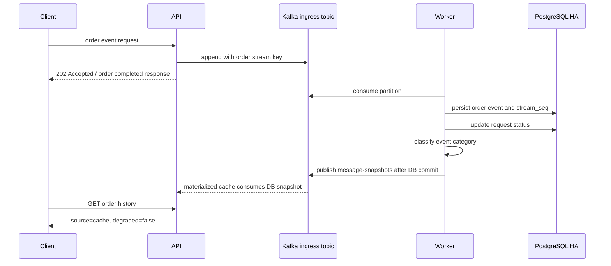
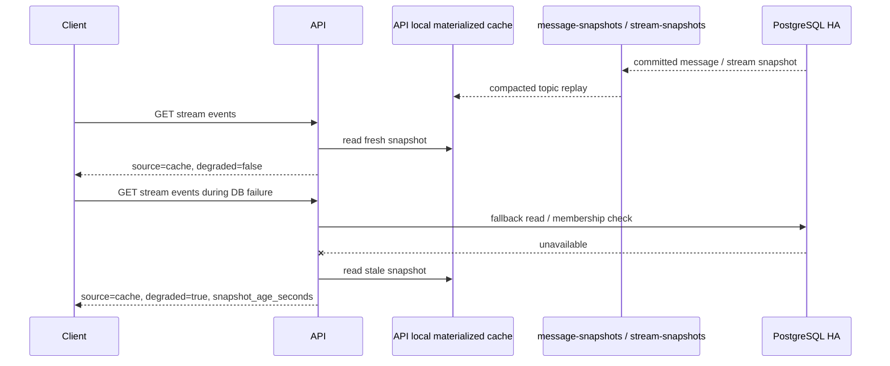
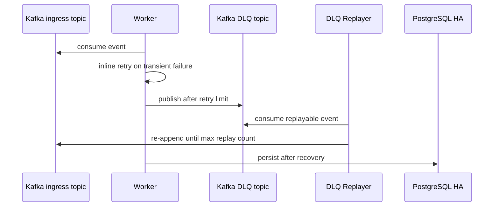

# 아키텍처

## 서비스 문제

서비스 기준:

- 대상: 쇼핑몰 주문 이후 이벤트 처리
- 사용자 관심: 결제 완료와 주문 완료 빠른 확인
- 운영자 관심: DB write 지연, 일시 장애, event 상태 분리 확인
- 분리 대상: intake, persistence, 분류, 알림, DLQ, replay

설계 기준:

- Kafka append 중심의 빠른 주문 이후 event 수락
- 같은 주문 / 업무 stream ordering boundary 유지
- PostgreSQL write path 장애 시 DLQ / replay 기반 복구
- Prometheus / Grafana / Runbook으로 장애 위치를 설명할 수 있는 운영성

서비스 요구와 SLO guardrail: [SERVICE_REQUIREMENTS.md](SERVICE_REQUIREMENTS.md)

## 구성 요소
- API (`FastAPI`)
  - 주문 이후 event request 수락
  - Kafka ingress topic append
  - DB snapshot local materialized cache
  - health / readiness / metrics 노출
- Kafka
  - ingress event log
  - 주문 / 업무 stream 단위 partition ordering boundary
  - DLQ topic
  - request status compacted topic
  - message / stream snapshot compacted topics
  - consumer group offset 관리
- Worker
  - Kafka consumer group으로 ingress topic 소비
  - PostgreSQL 영속화
  - retry / DLQ 처리
- DLQ Replayer
  - Kafka DLQ topic 소비
  - ingress topic 재주입
- PostgreSQL HA
  - `bitnami/postgresql-ha` 기반
  - pgpool 경유 접근
- Prometheus / Grafana
  - metrics 수집, alert, dashboard
- Kubernetes autoscaling
  - API CPU 기반 HPA
  - Worker KEDA Kafka lag scaling
- metrics-server
  - HPA용 resource metrics 제공
- ingress-nginx
  - 로컬 kind 환경의 ingress 진입
- Runtime Secrets
  - auth key와 운영 credential 분리
- PostgreSQL Backup / Restore
  - 수동 logical backup
  - backup본 기반 restore
  - 주 1회 backup `CronJob`

## 외부 진입
현재 로컬 검증 기준 기본 진입점:

- API: `http://localhost`
- Grafana: `http://localhost/grafana`
- Prometheus: `http://localhost/prometheus/`

- Service: `ClusterIP`
- 외부 요청: `ingress-nginx` 라우팅
- 기본 문서와 데모 경로: HTTP 기준
- HTTPS: self-signed certificate 기반 TLS 종료 확인용 보조 경로

## 요청 처리 흐름
1. 클라이언트: 결제 완료, 주문 생성, 배송 시작, 환불 요청 event request 전송
2. API: DB 직접 write 제외, Kafka ingress topic append
3. Kafka message key: 현재 구현 기준 `stream_id`, 주문 도메인에서는 `order_id` 대응 ordering key
4. Worker consumer group: partition 분산 consume
5. Worker: PostgreSQL event 영속화
6. Worker: 운영 카테고리 분류, DB commit 이후 snapshot과 notification event 발행
7. 실패 event: retry 수행
8. retry 한도 초과: Kafka DLQ topic 이동
9. DLQ Replayer: 복구 조건 충족 시 ingress topic 재주입

정상 event 흐름:

DB snapshot cache / degraded read 흐름:

장애 / DLQ 흐름:

## Kafka 설계 선택
Kafka를 request intake 경로에 둔 이유:

- queue buffer 역할 확인
- event stream processing 특성 검증
- consumer group 기반 Worker 확장 확인
- DLQ / replay 운영 경로 확인

- `stream_id` key 기반 partitioning으로 같은 주문 / 업무 stream ordering boundary 구분
- Worker consumer group 기반 partition 분산 소비
- 처리 성공 후 offset commit, 재처리 가능성 유지
- DLQ topic 분리, 실패 이벤트 보존과 replay
- Worker scaling 기준: queue length 제외, consumer lag 사용
- Worker success path: message persistence와 request status update를 하나의 PostgreSQL transaction으로 처리
- 알림 처리: DB commit 이후 `message-notifications` topic 전달, 별도 `notification-worker`가 `notification_attempts` 기록
- 운영 분류 1차 범위: `payment`, `order`, `delivery`, `refund`, `support`, `needs_review`
- AI 기반 세부 분류와 자동 응답: 후속 과제

설계 선택: 이 시스템은 최소 latency보다 요청 수락 안정성과 복구 가능성을 우선합니다. Kafka event log와 Worker persistence를 거치며 일부 latency를 감수하지만, DB 장애 전파를 줄이고 replay 가능한 event 처리 경로를 확보합니다.

## 인증 / 인가
현재 최소 범위의 인증 / 인가가 적용되어 있습니다.

- 사용자 생성 시 `password_hash` 저장
- `/v1/auth/login`으로 bearer token 발급
- 주요 API는 로그인 사용자 기준으로 처리
- stream membership 검증 적용

중요한 점:
- 인증: token payload 기준 처리, DB down 중 인증 경로 차단 방지
- Kafka-native intake: membership / idempotency / request status 같은 low-latency state path를 Kafka append 앞에서 제외
- API: request를 Kafka에 먼저 append
- Worker persistence 단계: 최종 검증 / 상태 갱신
- DB read fallback: Kafka ingress event 읽기 제외
- local materialized cache 원본: DB commit 이후 `message-snapshots`, stream 생성 commit 이후 `stream-snapshots`
- request lifecycle status: `message-request-status` 보조 기록
- `accepted`: Kafka 수락 상태, DB snapshot 아님
- `GET /streams/{stream_id}/events`: cache-first 동작
- fresh snapshot: cache 응답
- cache miss 또는 stale: PostgreSQL 조회
- PostgreSQL 조회 실패 + stale snapshot 존재: `degraded=true` 반환
- 응답 필드: `source`, `degraded`, `snapshot_age_seconds`, `items`
- API startup: PostgreSQL 초기화 실패만으로 process 종료 제외
- DB failover 중 새 API pod: Kafka intake와 materialized cache consumer 우선 기동

## 장애 시나리오별 동작

### PostgreSQL / Pgpool 병목
- API intake: Kafka append를 통해 persistence path와 state validation path에서 분리
- Worker: DB 쓰기 실패 시 retry 수행
- retry 한도 초과 요청: Kafka DLQ topic 이동
- DB recovery 후: worker와 replayer 영속화 재진행
- Kafka 모드: API sequence 선점 제외
- Worker: persistence 시점 sequence 배정
- request status: Worker persistence path에서 갱신, API intake DB hot path 결합 방지

### Kafka broker 장애
- API ingress topic append 불가: event intake 실패
- readiness는 Kafka reachable 여부를 반영해 `not_ready`로 내려갈 수 있습니다.
- Worker topic 소비 중단
- Kafka recovery 후 API append와 Worker consume 정상화

### Worker backlog 증가
- API는 Kafka append를 통해 요청을 계속 수락할 수 있습니다.
- Worker 처리량이 ingress rate보다 낮음: consumer lag 증가
- KEDA Kafka scaler가 lag를 기준으로 Worker replica를 늘립니다.
- Worker replica 증가 또는 부하 감소 시 lag가 다시 줄어듭니다.

### DLQ replay
- Worker retry 한도 초과 job: Kafka DLQ topic publish
- `GET /v1/dlq/ingress`: Kafka 모드에서 DLQ topic 최근 메시지 조회
- DLQ Replayer: DLQ topic 소비 후 ingress topic 재주입
- replay event: Worker consumer group 재처리

## 자동 확장
현재 autoscaling은 API와 Worker가 서로 다른 기준을 사용합니다.

- API HPA
  - min replicas: `3`
  - max replicas: `8`
  - target CPU: `65%`
- Worker KEDA
  - min replicas: `2`
  - max replicas: `8`
  - trigger: KEDA `type: kafka`
  - bootstrap servers: `kafka.messaging-app.svc.cluster.local:9092`
  - consumer group: `message-worker`
  - topic: `message-ingress`
  - lag threshold: `100` for the local demo cluster

Worker를 CPU나 Prometheus query가 아니라 KEDA Kafka scaler 기준으로 스케일링한 이유는, 이 프로젝트의 병목이 pure CPU보다 ingress rate와 downstream persistence 처리량의 차이에서 먼저 드러나기 때문입니다. KEDA는 Kafka broker의 `message-ingress` topic과 `message-worker` consumer group lag를 직접 확인해 `worker-keda-hpa` external metric을 만들고, Prometheus / kafka-exporter는 같은 lag를 운영자가 관측하고 alerting하기 위한 별도 경로입니다.

다만 최근 성능 suite에서는 Worker가 KEDA max `8`까지 확장돼도 backlog drain이 즉시 개선되지 않았습니다. 따라서 현재 병목은 단순 replica 수보다 PostgreSQL write throughput, commit latency, `room_sequences FOR UPDATE` lock, Kafka record 단건 처리 / offset commit 전략 쪽에 더 가깝다고 봅니다. Worker max를 더 늘리려면 Kafka partition 수, stream 분산도, DB connection / lock wait를 함께 측정해야 하며, replica 증가만으로 성능 개선을 단정하지 않습니다.

Stream 생성 직후 event append는 PostgreSQL read-after-write에 의존하지 않습니다. API는 Kafka append를 먼저 수행하고, Worker persistence 단계에서 stream / membership을 primary state 기준으로 검증합니다. 조회 API의 membership check는 Pgpool primary routing hint를 사용해 standby replication lag 영향을 줄입니다.

## 관측성
현재 관측 가능한 항목:
- API request count / latency
- API stage latency
- worker processing count / latency
- queue wait / accepted-to-persisted lag
- worker replica count / KEDA desired replicas
- Kafka health
- Kafka broker count
- Kafka consumer group lag
- Kafka topic partition offset
- PostgreSQL primary / standby / replication state / replication delay
- DB / Kafka / Worker health
- Prometheus alert firing / resolution

관측 확장 포인트:
- Kafka DLQ topic depth / replay rate metric

## 백업과 복구
현재 PostgreSQL 운영 보강은 아래처럼 구성되어 있습니다.

- 수동 backup
  - `scripts/backup_postgres_k8s.ps1`
  - `pgpool` 경유 `pg_dump`
  - 결과는 로컬 `backups/`에 저장
- restore
  - `scripts/restore_postgres_k8s.ps1`
  - backup SQL 적용
  - `-Force` 필수
  - 필요 시 `-ResetSchema` 지원
- 주기 backup
  - HA 매니페스트에 `postgres-weekly-backup` `CronJob`
  - 스케줄: `0 3 * * 0`
  - cluster PVC `postgres-backups` 사용

## 운영 기준
- Kafka broker: 로컬 기준 3-broker KRaft StatefulSet
- 최신 Kafka intake baseline: 100 VU / 30초 기준 `31676` requests, error `0.00%`, p95 `80.65ms`, p99 `103.57ms`
- 2026-06-09 재실행: `34284` requests, error `0.00%`, p95 `66.06ms`
- 2026-06-09 ordering: `stream_id=30`, 100개 event, `stream_seq 1..100`, ordering `pass`
- 2026-06-09 lag: Worker consumer lag `36394`까지 증가, 약 14분 후 `0` drain
- 2026-06-09 해석: 안정 baseline 대체값 제외, Worker persistence capacity 신호
- Worker success path transaction 통합 적용
- 현재 핵심 transaction: message persistence와 request status update
- notification attempt 기록: `message-notifications` topic과 별도 `notification-worker` 분리
- Post-tuning 재실행: accepted-to-persisted p95 `8.08ms`, Worker lag 약 10분 후 `0` drain
- Post-tuning 해석: k6 API intake p95 `108.68ms` 악화, 안정 baseline 대체 수치 제외
- baseline 조건: `X-Idempotency-Key`를 끈 Kafka append 중심 경로
- idempotency header: API PostgreSQL claim 선점 제외, Kafka payload 포함
- 최종 deduplication: Worker persistence 단계 처리
- DB read fallback: DB commit 이후 snapshot topic만 사용
- idempotency state 분리: 다음 보강 대상
- Kafka lag / consumer group metric: KEDA와 consumer group 상태 기준 해석
- 멀티 파드 stream ordering boundary: Kafka key와 partition 기준 유지
- 운영 UI: 로컬 포트폴리오 검증용 ingress 노출

## 신뢰성 상태 모델
Kafka-native 기준 readiness는 단순 up/down이 아니라 intake path와 persistence path를 분리해 봅니다.

### `ready`
- Kafka bootstrap reachable
- PostgreSQL writable primary reachable
- API / Worker metrics scrape 가능
- Worker consumer group running

### `degraded`
- PostgreSQL primary가 일시적으로 unavailable하지만 Kafka append path는 살아 있음
- Worker backlog 또는 consumer lag가 증가 중
- PostgreSQL standby count / replication state가 기대보다 약함
- Kafka broker는 살아 있지만 lag / replay가 증가 중

### `not_ready`
- Kafka bootstrap unreachable
- API가 ingress topic에 append할 수 없음
- PostgreSQL state path가 현재 API 계약상 필수인데 사용할 수 없음

## readiness와 alert 해석
- readiness: 현재 intake 가능 여부 즉시 반영
- Kafka append 가능 / PostgreSQL primary down: `degraded` 유지
- `30초`: readiness 유예 제외, alert 승격 유예
- Kafka unavailable: intake write path 중단, 즉시 critical
- PostgreSQL persistence 장애: Worker retry / DLQ replay와 함께 해석
