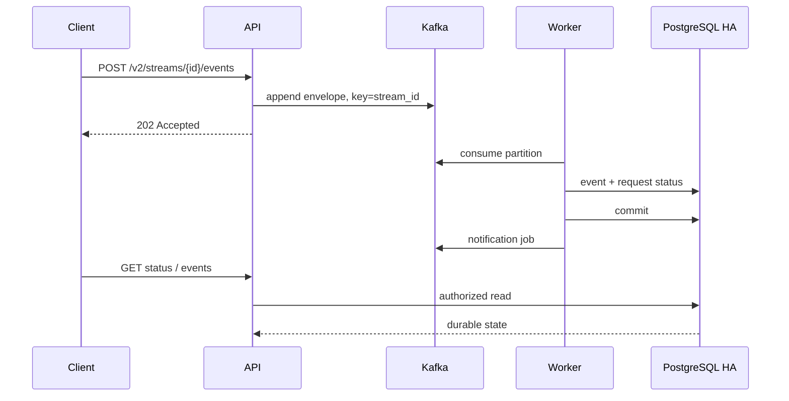
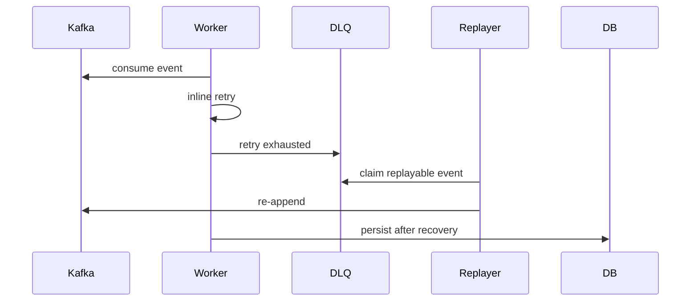
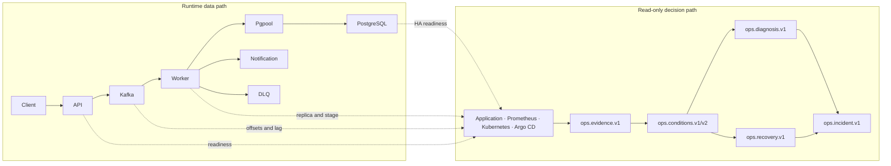

# Kubernetes 이벤트 처리 운영 플랫폼 아키텍처

## 서비스 문제

서비스 기준:

- 대상: domain-neutral typed event acceptance와 비동기 영속화
- 공개 핵심 경계: `POST /v2/streams/{stream_id}/events`
- event envelope: client input `event_type`, JSON `payload`, JSON `metadata`; API-assigned `schema_version=2`
- reference scenario: 주문·결제 lifecycle과 `/v1/orders/{order_id}/events` compatibility adapter
- 운영자 관심: DB write 지연, 일시 장애, event 상태 분리 확인
- 분리 대상: intake, persistence, metadata, notification job, DLQ, replay
- 운영 의사결정: immutable evidence, deterministic condition/recovery, bounded read-only diagnosis, incident lifecycle

설계 기준:

- Kafka append 중심의 빠른 범용 event 수락
- 같은 업무 stream ordering boundary 유지
- PostgreSQL write path 장애 시 DLQ / replay 기반 복구
- Prometheus / Grafana / Runbook으로 장애 위치를 설명할 수 있는 운영성
- runtime 처리 경로와 Ops 판단 경로, AI trust boundary 분리

서비스 요구와 SLO guardrail: [SERVICE_REQUIREMENTS.md](SERVICE_REQUIREMENTS.md)

## 구성 요소

- API Deployment: generic event 검증, Kafka append, PostgreSQL status·event 조회, readiness·metrics 제공
- Kafka StatefulSet: ingress·DLQ·notification topic, stream key partition ordering, Worker lag source
- Worker Deployment: ingress consume, PostgreSQL transaction, inline retry, DLQ 이동, record 단위 explicit offset commit
- Notification Worker: core persistence 뒤 notification job 소비, poll당 최대 20건의 attempt를 한 PostgreSQL transaction으로 기록
- DLQ Replayer: replay guard 확인 뒤 ingress topic 재주입
- PostgreSQL HA·Pgpool: durable source of truth, synchronous replica, writable primary routing
- Prometheus·Grafana·kafka-exporter: application·Kafka·Kubernetes 신호 수집과 시각화
- HPA·KEDA: API CPU 확장과 Worker consumer lag 확장
- Argo CD·Migration Job: Secret → schema → Worker → API rollout 순서 적용
- Backup CronJob·restore drill: logical backup 생성과 disposable DB 복원 검증
- Ops Agent: normalized read-only evidence, deterministic detection/recovery, bounded diagnosis, incident lifecycle artifact

Current source는 API pod별 Kafka snapshot replay를 사용하지 않습니다. 읽기와 request status는 PostgreSQL이 담당합니다.

## 외부 진입
현재 로컬 검증 기준 기본 진입점:

- API: `http://localhost`
- Grafana: `http://localhost/grafana`
- Prometheus: `http://localhost/prometheus/`

- Service: `ClusterIP`
- 외부 요청: `ingress-nginx` 라우팅
- 기본 문서와 데모 경로: HTTP 기준
- HTTPS: self-signed certificate 기반 TLS 종료 확인용 보조 경로

## 요청 처리 흐름

### 정상 event 흐름

1. Client가 `stream_id`, `event_type`, `payload`, `metadata` 전송
2. API가 `stream_id`를 key로 `message-ingress`에 append
3. Kafka append 성공 시 `202 Accepted` 반환
4. `message-worker` consumer group이 partition을 분산 consume
5. Worker가 membership·idempotency·sequence를 검증하고 PostgreSQL transaction으로 event와 request status 저장
6. commit 완료 뒤 notification job 발행
7. transient failure는 같은 record inline retry, terminal failure는 DLQ 이동
8. status·event 조회는 PostgreSQL source of truth 사용

PostgreSQL read 장애 시 status·event endpoint는 `503`을 반환합니다. Kafka intake가 정상이면 event append와 `202` 경로는 계속 사용할 수 있습니다.

### 장애 / DLQ 흐름

## Kafka 설계 선택
Kafka를 request intake 경로에 둔 이유:

- queue buffer 역할 확인
- event stream processing 특성 검증
- consumer group 기반 Worker 확장 확인
- DLQ / replay 운영 경로 확인

- `stream_id` key 기반 partitioning으로 같은 업무 stream ordering boundary 구분
- Worker가 key 누락·비 UTF-8·payload stream 불일치를 invalid ingress로 terminal 격리해 partition ordering 전제 보호
- Worker consumer group 기반 partition 분산 소비
- 처리 성공, validation rejection, DLQ terminal 처리 뒤 해당 record offset explicit commit
- 예외 발생 record의 partition seek-back과 이후 같은 partition record 처리 보류
- DLQ topic 분리, 실패 이벤트 보존과 replay
- Worker scaling 기준: queue length 제외, consumer lag 사용
- Worker success path: message persistence와 request status update를 하나의 PostgreSQL transaction으로 처리
- 알림 처리: DB commit 이후 `message-notifications` topic best-effort 전달. 별도 `notification-worker`가 poll당 최대 20건을 한 statement·transaction으로 `notification_attempts`에 기록. DB commit 뒤 각 record offset을 순서대로 commit
- notification batch failure: DB 연결 오류 시 poll에 포함된 각 partition의 첫 record로 rewind. PostgreSQL DataError는 record 단위 처리로 전환해 terminal row와 정상 row 분리
- notification replay: DB commit 뒤 offset commit 전 crash는 같은 job 재처리 가능. `notification_attempts.message_id` unique constraint와 `ON CONFLICT DO NOTHING`으로 중복 insert 억제
- post-commit notification 발행: 현재 transactional outbox 미적용, DB commit 뒤 process crash 시 notification job 누락 gap 존재
- local Kafka trust boundary: PLAINTEXT demo 구성; production에서 broker 인증과 topic별 최소 권한 ACL 필요
- `event_type` 의미와 `metadata` 분류: producer/adapter 소유; generic Worker가 domain taxonomy를 강제하지 않음
- order reference adapter 분류 예시: `payment`, `order`, `delivery`, `refund`, `support`, `needs_review`
- AI 기반 운영 요약과 자동 응답: core persistence path 밖의 후속 과제

설계 선택: 이 시스템은 최소 latency보다 요청 수락 안정성과 복구 가능성을 우선합니다. Kafka event log와 Worker persistence를 거치며 일부 latency를 감수하지만, DB 장애 전파를 줄이고 replay 가능한 event 처리 경로를 확보합니다.

### 호환 식별자 경계

- 유지 대상: active `message-ingress`, `message-ingress-dlq`, `message-notifications`, `message-worker` consumer group, `messaging-app` namespace, `rooms`/`messages` table
- 유지 이유: consumer offset, deployment selector, database migration compatibility
- 범용 의미 모델: v2 public contract와 envelope column에서 제공
- 물리 이름 교체: 별도 migration·rollout·rollback 계획 없이 수행 제외
- 이전 compacted topic 3개: source bootstrap·consumer·publisher에서 제거. 기존 cluster의 topic 삭제는 retention·rollback 확인 뒤 별도 수행
- event list의 `source`, `degraded`, `snapshot_age_seconds`: v2 response 호환을 위해 유지하며 current source는 `database`, `false`, `null` 고정

### Generic v2 Rollout Boundary

GitOps 순서:

1. gate `false`인 `messaging-env` Secret, sync wave `-3`: migration/Worker 공통 configuration 준비
2. 일반 Sync `messaging-schema-migration` Job, wave `-2`: Alembic head `0008`; `messaging-runtime-secrets` 의존 제외
3. Worker Deployment, sync wave `-1`: legacy/generic dual-read, generic/legacy dual-write
4. API Deployment, sync wave `0`: `local-ha` overlay의 container-level gate `true`, v2 공개

수동 local 순서:

1. `k8s/app/manifests-ha.yaml` 적용: `GENERIC_EVENTS_V2_ENABLED=false`
2. API startup migration 동안 v2 POST `503` 유지
3. quick start가 Worker rollout 완료 대기
4. `kubectl set env deployment/api ... GENERIC_EVENTS_V2_ENABLED=true`
5. API rollout/readiness와 v2 canary stored JSON 확인

호환성은 비대칭입니다. 새 Worker는 legacy producer payload를 정규화할 수 있습니다. 구 Worker가 v2 job을 처리하면 compatibility `body` preview만 저장하고 원본 JSON `payload`/`metadata`를 보존하지 못합니다. API v2 선행 rollout과 old/new Worker 혼합 상태의 v2 traffic은 허용하지 않습니다.

`GENERIC_EVENTS_V2_ENABLED`는 v2 POST intake만 제어합니다. GitOps base와 수동 app manifest의 Secret 값은 `false`이며, `local-ha` overlay가 API Deployment에만 `true` env를 추가합니다. 인증과 stream 생성은 공유 `/v1` resource API를 사용하고, request status와 event list는 `/v2` GET alias도 제공합니다.

## 인증 / 인가

- password: PBKDF2-SHA256과 random salt
- token: HMAC 서명, expiry와 claim type 검증
- stream read: PostgreSQL membership 확인 뒤 event 조회
- intake: API hot path에서 DB membership 조회 제외, Worker persistence 단계에서 최종 authorization
- non-local unsafe auth secret: readiness `not_ready`, business API `503`
- request body: transport `1 MiB`, payload `65,536` bytes, metadata `16,384` bytes
- JSON: nesting·cycle·NUL·Unicode scalar·non-finite number 검증

## 장애 시나리오별 동작

### PostgreSQL / Pgpool 병목
- API intake: Kafka append를 통해 persistence path와 state validation path에서 분리
- Worker: DB 쓰기 실패 시 retry 수행
- retry 한도 초과 요청: Kafka DLQ topic 이동
- DB recovery 후: worker와 replayer 영속화 재진행
- Kafka 모드: API sequence 선점 제외
- Worker: persistence 시점 sequence 배정
- request status: Worker persistence path에서 갱신, API intake DB hot path 결합 방지

### Kafka broker 장애
- API가 Kafka bootstrap에 연결하지 못하거나 ingress topic append 불가: event intake 실패
- bootstrap 연결 불가: readiness `not_ready`
- 일부 broker 손실: replication/ISR와 producer acknowledgment 조건에 따라 intake 지속 가능, broker count/ISR alert 별도 확인
- Worker topic 소비 중단
- Kafka recovery 후 API append와 Worker consume 정상화

### Worker backlog 증가
- API는 Kafka append를 통해 요청을 계속 수락할 수 있습니다.
- Worker 처리량이 ingress rate보다 낮음: consumer lag 증가
- KEDA Kafka scaler가 lag를 기준으로 Worker replica를 늘립니다.
- Worker replica 증가 또는 부하 감소 시 lag가 다시 줄어듭니다.

### DLQ replay
- Worker retry 한도 초과 job: Kafka DLQ topic publish
- `GET /v1/dlq/ingress`: append-only DLQ topic 최근 log sample 조회
- `/summary`: 조회 sample의 count / reason / age 통계, unresolved depth 또는 current backlog 제외
- DLQ Replayer: DLQ topic 소비 후 ingress topic 재주입
- replay event: Worker consumer group 재처리
- manual/automatic replay: `(request_id, replay_generation)` PostgreSQL claim 공유, persisted/published generation 재주입 제외
- automatic replayer: 각 poll batch 전에 PostgreSQL primary reachability 재확인

## 자동 확장

### API HPA

- CPU target `65%`
- replica `6→8`
- scale-up stabilization `60s`, 최대 `2 pods/60s`
- scale-down stabilization `120s`

API pod는 stateless request 처리와 PostgreSQL read를 담당합니다. scale-out 시 Kafka changelog replay나 대형 local state rebuild가 없습니다.

### Worker KEDA

- Kafka scaler topic `message-ingress`
- consumer group `message-worker`
- lag threshold `100`
- core Worker replica `2→4`, notification Worker replica `1→2`

KEDA 효과는 API request 수가 아니라 consumer lag, Worker replica, accepted-to-commit lag, backlog drain time으로 판정합니다. 한 hot stream은 한 partition·sequence lock 경계에 묶이므로 multi-stream A/B와 분리합니다.

## 관측성
현재 관측 가능한 항목:
- API request count / latency
- API stage latency
- worker processing count / latency
- queue wait / Worker 관측 lag
- Kafka append 전 API `queued_at`부터 Worker `commit()` 반환 직후까지의 histogram
- 현재 PowerShell `accepted_to_status_observed_ms` client 관측 지연
- 과거 PowerShell row-visible latency proxy
- worker replica count / KEDA desired replicas
- Kafka health
- Kafka broker count
- Kafka consumer group lag (`message-worker` / `notification-worker`)
- Kafka topic partition offset
- PostgreSQL primary / standby / replication state / replication delay
- DB / Kafka / Worker health
- Prometheus alert firing / resolution

관측 확장 포인트:
- unresolved DLQ state / depth / oldest unresolved age
- accepted/commit clock source와 cluster 재측정 증거
- post-commit publish backlog와 retry

### Runtime path와 Ops decision path

Runtime path는 event를 수락·처리·영속화합니다. Ops path는 runtime 밖에서 고정된
read-only source만 관측하며 event 처리나 Kubernetes/Argo/Kafka/DB control plane을
변경하지 않습니다. Host-local calibration의 workload API write는 incident 재현을
위한 입력이고 Ops Agent 권한과 분리됩니다.

Phase 1은 Application, Prometheus, Kubernetes, Argo CD의 safe projection을
`ops.evidence.v1` bundle로 정규화합니다. Source timestamp, freshness, expected/observed
partition coverage, missing/anomaly, source identity, runtime image, GitOps revision,
raw artifact SHA-256을 보존합니다. Bundle `COMPLETE/PARTIAL/FAILED`는 수집 완전성이고
system health가 아닙니다.

Phase 2 v1은 single bundle의 condition별 required evidence만 사용합니다. V2 Worker
backlog activation은 동일 profile/context/namespace/topic/group/8 partitions/source
identity의 ordered capture 세 개에서 각각 lag `>=7,000`, 60초 slope `>=100/s`, 두
transition의 lag 증가를 요구합니다. 모든 capture는 fresh source timestamp, 8/8
coverage, no `-1`, no offset decrease, `lag=end-committed`, aligned range grid를
통과해야 합니다. Produce-minus-committed rate는 slope와 같은 offset 변화의 산술
검사이며 독립 vote가 아닙니다. 하나라도 불완전하면 `PRESENT` 대신 `UNKNOWN`입니다.

Phase 3 single Diagnosis Agent는 integrity-valid v2 `PRESENT`를 변경할 수 없는 입력으로
받습니다. LLM은 allowlisted normalized evidence tool만 고르고 evidence ID가 있는
hypothesis와 gap을 출력합니다. Arbitrary PromQL, URL, shell, kubectl, raw credential,
condition 재판정, recovery 선언, remediation은 허용하지 않습니다. Local validator가
schema, citation, tool budget, stop semantics를 통과한 output만 completed diagnosis로
승격합니다.

Phase 4 calibration harness는 host-local k6가 current KEDA `2→4`를 유지한 채 64-stream
arrival-rate traffic을 만들고 약 15초 간격으로 bundle을 수집합니다. Recovery v1은
activation 뒤 fresh usable capture 세 개의 negative slope, committed rate `>=` produce
rate, PostgreSQL readiness에서만 RECOVERING을 판정합니다. Recovery v2는 prior
RECOVERING 뒤 actual local-ha MEDIUM envelope, produce `74.9833~77.0833/s`, lag `<=22`,
slope `<=0`, fresh usable 8/8 Kafka와 PostgreSQL ready가 세 capture 연속일 때만 해당
incident scope를 RECOVERED로 완료합니다. `lag==0`, Worker replica, KEDA inactive는
필수 조건이 아닙니다.

Kafka exporter `v1.7.0`은 topic end offset과 committed offset을 서로 다른 시점에
읽으므로 small-lag scrape에서 `-1/-2`가 관측됐습니다. 이 값은 `INVALID_ONLY`로 raw
보존하고 `0`으로 clamp하거나 derived replacement를 만들지 않습니다. Detection과
recovery는 해당 capture를 usable evidence에서 제외합니다.

Phase 5 lifecycle은 condition evaluation ID, ordered bundle digest, complete source
identity로 deterministic incident ID를 만들고 diagnosis/recovery artifact hash를
timeline에 연결합니다. State는 `DETECTED→ACTIVE→RECOVERING→RECOVERED→CLOSED`입니다.
Closure 뒤 관측은 immutable history를 reopen하지 않고 `current_observation`으로
분리합니다. 2026-08-23 actual Gate 2는 `75→330→75/s`, dropped `0`, peak lag `20,574`,
133 bundles/532 raw projection 검증으로 이 흐름을 끝까지 재현했습니다. Later ACTIVE
observation을 closed record와 분리했으며 automatic reopen/new incident correlation은
아직 없습니다.

이 계층은 self-healing이나 production-ready AI가 아닙니다. Threshold/envelope는
single-node kind `local-ha` calibration이고, consumer rebalance·CPU throttling·exact
transaction commit latency는 현재 instrumentation으로 `UNAVAILABLE`입니다. Public
Verified Incident Replay는 sanitized static source candidate까지 구현했으며 demo-lite
배포는 아직 진행하지 않았습니다. 상세 계약과 case study는
[OPS_AGENT.md](OPS_AGENT.md), 실제 결과는 [TEST_RESULTS.md](TEST_RESULTS.md)를 봅니다.

## 백업과 복구
현재 PostgreSQL 운영 보강은 아래처럼 구성되어 있습니다.

- 수동 backup
  - `scripts/backup_postgres_k8s.ps1`
  - `pgpool` 경유 `pg_dump`
  - 결과는 로컬 `backups/`에 저장
- restore
  - `scripts/restore_postgres_k8s.ps1`
  - backup SQL 적용
  - `-Force` 필수
  - 필요 시 `-ResetSchema` 지원
- 주기 backup
  - HA 매니페스트에 `postgres-weekly-backup` `CronJob`
  - 스케줄: `0 3 * * 0`
  - cluster PVC `postgres-backups` 사용
  - 같은 namespace/PVC의 dump는 namespace 삭제 재해 복구 지점에서 제외

2026-07-21에는 새 `postgres-backups` PVC를 대상으로 수동 실행한 in-cluster backup Job의 dump와 host `backups/` logical dump를 확인했습니다. Host dump `39,433,414` bytes를 disposable database에 복원한 뒤 10개 table row count, Alembic `0008_generic_event_envelope`, generic v2 row `33,840`, message max id/sequence가 원본과 일치함을 확인하고 임시 DB를 삭제했습니다. 이 결과는 같은 local cluster의 logical restore 증거이며 object storage 복제, cluster-loss 복구, RPO/RTO 자동화 증거는 아닙니다.

## 운영 기준
- 아래 수치는 legacy/order contract로 수집한 historical Kafka intake evidence입니다. Generic v2 첫 후보는 2026-07-21 별도로 측정했으며 반복 전 stable baseline으로 승격하지 않습니다.
- Kafka broker: 로컬 기준 3-broker KRaft StatefulSet
- 안정 Kafka intake baseline: 100 VU / 30초 기준 `31676` requests, error `0.00%`, p95 `80.65ms`, p99 `103.57ms`
- 2026-06 performance event status `200`: HTTP `202` route contract 명시 전 historical evidence
- 2026-06-09 재실행: `34284` requests, error `0.00%`, p95 `66.06ms`
- 2026-06-09 ordering: `stream_id=30`, 100개 event, `stream_seq 1..100`, ordering `pass`
- 2026-06-09 lag: Worker consumer lag `36394`까지 증가, 약 14분 후 `0` drain
- 2026-06-09 해석: 안정 baseline 대체값 제외, Worker persistence capacity 신호
- Worker success path transaction 통합 적용
- 현재 핵심 transaction: message persistence와 request status update
- notification attempt 기록: `message-notifications` topic과 별도 `notification-worker` 분리
- Post-tuning 재실행: row-visible proxy p95 `8.08ms`, Worker lag 약 10분 후 `0` drain
- Post-tuning 해석: k6 API intake p95 `108.68ms` 악화, 안정 baseline 대체 수치 제외
- 2026-06-18 notification split suite: `27795` requests, p95 `119.28ms`, row-visible proxy p95 `22.13ms`, Worker lag 약 16분 후 `0` drain
- 기존 persistence latency: DB row `created_at` / row-visible proxy, DB commit timestamp 직접 측정 제외
- baseline 조건: `X-Idempotency-Key`를 끈 Kafka append 중심 경로
- idempotency header: API PostgreSQL claim 선점 제외, Kafka payload 포함
- 최종 deduplication: Worker persistence 단계 처리
- DB read fallback: 제공하지 않음; PostgreSQL read 장애 시 `503`
- idempotency state: API hot path에서 분리하고 Worker persistence transaction의 `idempotency_keys`에서 최종 deduplication
- Kafka lag / consumer group metric: KEDA와 consumer group 상태 기준 해석
- 멀티 파드 stream ordering boundary: Kafka key와 partition 기준 유지
- 운영 UI: 로컬 포트폴리오 검증용 ingress 노출

## 신뢰성 상태 모델

`GET /health/ready`는 traffic 진입에 필요한 핵심 의존성만 검사합니다.

### `ready`

- schema startup 완료
- Kafka bootstrap/append 경로 연결
- PostgreSQL primary와 HA guardrail 충족
- non-local auth secret 안전

### `degraded`

- PostgreSQL primary는 쓰기 가능
- ready/sync standby 수 또는 replication delay가 local HA 목표 이탈
- HTTP `200`, reason 배열에 이탈 항목 포함

### `not_ready`

- schema startup 미완료
- Kafka 연결 불가
- non-local unsafe auth secret
- HTTP `503`

Worker replica 정보는 `/ops/summary`에서 제공하며 readiness 판정에 참여하지 않습니다. 이 endpoint는 Prometheus 결과를 15초 재사용합니다.

## readiness와 alert 해석
- readiness: 현재 intake 가능 여부 즉시 반영
- Kafka append 가능 / PostgreSQL primary down: `degraded` 유지
- `30초`: readiness 유예 제외, alert 승격 유예
- Kafka unavailable: intake write path 중단, 즉시 critical
- PostgreSQL persistence 장애: Worker retry / DLQ replay와 함께 해석
