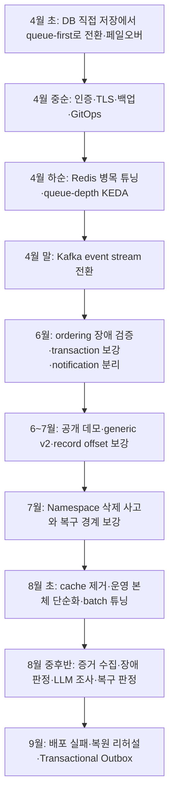

# 프로젝트 발전사: 페일오버 실험에서 이벤트 처리 운영 플랫폼까지

작성 기준: 2026-09-07. 정합성 재검토: 2026-09-08, `dev-kafka` 작업 트리, Git 이력과 보존된 실험 결과.

이 프로젝트의 출발 동기는 작성자가 설명한 **“페일오버를 구성해 보자”**였습니다.
저장소에서 확인되는 가장 오래된 commit은 2026-04-04 `50db1fe`입니다. 그 시점에는 이미
FastAPI·PostgreSQL·Redis·Worker·Frontend·Observer가 들어 있었습니다. 따라서 Git에 남기기 전의
작업 순서나 정확한 착수일은 이 문서에서 추정하지 않습니다.

이후에는 장애 시 요청 보존, 부하에 맞는 확장, 처리 순서, 배포 안전성, 운영 증거와 진단으로
문제 범위가 넓어졌습니다. 중간에 만든 기능을 제거해 복잡도를 줄인 시기도 있었고,
현재는 **이벤트 처리 workload를 직접 만든 Kubernetes·GitOps 운영 플랫폼**으로 정리됐습니다.

## 기존 문서와 이 문서의 역할

| 문서 | 기존에 담고 있던 내용 |
| --- | --- |
| [PATCH_NOTES](PATCH_NOTES.md) | 날짜별 주요 구현·수정·실험 기록. 도입 시점은 Git 변경과 함께 확인 |
| [KAFKA_EXPERIMENT](KAFKA_EXPERIMENT.md) | Kafka 도입 이유, 처리 경계, 성능 해석 |
| [TEST_RESULTS](TEST_RESULTS.md) | 실제 측정 조건과 결과, 검증 한계 |
| [ARCHITECTURE](ARCHITECTURE.md) | 현재 구조와 동작 |
| [IMPROVEMENT_ROADMAP](IMPROVEMENT_ROADMAP.md) | 아직 해결하지 않은 과제 |
| 이 문서 | 처음부터 현재까지 **문제 → 선택 → 배운 점**을 시간순으로 연결 |

아래의 사실과 수치는 연결된 문서·코드·실험 결과에 근거합니다. Commit 날짜는 변경이 Git에
기록된 시점이며 실제 실험 일시는 결과의 timestamp를 우선합니다. 날짜는 근거 문서의 표기를
따르되 UTC와 한국 날짜가 다른 주요 실험은 둘 다 적었습니다. 과거 문서의 “현재”는 그 기록
당시를 뜻하며, 오늘의 구현·공개 배포 상태와 구분합니다.

각 단계가 던진 질문은 기록을 읽기 쉽게 정리한 설계 해석이며, 모두가 당시 그대로 작성된
요구사항이라는 뜻은 아닙니다. 이번 확인은 보존된 증거의 대조이며 runtime 실험을 새로 실행한 결과가 아닙니다.

## 한눈에 보는 흐름

GitOps·관측·신뢰성 작업은 여러 시기에 병행됐습니다. 그림은 주요 전환점을 요약한 것으로,
각 기술이 바로 앞 단계가 끝난 뒤에만 처음 도입됐다는 뜻은 아닙니다.

## 1. 2026-04-04 — 메시징 workload로 실제 페일오버를 실험하다

**출발점:** DB나 queue의 주 노드가 사라졌을 때 다른 노드가 역할을 이어받는지 확인하는 것.
이를 관찰할 대상이 필요했고, 메시지를 보내고 저장·처리 상태를 확인하는 작은 서비스가 있었습니다.

첫날에도 저장 책임이 바뀌었습니다. 초기 커밋부터 queue-first였던 것은 아닙니다.

| 4월 4일의 기록 순서 | 실제 메시지 처리 경로 |
| --- | --- |
| `50db1fe` · 14:45 KST | API가 PostgreSQL `messages`에 저장·commit한 뒤 Redis에 notification 작업을 넣고 Worker가 처리 |
| `26a6154` · 18:02 KST | API가 Redis ingress queue에 넣고, Worker가 PostgreSQL에 메시지를 저장하는 queue-first로 전환 |
| `ecdd5cf` · 19:39 KST | Kubernetes에서 PostgreSQL/Redis 주 노드 삭제와 역할 전환 결과를 README에 기록 |

Frontend·Observer, 사용자·방·메시지·읽음 처리 기능은 이 동작을 관찰하는 workload였습니다.
Queue-first로 바뀐 `26a6154`의 README는 DB 장애 중 재처리와 Prometheus/Grafana 관측도 설명합니다.

`ecdd5cf`의 README에는 실제 primary/master Pod 삭제 결과가 남아 있습니다.

| 당시 대상 | 장애 주입과 관측 | 당시 README에 기록된 시간 |
| --- | --- | --- |
| PostgreSQL HA | `postgresql-1` Primary 삭제 → `postgresql-0` 승격 | failover 약 14.91초, 기존 Primary의 standby 재합류 약 2.48초 |
| Redis Sentinel | `messaging-redis-node-0` Master 삭제 → `node-1` 승격 | failover 약 24.13초, 기존 Master의 replica 재합류 약 2.81초 |

**여기서 넓어진 질문:** 역할 전환이 되는 것뿐 아니라, 전환 중 들어온 요청이 어떻게 처리되는지도 설명해야 한다.

근거: [최초 README](https://github.com/Jangwanko/Cloud_portfolio/blob/50db1fe/README.md),
[최초 API 저장 경로](https://github.com/Jangwanko/Cloud_portfolio/blob/50db1fe/portfolio/api.py),
[queue-first 초기 README](https://github.com/Jangwanko/Cloud_portfolio/blob/26a6154/README.md),
[queue-first API](https://github.com/Jangwanko/Cloud_portfolio/blob/26a6154/portfolio/api.py),
[실제 페일오버 기록](https://github.com/Jangwanko/Cloud_portfolio/blob/ecdd5cf/README.md).

이 수치는 **당시 README의 역사적 실험 보고**입니다. 이번 문서 작성에서 raw timing을 재검산하거나
현재 Kafka/local-ha 환경에서 재현한 수치가 아닙니다. 현재 [PostgreSQL recovery 결과](../results/postgres-recovery/latest.json)의
“primary promotion 미검증”은 그 결과 파일이 다루는 전체 StatefulSet 중단·재시작 실험의 한계입니다.
프로젝트 전체 역사에 페일오버 실험이 없었다는 뜻으로 해석하지 않습니다.

## 2. 2026-04-16~18 — 실행되는 실습을 반복 운영 가능한 환경으로 바꾸다

**문제:** HA 실험이 가능해도 설치·접근·백업·배포를 매번 수동으로 맞추면 재현과 운영이 어렵다.

인증 흐름과 HA quick start를 보강하고, Ingress TLS와 Prometheus 접근 경로, 백업·복원 도구를 추가했습니다.
4월 18일에는 Terraform 구성과 Argo CD/GitOps bootstrap, CI workflow를 정리했습니다.
공개 API를 `streams/events`로 정리한 기록도 4월 16일 `cf4e10b`에 있습니다.
7월의 generic v2는 이 이름을 처음 도입한 일이 아니라, event envelope와 호환·배포 계약을 확장한 단계입니다.

서비스를 실행하는 능력에서 **같은 환경을 다시 만들고 변경을 추적하는 능력**으로 범위가 확장된 단계입니다.
Terraform은 AWS 이식 설계이며 실제 AWS 운영 경험으로 확대해서 설명하지 않습니다.

근거: Git commits `5461b2f`, `ab5f513`, `4453c12`, `cf4e10b`, `b640e53`, `ebaf18a`, `f7bba26`;
[GitOps 문서](GITOPS.md), [AWS 설계](AWS_IAC_PLAN.md).

## 3. 2026-04월 중하순 — 살아 있는 시스템의 처리 용량을 개선하다

**문제:** 요청을 queue에 보존하더라도 Worker와 DB 처리 능력이 부족하면 대기시간이 길어진다.
CPU만 보고 Worker를 늘리는 방식은 DB 대기·연결 경합과 queue 적체를 충분히 표현하지 못했다.

Pgpool/DB pool과 Redis hot path를 조정하고, Worker 확장 기준을 CPU에서 Redis queue depth로 옮겼습니다.

| Redis 단계의 역사적 측정 | 요청 수 | 평균 응답 | p95 |
| --- | ---: | ---: | ---: |
| 초기 기준 | 5,434 | 3,660ms | 8,175ms |
| Pgpool / DB pool 조정 후 | 11,314 | 1,519ms | 3,333ms |
| Queue-depth KEDA 적용 후 | 19,528 | 811ms | 1,954ms |

**배운 점:** replica 수 자체보다 병목을 설명하는 확장 신호가 중요하다.
세 단계에는 여러 튜닝이 포함돼 있으므로 전체 차이를 KEDA 하나의 효과로 귀속하지 않습니다.

근거: commits `093317e`, `5e6ba0a`, `970889f`; [Redis historical context](TEST_RESULTS.md#redis-historical-context).

## 4. 2026-04-28~29 — Redis queue에서 Kafka event stream으로 전환하다

**문제:** 요청 보관을 넘어 같은 stream의 순서, Worker 간 분담, 처리 진도와 재처리 경계를 명확히 해야 했다.

Kafka 3-broker KRaft, partition, consumer group을 도입했습니다. API는 Kafka에 append하고 Worker가
PostgreSQL에 저장하며, `stream_id` key로 ordering 경계를 정의했습니다. Worker 확장 신호도
Redis queue depth에서 Kafka consumer lag로 바뀌었습니다. Kafka exporter와 AWS MSK 설계도 뒤따랐습니다.

4월 28일에는 retry를 topic 끝으로 다시 보내는 방식에서 같은 record의 inline retry로 바꾸고,
Pgpool HA·pool 설정과 ordering 검증을 보강했습니다. 따라서 inline retry의 도입을 6월로 늦춰 설명하지 않습니다.

Historical Kafka 2차 intake baseline은 100 VU/30초, 31,676 HTTP requests, 오류율 0%, p95 80.65ms입니다.
이 중 event 응답은 31,672건이며, 당시 legacy body 기반 `/v1/streams/.../events`의 **HTTP `200`** 기록입니다.
현재 generic v2의 `202` 계약·성능이나 DB 최종 저장 속도를 뜻하지 않습니다.
Redis와의 동일 조건 교체 실험 또는 Kafka Worker scaling ON/OFF 비교로 제시하지 않습니다.

근거: commits `bc9ac79`, `fb8eaa1`, `44b933e`, `ecf8f2f`;
[Kafka 도입 이유와 결과](KAFKA_EXPERIMENT.md), [검증 결과](TEST_RESULTS.md).

## 5. 2026-06월 — 빠른 수락과 올바른 처리를 구분하다

**문제:** API 응답이 빨라도 Worker backlog가 남을 수 있고, 재시도 방식에 따라 같은 stream의 뒤 이벤트가 앞설 수 있다.
부가적인 notification 처리 실패가 핵심 이벤트 저장에도 영향을 줄 수 있었다.

6월 8일에는 단일·다중 stream과 DB 장애 주입을 조합한 네 시나리오에서 최종 PostgreSQL 저장을 확인했습니다.
각 실행에서 accepted=persisted, missing·duplicate·mixed payload·DLQ 0을 기록했습니다.
6월 9일에는 event와 request status의 transaction을 통합했고, 6월 18일 notification을 별도 topic/Worker로 분리했습니다.

당시에도 수동 `consumer.commit()` 호출은 있었지만, 처리한 record의 partition과 `offset+1`만 지정하는
보강은 **7월 14일 `bc7d7d9`**에 들어갔습니다. 6월의 시나리오 통과를 이후 보강까지 이미 완료됐다는 증거로 쓰지 않습니다.

이 변화는 모두 “성능 개선”으로 분류하지 않았습니다. Notification 분리 실험은 처리 경계를 분명히 했지만
해당 측정의 intake와 지연은 개선되지 않았습니다. **장애 격리와 성능의 효과를 따로 평가**하게 된 단계입니다.

근거: [6월 transaction·notification 분리 기록](PATCH_NOTES.md), [ordering/failure 검증](TEST_RESULTS.md),
[7월 record offset 보강](https://github.com/Jangwanko/Cloud_portfolio/blob/bc7d7d9/worker/main.py).

## 6. 2026-06~07월 — 메시징 기능에서 범용 이벤트 운영 플랫폼으로 정체성을 다듬다

**문제:** 채팅이나 주문 화면만 보면 프로젝트의 핵심인 배포·확장·장애 대응이 가려질 수 있었다.

6월에는 주문 lifecycle을 reference scenario로 보여주는 데모와 저사양 demo-lite 경로를 정리했습니다.
예약·Kafka 적재·DB 저장을 나눠 표시하고, 실제 처리 흐름을 외부에서도 시연할 수 있게 했습니다.
초기 Operations Advisor는 규칙 기반이며 LLM 호출이 없었습니다.

7월에는 핵심 계약을 `POST /v2/streams/{stream_id}/events`와 구조화 JSON envelope로 정리했습니다.
주문·결제는 호환 adapter/reference로 남기고, 프로젝트 정체성을 Kubernetes·GitOps 운영 플랫폼으로 재구성했습니다.
Gate를 닫은 상태에서 Migration → **신규 dual-read/dual-write Worker** → API 순서로 배포하고,
Worker 교체 뒤 v2 traffic을 여는 경계를 마련했습니다. 구 Worker는 v2의 구조화 `payload`·`metadata`를
보존하지 못하므로 신·구 Worker가 섞인 상태에서 v2를 먼저 열 수 없습니다. 호환은 대칭이 아닙니다.
같은 시기에 record별 offset commit과 실패 partition rewind도 보강했습니다.

**배운 점:** 서비스 화면, 내부 물리 식별자, 공개 API 계약, 포트폴리오의 설명은 서로 다른 변경 단위다.

근거: [6월 18일 서비스 표면 계획](superpowers/plans/2026-06-18-order-event-service-surface.md),
[Demo Lite](DEMO_LITE.md), [7월 정체성·rollout 변경](PATCH_NOTES.md), [v2 배포 계약](ARCHITECTURE.md).

## 7. 2026-07-21 — 실제 데이터 손실을 통해 백업과 GitOps의 경계를 배우다

**사건:** GitOps desired state 전환에서 Namespace가 prune되며 namespace 안의 PostgreSQL/Pgpool,
local demo data와 in-cluster backup PVC가 삭제됐습니다. 삭제된 local demo data는 복구하지 못했습니다.

Namespace를 명시적인 관리 대상으로 유지하고 `Prune=false`를 적용했습니다. DB를 다시 설치한 뒤
새 logical dump를 별도 DB에 복원해 table count·schema·sequence 등을 비교했습니다.
이는 **재설치 후 새로 만든 백업의 검증**이며 삭제된 데이터 복구 성공이 아닙니다.

같은 날 persisted volume 재시작 뒤 동기 복제 설정이 사라지는 문제도 확인했습니다.
Pod가 Ready라는 사실만으로 복구 완료를 선언하지 않고 실제 Primary와 sync/quorum standby 상태를 확인하도록 보강했습니다.

**배운 점:** 같은 cluster 안에 있는 백업은 cluster lifecycle 사고의 영향을 함께 받을 수 있다.
그리고 “프로세스가 살아 있음”, “HA 설정이 유효함”, “데이터가 복원됨”은 각각 확인해야 한다.

근거: [Namespace prune·복구 기록](PATCH_NOTES.md), [recovery 결과](../results/postgres-recovery/latest.json),
[재설치 후 logical restore 결과](../results/postgres-restore/latest.json),
[신뢰성 정책](RELIABILITY_POLICY.md).

## 8. 2026-08-05~10 — 기능을 늘리는 대신 핵심 경로를 단순하게 만들다

**문제:** API별 materialized cache와 snapshot topic을 유지하면서 replay·freshness·watermark를 함께 설명하고 검증해야 했다.
운영 본체에 비해 관리해야 할 경계가 커졌다.

8월 5일 cache와 snapshot topic 3개를 제거하고, request status/event read의 최종 기준을 PostgreSQL로 단일화했습니다.
DB read 장애에는 `503`을 반환하고, Worker 정보는 readiness 판단에서 `/ops/summary`로 분리했습니다.
이 시기의 poll-batch offset commit 후보는 paired KEDA 실행에서 drain이 fixed보다 9.24% 길어
폐기했으며, record 단위 explicit commit을 유지했습니다.

8월 10일에는 동일 notification batch 후보 image에서 두 확장 설정을 각각 3회 비교했습니다.
공통 조건은 API 6개, 64 streams, 100 VU/30초, 실행마다 clean DB/topic·시작 lag 0입니다.

| 비교 설정 | Core Worker | Notification Worker | Drain 평균 | 실행별 API p95의 평균 |
| --- | --- | --- | ---: | ---: |
| Fixed | 고정 2개 | 고정 1개 | 222.49초 | 88.53ms |
| KEDA | 2→4개 | 1→2개 | 194.05초 | 94.28ms |

관측된 drain 감소는 12.78%, p95 평균 증가는 약 6.5%입니다. Core와 notification 확장 설정을 함께
바꿨으므로 core KEDA만의 효과로 분리하지 않습니다. 두 설정 모두 batch 후보를 사용했으므로
이 A/B 수치로 batch 도입 자체의 효과를 계산할 수도 없습니다. P95 평균은 전체 요청을 합친 p95가 아닙니다.
이 측정은 dirty local image 후보의 결과이며 stable release baseline으로 승격하지 않았습니다.

**배운 점:** 복잡한 기능을 추가한 것만큼 제거한 결정도 설계의 일부이며, 최적화에는 trade-off가 있다.

근거: [8월 단순화·batch 튜닝·폐기 기록](PATCH_NOTES.md), [측정 조건](TEST_RESULTS.md).

## 9. 2026-08-12~28 — 관측 화면에서 증거 기반 장애 조사로 확장하다

**문제:** 지표를 볼 수 있어도 지속적인 backlog인지, 일시적인 spike인지, 무엇을 더 조사해야 하는지는 별도 판단이 필요하다.

Read-only collector로 Evidence Bundle을 수집하고, 시간 순서가 있는 관측과 negative control을 사용해
deterministic 장애 판정을 만들었습니다. 이후 LLM은 **수집·고정된 증거를 읽는 허용 도구**로 원인 가설을
조사하고, validator가 출처·출력 계약을 검사하도록 역할을 제한했습니다. Model의 실제 API 호출과
도구가 runtime에서 새 증거를 직접 가져오는 기능은 구분합니다.

복구 판정과 incident lifecycle도 규칙으로 관리했습니다. 기록상 **8월 23일 UTC, 한국시간 8월 24일**에는
실제 부하의 탐지→조사→복구→종결 기록을 연결했습니다. `CLOSED`는 해당 incident의 복구 기록이며,
후속 backlog 관측은 별도 `current_observation`에 보존합니다. 자동 reopen이나 자율 복구를 뜻하지 않습니다.

8월 28일 공개 demo-lite의 recorded replay 배포·응답을 확인한 기록이 있습니다. 별도의 controlled
Scenario Lab은 네 normalized fixture로 조사 분기를 검증하고 local-ha용 기록 재생 화면을 구현했습니다.
Scenario Lab의 source·image 게시를 local-ha runtime rollout 증거로 해석하지 않습니다. 화면 재생은
OpenAI API나 runtime source를 호출하지 않으며, `LIVE_READ_ONLY` connector는 미구현입니다.

**배운 점:** AI를 붙이는 것과 운영 권한을 주는 것은 별개다. 이 Agent는 runtime을 임의 수정하지 않으며,
장애·복구 판정도 LLM의 자유 판단에 맡기지 않는다.

근거: [Ops Agent 설계·실험](OPS_AGENT.md), [검증된 incident 요약](../results/README.md#ops-agent-phase-5-verified-incident---2026-08-23),
[8월 단계별 기록](PATCH_NOTES.md).

## 10. 2026-09-05 — 배포와 저장 사이의 실패 지점을 직접 검증하다

| 작업 | 발견하거나 다룬 경계 | 결과와 현재 상태 |
| --- | --- | --- |
| Argo release failure lab | Migration 실패가 후속 Worker/API 배포를 차단하는가 | Baseline→실패 주입→rollback→수정 배포 4단계, 각 10개·총 40개 event 저장 검증 PASS. 동일 image를 쓰는 격리 Helm fixture이며 Git→CI 전체 전달·서로 다른 app 버전 호환 실험은 아님 |
| 백업·복원 리허설 | 원본 실험 환경이 사라져도 dump로 새 DB를 만들 수 있는가 | 원본 실험 namespace 삭제 후 별도 PostgreSQL 복원 PASS. 합성 event 10개를 포함한 11개 table의 행 수·내용 hash와 sequence 4개 등 비교. 같은 호스트의 실험이며 외부 저장소 왕복은 보류 |
| Transactional Outbox | DB commit 뒤 notification 발행 전에 죽으면 어떻게 되는가 | 같은 transaction에 발행 의도 저장, ACK 후 완료 표시. 실제 process exit·동시 publisher 실험 PASS |

Outbox 최종 실험은 event 12개, Kafka notification 13개, DB notification attempt 12개, pending 0입니다.
ACK 직후 종료에 따른 재발행 1개를 실제로 관찰했고, DB 기록의 중복은 억제했습니다.
이는 at-least-once 발행과 DB deduplication의 증거입니다. `notification_attempts` 기록까지를 검증했으며
외부 이메일·SMS·push 발송 성공이나 end-to-end exactly-once를 증명하지 않습니다.
현재 **uncommitted local candidate**이며 공개 image/runtime 승격과 성능 baseline은 미검증입니다.

근거: [배포 실패 실험](RELEASE_FAILURE_LAB.md)·[실행 결과](../results/release-failure/20260905T133642Z/summary.json),
[백업 리허설](OFFHOST_BACKUP_DRILL.md)·[실행 결과](../results/offhost-backup/20260905-local-rehearsal.json),
[Outbox 계약](TRANSACTIONAL_OUTBOX.md)·[실행 결과](../results/outbox-failure/20260905T144053Z/summary.json).

## 현재 도달점과 남은 경계

| 영역 | 현재 설명할 수 있는 것 | 구분해야 할 것 |
| --- | --- | --- |
| HA·페일오버 | 초기 PostgreSQL/Redis 실제 전환의 역사적 기록, 현행 HA·복구 설정 | 현재 Kafka profile에서 동일 promotion 재현과 다중 노드/AZ 검증 |
| 이벤트 처리 | 수락·저장 분리, stream ordering, retry/DLQ, DB 멱등성 | exactly-once·global ordering·production SLA 주장 제외 |
| 확장·성능 | 병목 신호 선택, 반복 A/B, 지연과 drain의 trade-off | Redis·legacy Kafka·generic v2·Outbox 수치 혼합 금지 |
| 배포 | CI·GitOps·migration 순서, 격리 release 실패 복구 | 로컬 후보의 테스트 통과와 공개 runtime 배포는 별개 |
| 관측·AI | 운영 증거 수집·규칙 판정·제한된 LLM 조사·recorded replay | 자율 remediation과 실시간 임의 도구 사용 미구현 |
| 백업·AWS | 로컬 복원 검증, S3 도구와 Terraform 설계 | 외부 저장소 구축·왕복 실험은 사용자 결정으로 보류 |

## 면접에서 설명하는 1분 버전

> 처음에는 PostgreSQL과 Redis의 페일오버를 직접 구성하고 확인하려고 시작했습니다.
> 메시징 서비스를 실험 대상으로 삼았고, API의 DB 직접 저장에서 queue-first로 바꾸며 장애 중 요청 보존과 재처리를 다뤘습니다.
> 부하를 걸면서 DB 연결과 CPU 기반 확장의 한계를 확인해 queue depth 기반 KEDA를 적용했고,
> 이후 Kafka의 partition·consumer group·lag를 중심으로 이벤트 처리 구조를 발전시켰습니다.
> 처리 순서와 중복, 배포 migration, 백업과 복구의 경계를 실험하면서 GitOps와 관측을 보강했습니다.
> 복잡해진 cache 경로는 제거했고, 운영 증거를 조사하는 제한된 Agent와 commit 경계의 Outbox 실험까지 추가했습니다.
> 현재는 이벤트 처리 workload를 통해 Kubernetes의 배포·확장·장애 대응을 검증하는 운영 플랫폼입니다.

이 설명에서 강조할 것은 기술 개수보다 **문제를 확인하고, 선택의 효과와 한계를 검증하며, 필요하면 설계를 되돌린 과정**입니다.
